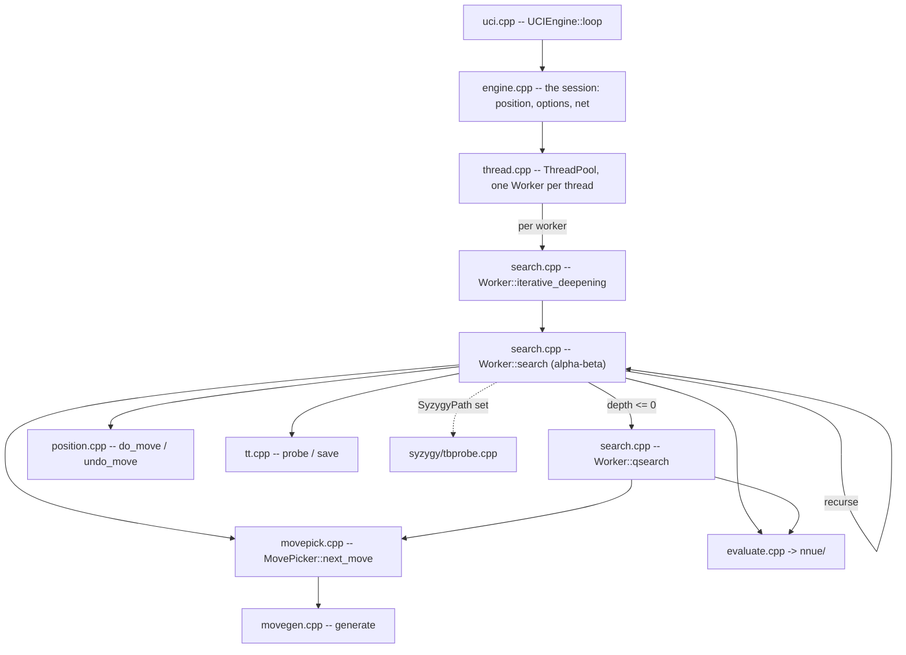

# Architecture

What is in `src/`, how one search flows through it, and what depends on what. For the gates
see [10-tooling-ci.md](10-tooling-ci.md); for building and usage see the
[wiki](https://github.com/official-stockfish/Stockfish/wiki).

Audience: anyone changing more than one file.

## The layout

`src/` is **flat**: every translation unit sits at the top level except three groups that
have their own directory.

```sh
ls src/*.cpp src/*.h                    # the engine, flat
ls src/nnue src/nnue/features src/nnue/layers   # the network
ls src/syzygy                           # the tablebase prober
ls src/universal                        # runtime ISA dispatch entry points
```

| File | Owns |
|---|---|
| `types.h` | the value domain: `Color`, `Square`, `Piece`, `Move`, `Value`, `Key`, `Bitboard`, `Depth` |
| `bitboard.h/.cpp`, `attacks.h/.cpp` | square sets and the slider/leaper attack tables |
| `position.h/.cpp` | the board, `StateInfo`, `do_move`/`undo_move`, Zobrist keys, `see_ge` |
| `movegen.h/.cpp`, `movepick.h/.cpp` | move generation and the staged picker |
| `search.h/.cpp` | `Search::Worker`, iterative deepening, alpha-beta, quiescence |
| `history.h` | the history tables and their update rule |
| `tt.h/.cpp` | the transposition table |
| `timeman.h/.cpp` | the time budget |
| `evaluate.h/.cpp` | the evaluation entry point and its trace |
| `nnue/` | the network: feature transformer, accumulator, layers, feature sets |
| `syzygy/` | the tablebase prober |
| `thread.h/.cpp`, `thread_native.h` | the worker pool |
| `numa.h/.cpp`, `numa_shared.h`, `shm.h`, `shm_unix.h`, `memory.h/.cpp` | NUMA topology, replication, shared memory, aligned allocation |
| `uci.h/.cpp`, `ucioption.h/.cpp`, `engine.h/.cpp` | the UCI transport, the option table, the session |
| `benchmark.h/.cpp`, `perft.h`, `tune.h/.cpp` | bench positions, perft, SPSA tuning |
| `score.h/.cpp` | the reported score, and the win-rate model (`win_rate_model`, `to_cp`) it is built from |
| `basetypes.h` | the type vocabulary: the integer aliases, `ValueList`, `MultiArray`, and `TypedKey<KeySpace>` |
| `platform.h` | what the machine provides: `prefetch`, `TimePoint`/`now`, `IsLittleEndian` |
| `misc.h/.cpp` | what is left of the utility drawer: `RelaxedAtomic`, `PRNG`, the logger, the `dbg_*` counters, `sync_cout`, `split`, `CommandLine` |
| `universal/` | per-ISA entry points for the runtime-dispatch binary |

**`src/Makefile` is the authority on what is compiled.** `SRCS` is an explicit list, not a
wildcard, so a file added to the directory and not to `SRCS` is in the tree and not in the
binary -- and it rots silently against the files that do move, which is the worst version of
the problem because it still looks maintained. Re-establish rather than trust:

```sh
comm -23 <(cd src && ls *.cpp nnue/*.cpp nnue/*/*.cpp syzygy/*.cpp | sort) \
         <(grep -oE '[a-z_/]+\.cpp' src/Makefile | sort -u)
```

## Startup

`main` (`src/main.cpp`) does four things in an order that is load-bearing:

```cpp
Attacks::init();      // slider and leaper tables
Position::init();     // Zobrist keys, from a fixed-seed generator
auto uci = std::make_unique<UCIEngine>(std::move(cli));
Tune::init(uci->engine_options());
uci->loop();
```

`Position::init()` must follow `Attacks::init()`: `Position::set` calls `set_check_info`,
which reads the attack tables. A `Position` built before them does not crash -- it reads
zeroed attack sets, finds no checkers and generates no piece moves, so the failure presents
as a search bug rather than a startup bug.

The network is **not** loaded here. It is a runtime input the UCI layer loads later, because
the UCI layer owns the `EvalFile` option. The binary resolves it relative to the working
directory, which is why the engine is run from `src/`.

## How a search flows



`uci_loop` parses `go` into a `LimitsType`; `ThreadPool::start_thinking` hands it to every
`Worker`; each runs `iterative_deepening`, which recurses through `search` and drops into
`qsearch` at depth zero. Move ordering comes from `MovePicker`, leaf scores from the NNUE.

The search allocates nothing per node: move lists are automatics, and the transposition
table, the accumulator stack and the refresh cache are allocated once outside any search.

## What depends on what

`src/` is flat, so a zone is a **name list rather than a directory**, and the stack is
`shell -> platform -> engine` with the engine at the bottom:

| Zone | Owns | May include |
| --- | --- | --- |
| **engine** | the chess library: types, bitboards, position, movegen, search, per-worker state, the TT, evaluation | nothing outside the engine |
| **platform** | the OS runtime: the clock, memory, threads, NUMA, shared memory | engine |
| **shell** | the process: `main`, the UCI loop, the option table, bench, tuning | engine, platform |

`platform` is not a layer *beneath* the engine: it is the runtime that hosts the engine, so it
may depend on engine types and not the other way round.

**One edge is checked, because only one is a defect rather than a choice**: an engine file that
includes a shell header. `./tests/depcheck.sh` fails on a new one, and
`tests/depcheck.baseline` lists the ones that exist today. The baseline expires in both
directions -- an entry describing an edge that no longer happens fails too, so a fixed edge
cannot quietly stay listed as debt.

The direction is now declared and checked; it was neither until recently, and the baseline is
the honest measure of how far the tree is from it. Concretely, at the time of writing:

- **`search.cpp` still depends on the UCI frontend**, for `UCIEngine::wdl` and
  `UCIEngine::format_score` on the `info` line. That edge is string rendering and remains.
  The four other core files that reached across no longer do: the win-rate model
  (`win_rate_model`, `to_cp`) is evaluation-domain knowledge fitted to fishtest statistics
  rather than protocol, so it lives in `score.h/.cpp`, and coordinate notation is
  `square_name` in `position.h/.cpp`. `evaluate.cpp`, `position.cpp`, `score.cpp` and
  `nnue/nnue_misc.cpp` include neither.
- **`Search::Worker` holds the frontend as members**: `const OptionsMap&`, `ThreadPool&`,
  `TranspositionTable&` and the network reference (`src/search.h`). Linking the search means
  linking the option model and the thread pool; there is no way to drive a search without a
  process around it.
- **`numa.h` no longer carries all of its implementation.** The cold half of `NumaConfig` --
  topology discovery, the string forms, thread binding, 452 lines that all run before the
  first search -- is in `numa.cpp`. What stays is template-bound and cannot move.
  `search.h` still includes `numa.h`, so the NUMA subsystem still reaches everything that
  includes `search.h`.
  `Search::Worker` holds a `NumaReplicatedAccessToken` by value, so that edge is load-bearing
  and a forward declaration cannot replace it.
- **Shared memory no longer rides along with it.** `LazyNumaReplicatedSystemWide` was the only
  user of `shm.h` inside `numa.h`, and it now lives in `numa_shared.h`, which includes both.
  `engine.h` owns one by value and includes it; `search.h` holds one only by reference and
  forward-declares instead, so `shm.h` and `shm_unix.h` no longer reach every consumer of
  `search.h`. Removing the include also exposed that `numa.h` had been getting `<variant>`
  transitively through `shm.h`, which it now includes itself.
- **`types.h` includes `tune.h` after its own `#endif`**, deliberately outside the include
  guard and commented "Global visibility to tuning setup". Anything that touches `types.h` or
  the tunable constants has to account for it. This one is **kept on purpose**: no committed
  file uses `TUNE(...)`, because the injection exists so that a developer tuning a parameter
  can drop a `TUNE(...)` line beside a constant without adding an include and remove it before
  the change lands. Removing the edge would tax every future SPSA run to buy a tidier include
  graph, so it stays, documented rather than silently odd.
- **`types.h` includes `basetypes.h`, not `misc.h`.** The type vocabulary it needs -- the
  integer aliases and `ValueList` -- was split out of the utility drawer, so the fundamental
  type header no longer pulls the logger, the `dbg_*` counters and `sync_cout` into every
  translation unit that touches a `Square`. `misc.h` includes `basetypes.h` and `platform.h`
  in turn, so its 27 includers were untouched by the split: the seam exists, but nothing has
  been migrated across it yet, and `misc.h` is still a drawer.

Measure the header closure rather than trusting a number here:

```sh
cd src && g++ -std=c++17 -E -I. search.cpp | grep -c ''
```

Note when reading that figure that **the standard library dominates it** -- over 90% of the
preprocessed lines of a translation unit come from system headers, so the project header
closure is a coupling fact and not a build-time one.

## Concurrency

Lazy SMP: every `Worker` searches the same tree independently and they share the
transposition table, the history tables and a stop flag. The sharing is **deliberately racy**
and the races are typed rather than left undefined -- see `RelaxedAtomic` in `src/misc.h` and
its uses in `search.h`, `history.h`, `thread.h` and `tt.cpp`.

`bench` is single-threaded, so every value gate in [10-tooling-ci.md](10-tooling-ci.md) stays
green while a data race is present. The sanitizer lanes are what cover it.
