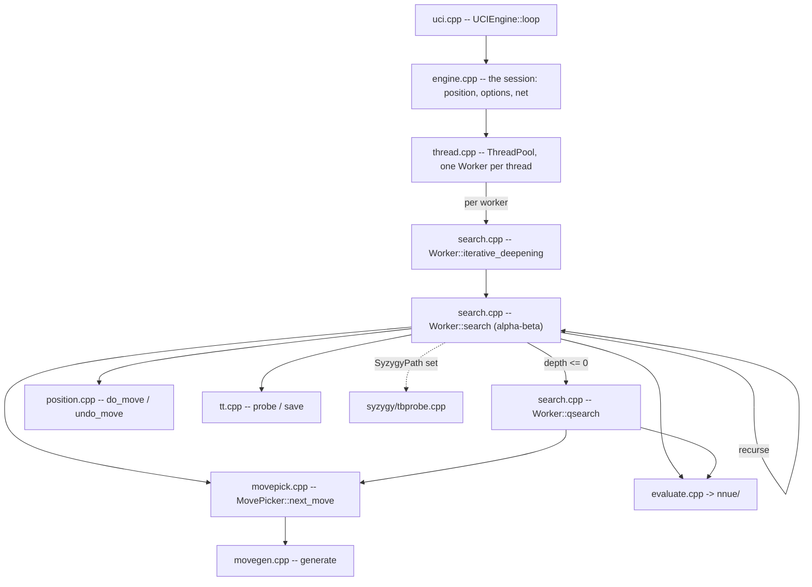

# Architecture

What is in `src/`, how one search flows through it, and what depends on what. For the gates
see [10-tooling-ci.md](10-tooling-ci.md); for building and usage see the
[wiki](https://github.com/official-stockfish/Stockfish/wiki).

Audience: anyone changing more than one file.

## The layout

`src/` is **flat**: every translation unit sits at the top level except three groups that
have their own directory.

```sh
ls src/*.cpp src/*.h                    # the engine, flat
ls src/engine/nnue src/engine/nnue/features src/engine/nnue/layers   # the network
ls src/platform/syzygy                           # the tablebase prober
ls src/universal                        # runtime ISA dispatch entry points
```

| File | Owns |
|---|---|
| `types.h` | the value domain: `Color`, `Square`, `Piece`, `Move`, `Value`, `Key`, `Bitboard`, `Depth` |
| `bitboard.h/.cpp`, `attacks.h/.cpp` | square sets and the slider/leaper attack tables |
| `position.h/.cpp` | the board, `StateInfo`, `do_move`/`undo_move`, Zobrist keys, `see_ge` |
| `movegen.h/.cpp`, `movepick.h/.cpp` | move generation and the staged picker |
| `search.h/.cpp` | `Search::Worker`, iterative deepening, alpha-beta, quiescence |
| `history.h` | the history tables and their update rule |
| `tt.h/.cpp` | the transposition table |
| `timeman.h/.cpp` | the time budget |
| `evaluate.h/.cpp` | the evaluation entry point and its trace |
| `nnue/` | the network: feature transformer, accumulator, layers, feature sets |
| `syzygy/` | the tablebase prober |
| `thread.h/.cpp`, `thread_native.h` | the worker pool |
| `numa.h/.cpp`, `numa_shared.h`, `shm.h`, `shm_unix.h`, `memory.h/.cpp` | NUMA topology, replication, shared memory, aligned allocation |
| `uci.h/.cpp`, `ucioption.h/.cpp`, `engine.h/.cpp` | the UCI transport, the option table, the session |
| `benchmark.h/.cpp`, `perft.h`, `tune.h/.cpp` | bench positions, perft, SPSA tuning |
| `score.h/.cpp` | the reported score, and the win-rate model (`win_rate_model`, `to_cp`) it is built from |
| `basetypes.h` | the type vocabulary: the integer aliases, `ValueList`, `MultiArray`, and `TypedKey<KeySpace>` |
| `platform.h` | what the machine provides: `prefetch`, `IsLittleEndian`, `RESTRICT` |
| `clock.h/.cpp` | `TimePoint` and `now()`: the engine's time type and the seam the host may substitute |
| `console.h/.cpp` | `sync_cout`, `sync_endl` and the `dbg_*` counters -- the shell's own terminal |
| `misc.h/.cpp` | what is left of the utility drawer: `RelaxedAtomic`, `PRNG`, the logger, `split`, `CommandLine` |
| `universal/` | per-ISA entry points for the runtime-dispatch binary |

**`src/Makefile` is the authority on what is compiled.** `SRCS` is an explicit list, not a
wildcard, so a file added to the directory and not to `SRCS` is in the tree and not in the
binary -- and it rots silently against the files that do move, which is the worst version of
the problem because it still looks maintained. Re-establish rather than trust:

```sh
comm -23 <(cd src && ls *.cpp nnue/*.cpp nnue/*/*.cpp syzygy/*.cpp | sort) \
         <(grep -oE '[a-z_/]+\.cpp' src/Makefile | sort -u)
```

## Startup

`main` (`src/shell/main.cpp`) does four things in an order that is load-bearing:

```cpp
Attacks::init();      // slider and leaper tables
Position::init();     // Zobrist keys, from a fixed-seed generator
auto uci = std::make_unique<UCIEngine>(std::move(cli));
Tune::init(uci->engine_options());
uci->loop();
```

`Position::init()` must follow `Attacks::init()`: `Position::set` calls `set_check_info`,
which reads the attack tables. A `Position` built before them does not crash -- it reads
zeroed attack sets, finds no checkers and generates no piece moves, so the failure presents
as a search bug rather than a startup bug.

The network is **not** loaded here. It is a runtime input the UCI layer loads later, because
the UCI layer owns the `EvalFile` option. The binary resolves it relative to the working
directory, which is why the engine is run from `src/`.

## How a search flows



`uci_loop` parses `go` into a `LimitsType`; `ThreadPool::start_thinking` hands it to every
`Worker`; each runs `iterative_deepening`, which recurses through `search` and drops into
`qsearch` at depth zero. Move ordering comes from `MovePicker`, leaf scores from the NNUE.

The search allocates nothing per node: move lists are automatics, and the transposition
table, the accumulator stack and the refresh cache are allocated once outside any search.

## What depends on what

`src/` splits by responsibility, one directory each, and the stack is
`shell -> platform -> engine` with the engine at the bottom:

| Zone | Owns | May include |
| --- | --- | --- |
| **engine** | the chess library: types, bitboards, position, movegen, search, per-worker state, the TT, evaluation | nothing outside the engine |
| **platform** | the OS runtime: the clock, memory, threads, NUMA, shared memory | engine |
| **shell** | the process: `main`, the UCI loop, the option table, bench, tuning | engine, platform |

`platform` is not a layer *beneath* the engine: it is the runtime that hosts the engine, so it
may depend on engine types and not the other way round.

A file's zone is now **its directory**, so a new file joins a zone by where it is put, and one
that belongs to none is reported rather than silently exempt. `tests/zones.sh` holds the
mapping and both checks read it.

**One edge is checked, because only one is a defect rather than a choice**: an engine file that
reaches a shell one. `./tests/depcheck.sh` reads includes and `./tests/linkcheck.sh` reads
symbols, and `tests/depcheck.baseline` and `tests/linkcheck.baseline` list what exists today. The baseline expires in both
directions -- an entry describing an edge that no longer happens fails too, so a fixed edge
cannot quietly stay listed as debt.

The direction is now declared and checked, and **both baselines are empty**: no engine object
references a shell-defined or a platform-defined symbol. `./tests/enginelink.sh` states the same
thing in the form that admits no argument -- it links `engine/` alone, against a stub `main` and
nothing else, and every symbol resolves.

How each edge was closed:

- **The UCI frontend.** `search.cpp` reached it for `UCIEngine::wdl` and
  `UCIEngine::format_score` on the `info` line. Two of those were never shell code -- the
  win-rate model (`win_rate_model`, `to_cp`) is evaluation-domain knowledge fitted to fishtest
  statistics rather than protocol, so it lives in `score.h/.cpp`, and coordinate notation is
  `square_name` in `position.h/.cpp` -- and the renderers followed them.
- **The option model.** `Search::Worker` takes a `const SearchOptions&`, a snapshot of the
  thirteen values the engine reads, filled by the composition root before each search
  (`src/engine/searchoptions.h`). The search can be driven without a UCI layer.
- **The platform.** Injection seams, catalogued below. In each the engine declares a hook,
  every reader in the zone goes through it, and the host registers before the first search.

**What is proven.** The engine links alone AND searches alone. `./tests/enginelink.sh` links the
engine objects with a host that registers nothing, then runs it: three depth-limited searches
and a repeat, through `Search::go` (`src/engine/search_go.h`). Every seam default is therefore
exercised rather than merely reachable -- the arena allocates, the parallel-for clears the
transposition table inline, time management reads the clock, the tablebase source answers "none
loaded".

## The seams

Each is a struct of function pointers the engine owns, a getter, and a setter the host calls
once. `src/shell/engine.cpp` is the composition root.

| Seam | Hands over | Default, unregistered | Registered by |
|---|---|---|---|
| `engine/arena.h` | `alloc`, `alloc_hinted`, `free` | plain aligned allocation | `Engine::ArenaInstallerTag`, **first** |
| `engine/output_sink.h` | `line`, `debug_dump` | prints to stdout unsynchronised | `Engine::ArenaInstallerTag` |
| `engine/tb_source.h` | `max_cardinality`, `probe_wdl`, `rank_root_moves` | no tablebases loaded | `Engine::ArenaInstallerTag` |
| `engine/clock.h` | `now` | reads `std::chrono::steady_clock` | nothing; the default is the clock |
| `engine/parallel.h` | thread count, NUMA map, `run_on`, `wait_on` | runs the work inline | `Engine::resize_threads` |
| `engine/worker_set.h` | `start_searching`, the counters, `count`, `at` | reports no workers | `Engine::resize_threads` |

A default must fail in one of three ways, and which one is a property of the service:

- **Same answer, slower.** The parallel-for runs the work inline; the clock still tells the
  time. Correct unregistered, not degraded.
- **Different answer, so refuse.** Fewer workers is not a slower search, it is another one. A
  worker set that silently searched with one thread when asked for eight would still produce a
  number, and the number would look fine.
- **Safe unregistered.** "No tablebases loaded" is exactly true of an engine with none.

Two things are handed over without a seam struct, because both are read per node and an
indirect call there would cost more than the boundary is worth:

- **The stop and increase-depth flags** reach `Search::Worker` as `std::atomic<bool>&` through
  `SharedState`. A reference member's binding is fixed at construction; a pointer member is not,
  so any call that might alias the worker forces a reload.
- **The NUMA network replica** reaches the worker as `const Eval::NNUE::Network*`, resolved by
  `ThreadPool::ensure_network_replicated` and handed in, so the engine never learns the network
  is replicated.

### Registration order is a correctness requirement

`Engine::ArenaInstallerTag` is the **first member declared** in `Engine`, so its constructor
runs before every member below it. Initialisation follows declaration order, not the order of
the constructor's initialiser list -- naming it first in the list and declaring it eighth
compiles, warns under `-Wreorder`, and runs the installer after four members exist.

A block taken from the engine's fallback allocator and released by the host's is heap corruption
with no diagnostic, so nothing that allocates may be constructed first.

`Engine::resize_threads` installs the parallel-for **before** `set_tt_size`, because the table
clears itself through it. Installing after clears a resized table single-threaded on the first
call and multi-threaded on every later one -- correct either way, and a performance cliff on
exactly the path that allocates gigabytes.

### What the seams cost

Nothing the gates can measure, and the reason is cadence. Re-establish it rather than trust it:

```sh
cd src && grep -cE 'worker_set\(\)|output_sink\(\)|arena\(\)|parallel_for\(\)|tb_source\(\)' \
  engine/movepick.cpp engine/evaluate.cpp engine/history.h
```

The hottest files reach no seam at all. Of the rest:

- `tt.cpp` touches `arena()` and `parallel_for()` only in `resize` and `clear` -- allocation and
  the parallel wipe, never the probe path.
- In `search.cpp` the only seam on the per-node path is `tb_source().probe_wdl`, and
  `tbConfig.cardinality` short-circuits before it, so an engine with no tablebases never reaches
  the call.
- `worker_set()` is reached per node only through `check_time`, which decrements a counter and
  returns on every call but one in at most 512.

**The limit.** With `SyzygyPath` set, `probe_wdl` is a live indirect call where upstream made a
direct one, and `bench` cannot see it -- the bench list never probes, so a measurement there
measures the guard rather than the call. The figure that exists was taken on a probing workload:
**-0.0040%**.
- **`numa.h` no longer carries all of its implementation.** The cold half of `NumaConfig` --
  topology discovery, the string forms, thread binding, 452 lines that all run before the
  first search -- is in `numa.cpp`. What stays is template-bound and cannot move.
  `search.h` still includes `numa.h`, so the NUMA subsystem still reaches everything that
  includes `search.h`.
  `Search::Worker` holds a `NumaReplicatedAccessToken` by value, so that edge is load-bearing
  and a forward declaration cannot replace it.
- **Shared memory no longer rides along with it.** `LazyNumaReplicatedSystemWide` was the only
  user of `shm.h` inside `numa.h`, and it now lives in `numa_shared.h`, which includes both.
  `engine.h` owns one by value and includes it; `search.h` holds one only by reference and
  forward-declares instead, so `shm.h` and `shm_unix.h` no longer reach every consumer of
  `search.h`. Removing the include also exposed that `numa.h` had been getting `<variant>`
  transitively through `shm.h`, which it now includes itself.
- **`types.h` includes `tune.h` after its own `#endif`**, deliberately outside the include
  guard and commented "Global visibility to tuning setup". Anything that touches `types.h` or
  the tunable constants has to account for it. This one is **kept on purpose**: no committed
  file uses `TUNE(...)`, because the injection exists so that a developer tuning a parameter
  can drop a `TUNE(...)` line beside a constant without adding an include and remove it before
  the change lands. Removing the edge would tax every future SPSA run to buy a tidier include
  graph, so it stays, documented rather than silently odd.
- **`types.h` includes `basetypes.h`, not `misc.h`.** The type vocabulary it needs -- the
  integer aliases and `ValueList` -- lives in `basetypes.h`, so the fundamental type header
  does not pull the logger or `CommandLine` into every translation unit that touches a
  `Square`. `misc.h` includes `basetypes.h` and `platform.h` in turn, so a file that includes
  `misc.h` still gets both. **`misc.h` is still a drawer**, and the count of files reaching for
  it is the measure of how much:

  ```sh
  grep -rl '"misc.h"\|/misc.h"' --include=*.cpp --include=*.h src | wc -l
  ```

Measure the header closure rather than trusting a number here:

```sh
cd src && g++ -std=c++17 -E -I. search.cpp | grep -c ''
```

Note when reading that figure that **the standard library dominates it** -- over 90% of the
preprocessed lines of a translation unit come from system headers, so the project header
closure is a coupling fact and not a build-time one.

## Concurrency

Lazy SMP: every `Worker` searches the same tree independently and they share the
transposition table, the history tables and a stop flag. The sharing is **deliberately racy**
and the races are typed rather than left undefined -- see `RelaxedAtomic` in `src/platform/misc.h` and
its uses in `search.h`, `history.h`, `thread.h` and `tt.cpp`.

`bench` is single-threaded, so every value gate in [10-tooling-ci.md](10-tooling-ci.md) stays
green while a data race is present. The sanitizer lanes are what cover it.
