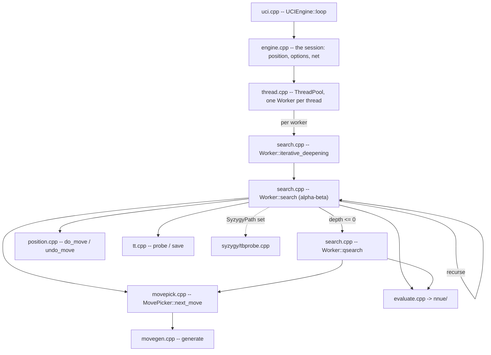

# Architecture

What is in `src/`, how one search flows through it, and what depends on what. For the gates
see [10-tooling-ci.md](10-tooling-ci.md); for building and usage see the
[wiki](https://github.com/official-stockfish/Stockfish/wiki).

Audience: anyone changing more than one file.

## The layout

**No translation unit sits at the top of `src/`.** Every source is in a zone directory, and
that placement is what assigns it a zone -- see [what depends on what](#what-depends-on-what).

```sh
ls src/engine src/engine/nnue src/engine/nnue/features src/engine/nnue/layers
ls src/platform src/platform/syzygy
ls src/shell
ls src/universal                        # runtime ISA dispatch entry points
```

| File | Owns |
|---|---|
| `engine/types.h` | the value domain: `Color`, `Square`, `Piece`, `Move`, `Value`, `Key`, `Bitboard`, `Depth` |
| `engine/basetypes.h` | the type vocabulary: the integer aliases, `ValueList`, `MultiArray`, `TypedKey<KeySpace>` |
| `engine/bitboard.h/.cpp`, `engine/attacks.h/.cpp` | square sets and the slider/leaper attack tables |
| `engine/position.h/.cpp` | the board, `StateInfo`, `do_move`/`undo_move`, Zobrist keys, `see_ge` |
| `engine/movegen.h/.cpp`, `engine/movepick.h/.cpp` | move generation and the staged picker |
| `engine/search.h/.cpp` | `Search::Worker`, iterative deepening, alpha-beta, quiescence |
| `engine/search_go.h/.cpp` | one depth-limited search from a FEN, with no seam registered |
| `engine/searchoptions.h` | the option snapshot a worker is built from |
| `engine/history.h` | the history tables and their update rule |
| `engine/tt.h/.cpp` | the transposition table |
| `engine/timeman.h/.cpp` | the time budget |
| `engine/evaluate.h/.cpp` | the evaluation entry point and its trace |
| `engine/nnue/` | the network: feature transformer, accumulator, layers, feature sets |
| `engine/score.h/.cpp` | the reported score, and the win-rate model (`win_rate_model`, `to_cp`) it is built from |
| `engine/arena.h`, `output_sink.h`, `tb_source.h`, `clock.h`, `parallel.h`, `worker_set.h` | the seams, catalogued below |
| `platform/memory.h/.cpp` | aligned and large-page allocation |
| `platform/numa.h/.cpp`, `numa_shared.h`, `shm.h`, `shm_unix.h` | NUMA topology, replication, cross-process sharing |
| `platform/thread.h/.cpp`, `platform/thread_native.h` | the worker pool and the native thread with a chosen stack |
| `platform/syzygy/` | the tablebase prober |
| `platform/platform.h` | what the machine provides: `prefetch`, `IsLittleEndian`, `RESTRICT` |
| `platform/misc.h/.cpp` | what is left of the utility drawer: `RelaxedAtomic`, `PRNG`, the logger, `split`, `CommandLine` |
| `shell/main.cpp`, `shell/uci.h/.cpp`, `shell/ucioption.h/.cpp`, `shell/engine.h/.cpp` | the UCI transport, the option table, the session |
| `shell/benchmark.h/.cpp`, `shell/perft.h`, `shell/tune.h/.cpp` | bench positions, perft, SPSA tuning |
| `shell/console.h/.cpp` | `sync_cout`, `sync_endl` and the `dbg_*` counters -- the shell's own terminal |
| `universal/` | per-ISA entry points for the runtime-dispatch binary |

**`src/Makefile` is the authority on what is compiled.** `SRCS` is an explicit list, not a
wildcard, so a file added to a zone directory and not to `SRCS` is in the tree and not in the
binary -- and it rots silently against the files that do move, which is the worst version of
the problem because it still looks maintained. `./tests/buildcoverage.sh` is that check, and it
is a merge gate rather than something to re-derive by hand.

## Startup

`main` (`src/shell/main.cpp`) starts the engine in an order that is load-bearing:

```cpp
Attacks::init();      // slider and leaper tables
Position::init();     // Zobrist keys, from a fixed-seed generator
auto uci = std::make_unique<UCIEngine>(std::move(cli));
Tune::init(uci->engine_options());
uci->loop();
```

`Position::init()` must follow `Attacks::init()`: `Position::set` calls `set_check_info`,
which reads the attack tables. A `Position` built before them does not crash -- it reads
zeroed attack sets, finds no checkers and generates no piece moves, so the failure presents
as a search bug rather than a startup bug.

The network is **not** loaded here. It is a runtime input the UCI layer loads later, because
the UCI layer owns the `EvalFile` option. The binary resolves it relative to the working
directory, which is why the engine is run from `src/`.

## How a search flows



`uci_loop` parses `go` into a `LimitsType`; `ThreadPool::start_thinking` hands it to every
`Worker`; each runs `iterative_deepening`, which recurses through `search` and drops into
`qsearch` at depth zero. Move ordering comes from `MovePicker`, leaf scores from the NNUE.

The search allocates nothing per node: move lists are automatics, and the transposition
table, the accumulator stack and the refresh cache are allocated once outside any search.

## What depends on what

`src/` splits by responsibility, one directory each, and the stack is
`shell -> platform -> engine` with the engine at the bottom:

| Zone | Owns | May include |
| --- | --- | --- |
| **engine** | the chess library: types, bitboards, position, movegen, search, per-worker state, the TT, evaluation | nothing outside the engine |
| **platform** | the OS runtime: the clock, memory, threads, NUMA, shared memory | engine |
| **shell** | the process: `main`, the UCI loop, the option table, bench, tuning | engine, platform |

`platform` is not a layer *beneath* the engine: it is the runtime that hosts the engine, so it
may depend on engine types and not the other way round.

A file's zone is **its directory**, so a new file joins a zone by where it is put, and one
that belongs to none is reported rather than silently exempt. `tests/zones.sh` holds the
mapping and both checks read it.

**One edge is checked, because only one is a defect rather than a choice**: an engine file that
reaches a shell one. `./tests/depcheck.sh` reads includes and `./tests/linkcheck.sh` reads
symbols, and `tests/depcheck.baseline` and `tests/linkcheck.baseline` list what exists. A
baseline expires in both directions -- an entry describing an edge that no longer happens fails
too, so a fixed edge cannot quietly stay listed as debt.

**Both symbol baselines are empty** -- `tests/linkcheck.baseline` for the engine-to-shell edge
and `tests/linkcheck-platform.baseline` for the engine-to-platform one -- so no engine object
references a shell-defined or a platform-defined symbol. `./tests/enginelink.sh` states the same
thing in the form that admits no argument: it links `engine/` alone, against a stub `main` and
nothing else, and every symbol resolves.

Where the engine gets each of those services instead:

- **The UCI frontend.** The `info` line needs a win-rate reading and a formatted score. Neither
  is protocol: the win-rate model (`win_rate_model`, `to_cp`) is evaluation-domain knowledge
  fitted to fishtest statistics and lives in `score.h/.cpp`, and coordinate notation is
  `square_name` in `position.h/.cpp`. The renderers sit beside them.
- **The option model.** `Search::Worker` takes a `const SearchOptions&`, a snapshot of the
  option values the engine reads (`src/engine/searchoptions.h`), filled by the composition root
  before each search. Every field defaults to a working value, so the search can be driven
  without a UCI layer having said anything.
- **The platform.** Injection seams, catalogued below. In each the engine declares a hook,
  every reader in the zone goes through it, and the host registers before the first search.

**What is proven.** The engine links alone AND searches alone. `./tests/enginelink.sh` links the
engine objects with a host that registers nothing, then runs it: three depth-limited searches
and a repeat, through `Search::go` (`src/engine/search_go.h`). Every seam default is therefore
exercised rather than merely reachable -- the arena allocates, the parallel-for clears the
transposition table inline, time management reads the clock, the tablebase source answers "none
loaded".

## What this branch is measured against

`master` tracks `upstream/master` and carries no work of its own. That makes it the pin, and
the pin needs no file:

```sh
git merge-base HEAD master        # the upstream commit this branch forked from
git rev-parse master              # what master currently is
git log master -1 --format='%h %ad %s' --date=short
```

**A recorded SHA would drift; a merge-base cannot.** `tests/perfcounters.sh` defaults its base
to `git merge-base HEAD master` for that reason, so a measurement always names the commit it
was actually taken against rather than one someone last wrote down.

Two things follow, and both are checkable rather than asserted:

- **The bench signature must agree.** This branch is refactoring work, so `bench` on `master`
  and `bench` here print the same node total. When they stop agreeing, either a functional
  change landed here or upstream moved -- and every performance comparison between the two is
  VOID until it is resolved, which is what `tests/perfcounters.sh` and `tests/perfbudget.sh`
  both refuse on.
- **`master` moving is a fact, not a problem.** Rebasing onto a newer upstream changes the
  merge-base and therefore the comparison; the number is re-taken, not adjusted.

## The seams

Each is a struct of function pointers the engine owns, a getter, and a setter the host calls
once. `src/shell/engine.cpp` is the composition root.

| Seam | Hands over | Default, unregistered | Registered by |
|---|---|---|---|
| `engine/arena.h` | `alloc`, `alloc_hinted`, `free` | plain aligned allocation | `Engine::ArenaInstallerTag`, **first** |
| `engine/output_sink.h` | `line`, `debug_dump` | prints to stdout unsynchronised | `Engine::ArenaInstallerTag` |
| `engine/tb_source.h` | `max_cardinality`, `probe_wdl`, `rank_root_moves` | no tablebases loaded | `Engine::ArenaInstallerTag` |
| `engine/clock.h` | `now` | reads `std::chrono::steady_clock` | nothing; the default is the clock |
| `engine/parallel.h` | thread count, NUMA map, `run_on`, `wait_on` | runs the work inline | `Engine::resize_threads` |
| `engine/worker_set.h` | `start_searching`, the counters, `count`, `at` | reports no workers | `Engine::resize_threads` |

A default must fail in one of three ways, and which one is a property of the service:

- **Same answer, slower.** The parallel-for runs the work inline; the clock still tells the
  time. Correct unregistered, not degraded.
- **Different answer, so refuse.** Fewer workers is not a slower search, it is another one. A
  worker set that silently searched with one thread when asked for eight would still produce a
  number, and the number would look fine.
- **Safe unregistered.** "No tablebases loaded" is exactly true of an engine with none.

Two things are handed over without a seam struct, because both are read per node and an
indirect call there would cost more than the boundary is worth:

- **The stop and increase-depth flags** reach `Search::Worker` as `std::atomic<bool>&` through
  `SharedState`. A reference member's binding is fixed at construction; a pointer member is not,
  so any call that might alias the worker forces a reload.
- **The NUMA network replica** reaches the worker as `const Eval::NNUE::Network*`, resolved by
  `ThreadPool::ensure_network_replicated` and handed in, so the engine never learns the network
  is replicated.

### Registration order is a correctness requirement

`Engine::ArenaInstallerTag` is the **first member declared** in `Engine`, so its constructor
runs before every member below it. Initialisation follows declaration order, not the order of
the constructor's initialiser list -- naming it first in the list and declaring it eighth
compiles, warns under `-Wreorder`, and runs the installer after four members exist.

A block taken from the engine's fallback allocator and released by the host's is heap corruption
with no diagnostic, so nothing that allocates may be constructed first.

`Engine::resize_threads` installs the parallel-for **before** `set_tt_size`, because the table
clears itself through it. Installing after clears a resized table single-threaded on the first
call and multi-threaded on every later one -- correct either way, and a performance cliff on
exactly the path that allocates gigabytes.

### What the seams cost

Nothing the gates can measure, and the reason is cadence. Re-establish it rather than trust it:

```sh
cd src && grep -cE 'worker_set\(\)|output_sink\(\)|arena\(\)|parallel_for\(\)|tb_source\(\)' \
  engine/movepick.cpp engine/evaluate.cpp engine/history.h
```

The hottest files reach no seam at all. Of the rest:

- `tt.cpp` touches `arena()` and `parallel_for()` only in `resize` and `clear` -- allocation and
  the parallel wipe, never the probe path.
- In `search.cpp` the only seam on the per-node path is `tb_source().probe_wdl`, and
  `tbConfig.cardinality` short-circuits before it, so an engine with no tablebases never reaches
  the call.
- `worker_set()` is reached per node only through `check_time`, which decrements a counter and
  returns on every call but one in at most 512.

**The limit.** With `SyzygyPath` set, `probe_wdl` is a live indirect call where upstream made a
direct one, and **`bench` cannot see it** -- the bench list never probes, so a measurement there
measures the guard rather than the call. Every performance gate in
[10-tooling-ci.md](10-tooling-ci.md) drives `bench`, so none of them sets a `SyzygyPath` and
none of them costs this seam; a change to it has to bring its own probing workload or it has no
evidence at all.

### The include graph

`src/` is one flat link step, so a header reaches every translation unit that includes anything
including it. Four edges decide most of that closure:

- **`numa.cpp` carries the cold half of `NumaConfig`** -- topology discovery, the string forms,
  thread binding, all of it running before the first search. What stays in `numa.h` is
  template-bound and cannot move. `search.h` includes `numa.h`, so the NUMA subsystem still
  reaches everything that includes `search.h`, and that edge is load-bearing rather than
  incidental: `Search::Worker` holds a `NumaReplicatedAccessToken` **by value**, so a forward
  declaration cannot replace it.
- **Shared memory does not ride along with it.** `LazyNumaReplicatedSystemWide` is the only user
  of `shm.h` in this family, and it lives in `numa_shared.h`, which includes both `numa.h` and
  `shm.h`. `engine.h` owns one by value and includes it; `search.h` holds one only by reference
  and forward-declares, so `shm.h` and `shm_unix.h` reach the files that own one rather than
  every consumer of `search.h`. `numa.h` includes `<variant>` itself: it needs it for the policy
  variant, and taking `shm.h` out of it removed the transitive path it had been arriving by.
- **`types.h` includes `tune.h` after its own `#endif`**, deliberately outside the include
  guard and commented "Global visibility to tuning setup". Anything that touches `types.h` or
  the tunable constants has to account for it. This one is **kept on purpose**: no committed
  file uses `TUNE(...)`, because the injection exists so that a developer tuning a parameter
  can drop a `TUNE(...)` line beside a constant without adding an include and remove it before
  the change lands. Removing the edge would tax every future SPSA run to buy a tidier include
  graph, so it stays, documented rather than silently odd.
- **`types.h` includes `basetypes.h`, not `misc.h`.** The type vocabulary it needs -- the
  integer aliases and `ValueList` -- lives in `basetypes.h`, so the fundamental type header
  does not pull the logger or `CommandLine` into every translation unit that touches a
  `Square`. `misc.h` includes `basetypes.h` and `platform.h` in turn, so a file that includes
  `misc.h` still gets both. **`misc.h` is still a drawer**, and the count of files reaching for
  it is the measure of how much:

  ```sh
  grep -rl '"misc.h"\|/misc.h"' --include=*.cpp --include=*.h src | wc -l
  ```

Measure the closure rather than trusting a number here:

```sh
cd src && g++ -std=c++17 -E -I. search.cpp | grep -c ''
```

**That figure is dominated by the standard library**, not by this tree, so it is a poor proxy
for build time and a poor way to score an include change. What the project headers control is
coupling -- which files a change forces to be re-checked -- and the way to see that is which
headers reach `search.h`, not how many lines the preprocessor emits.

## Concurrency

Lazy SMP: every `Worker` searches the same tree independently and they share the
transposition table, the history tables and a stop flag. The sharing is **deliberately racy**
and the races are typed rather than left undefined -- see `RelaxedAtomic` in `src/platform/misc.h` and
its uses in `search.h`, `history.h`, `thread.h` and `tt.cpp`.

`bench` is single-threaded, so every value gate in [10-tooling-ci.md](10-tooling-ci.md) stays
green while a data race is present. The sanitizer lanes are what cover it.
