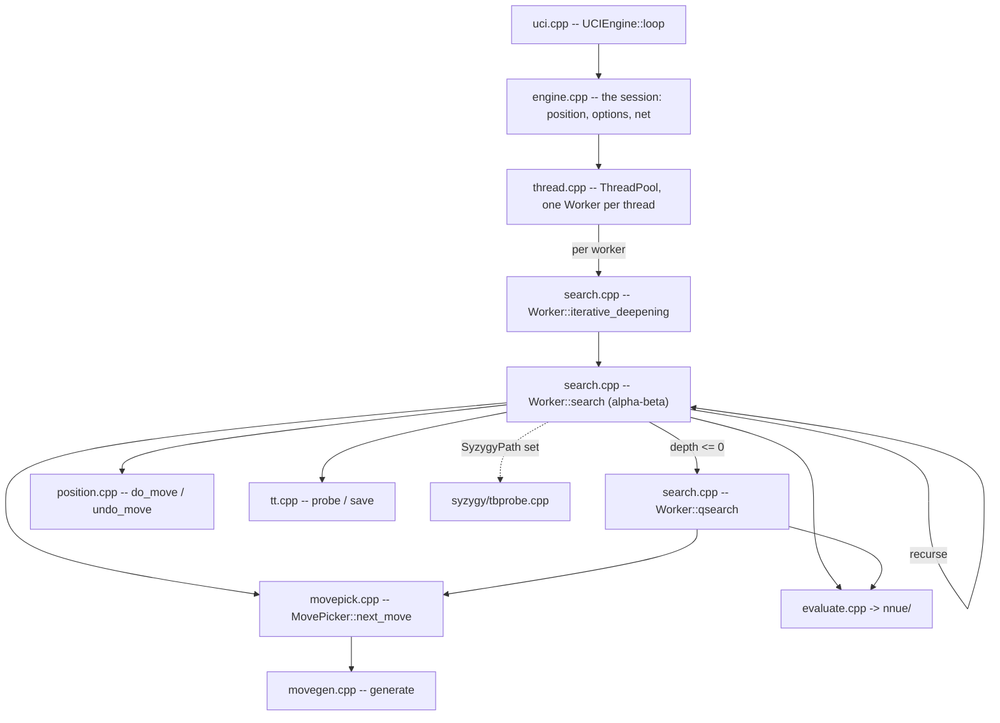

# Architecture

What is in `src/`, how one search flows through it, and what depends on what. For the gates
see [10-tooling-ci.md](10-tooling-ci.md); for building and usage see the
[wiki](https://github.com/official-stockfish/Stockfish/wiki).

This page states structure. Where a count would date it, it names the command instead.

## The layout

`src/` is **flat**: every translation unit sits at the top level except three groups that
have their own directory.

```sh
ls src/*.cpp src/*.h                    # the engine, flat
ls src/nnue src/nnue/features src/nnue/layers   # the network
ls src/syzygy                           # the tablebase prober
ls src/universal                        # runtime ISA dispatch entry points
```

| File | Owns |
|---|---|
| `types.h` | the value domain: `Color`, `Square`, `Piece`, `Move`, `Value`, `Key`, `Bitboard`, `Depth` |
| `bitboard.h/.cpp`, `attacks.h/.cpp` | square sets and the slider/leaper attack tables |
| `position.h/.cpp` | the board, `StateInfo`, `do_move`/`undo_move`, Zobrist keys, `see_ge` |
| `movegen.h/.cpp`, `movepick.h/.cpp` | move generation and the staged picker |
| `search.h/.cpp` | `Search::Worker`, iterative deepening, alpha-beta, quiescence |
| `history.h` | the history tables and their update rule |
| `tt.h/.cpp` | the transposition table |
| `timeman.h/.cpp` | the time budget |
| `evaluate.h/.cpp` | the evaluation entry point and its trace |
| `nnue/` | the network: feature transformer, accumulator, layers, feature sets |
| `syzygy/` | the tablebase prober |
| `thread.h/.cpp`, `thread_native.h` | the worker pool |
| `numa.h`, `shm.h`, `shm_unix.h`, `memory.h/.cpp` | NUMA topology, replication, shared memory, aligned allocation |
| `uci.h/.cpp`, `ucioption.h/.cpp`, `engine.h/.cpp` | the UCI transport, the option table, the session |
| `benchmark.h/.cpp`, `perft.h`, `score.h/.cpp`, `tune.h/.cpp` | bench positions, perft, score reporting, SPSA tuning |
| `misc.h/.cpp` | integer aliases, `prefetch`, `TimePoint`, `MultiArray`, `RelaxedAtomic`, `PRNG`, the logger, the `dbg_*` counters |
| `universal/` | per-ISA entry points for the runtime-dispatch binary |

**`src/Makefile` is the authority on what is compiled.** `SRCS` is an explicit list, not a
wildcard, so a file added to the directory and not to `SRCS` is in the tree and not in the
binary -- and it rots silently against the files that do move, which is the worst version of
the problem because it still looks maintained. Re-establish rather than trust:

```sh
comm -23 <(cd src && ls *.cpp nnue/*.cpp nnue/*/*.cpp syzygy/*.cpp | sort) \
         <(grep -oE '[a-z_/]+\.cpp' src/Makefile | sort -u)
```

## Startup

`main` (`src/main.cpp`) does four things in an order that is load-bearing:

```cpp
Attacks::init();      // slider and leaper tables
Position::init();     // Zobrist keys, from a fixed-seed generator
auto uci = std::make_unique<UCIEngine>(std::move(cli));
Tune::init(uci->engine_options());
uci->loop();
```

`Position::init()` must follow `Attacks::init()`: `Position::set` calls `set_check_info`,
which reads the attack tables. A `Position` built before them does not crash -- it reads
zeroed attack sets, finds no checkers and generates no piece moves, so the failure presents
as a search bug rather than a startup bug.

The network is **not** loaded here. It is a runtime input the UCI layer loads later, because
the UCI layer owns the `EvalFile` option. The binary resolves it relative to the working
directory, which is why the engine is run from `src/`.

## How a search flows



`uci_loop` parses `go` into a `LimitsType`; `ThreadPool::start_thinking` hands it to every
`Worker`; each runs `iterative_deepening`, which recurses through `search` and drops into
`qsearch` at depth zero. Move ordering comes from `MovePicker`, leaf scores from the NNUE.

The search allocates nothing per node: move lists are automatics, and the transposition
table, the accumulator stack and the refresh cache are allocated once outside any search.

## What depends on what

**There is no declared dependency direction and nothing enforces one.** That is the single
most useful thing to know before moving code, so it is stated plainly rather than left to be
discovered.

Concretely, at the time of writing:

- **The engine core depends on the UCI frontend.** `evaluate.cpp` includes `uci.h` for
  `UCIEngine::to_cp`, used inside `Eval::trace` to render centipawns; `position.cpp` includes
  it for `UCIEngine::square`. Both are string formatting, and both are real -- `iwyu` runs in
  CI, so these are used includes rather than leftovers.
- **`Search::Worker` holds the frontend as members**: `const OptionsMap&`, `ThreadPool&`,
  `TranspositionTable&` and the network reference (`src/search.h`). Linking the search means
  linking the option model and the thread pool; there is no way to drive a search without a
  process around it.
- **`numa.h` carries its implementation in the header** and includes `shm.h`, which includes
  `shm_unix.h`. `search.h` includes `numa.h`, so the shared-memory and NUMA subsystems reach
  everything that includes `search.h`.
- **`types.h` includes `tune.h` after its own `#endif`**, deliberately outside the include
  guard and commented "Global visibility to tuning setup". Anything that touches `types.h` or
  the tunable constants has to account for it.
- **`types.h` includes `misc.h`**, so the fundamental type header depends on the utility
  grab bag.

Measure the header closure rather than trusting a number here:

```sh
cd src && g++ -std=c++17 -E -I. search.cpp | grep -c ''
```

Note when reading that figure that **the standard library dominates it** -- over 90% of the
preprocessed lines of a translation unit come from system headers, so the project header
closure is a coupling fact and not a build-time one.

## Concurrency

Lazy SMP: every `Worker` searches the same tree independently and they share the
transposition table, the history tables and a stop flag. The sharing is **deliberately racy**
and the races are typed rather than left undefined -- see `RelaxedAtomic` in `src/misc.h` and
its uses in `search.h`, `history.h`, `thread.h` and `tt.cpp`.

`bench` is single-threaded, so every value gate in [10-tooling-ci.md](10-tooling-ci.md) stays
green while a data race is present. The sanitizer lanes are what cover it.
