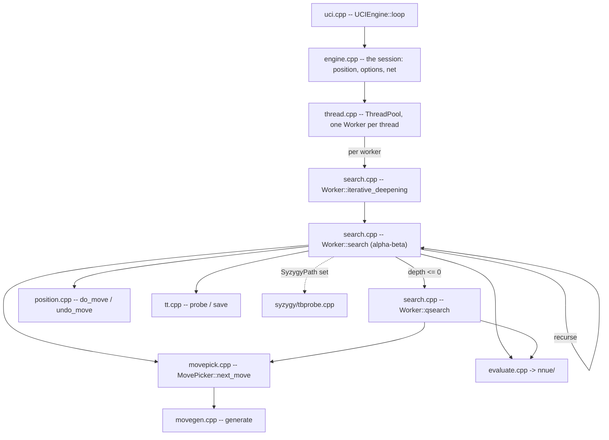

# Architecture

What is in `src/`, how one search flows through it, and what depends on what. For the gates
see [10-tooling-ci.md](10-tooling-ci.md); for building and usage see the
[wiki](https://github.com/official-stockfish/Stockfish/wiki).

Audience: anyone changing more than one file.

## Where a thing lives

| question | file | symbol |
|---|---|---|
| where the process starts | `src/shell/main.cpp` | `main` |
| where a UCI command is dispatched | `src/shell/uci.cpp` | `UCIEngine::loop` |
| where `go` becomes a budget | `src/shell/uci.cpp` | `UCIEngine::parse_limits` |
| where an option is declared and defaulted | `src/shell/engine.cpp` | the `options.add` calls in `Engine::Engine` |
| where the host registers itself | `src/shell/engine.cpp` | `Engine::ArenaInstallerTag`, `Engine::resize_threads` |
| where a search is launched | `src/platform/thread.cpp` | `ThreadPool::start_thinking` |
| where the root loop is | `src/engine/search.cpp` | `Search::Worker::iterative_deepening` |
| where alpha-beta is | `src/engine/search.cpp` | `Search::Worker::search` |
| where quiescence is | `src/engine/search.cpp` | `Search::Worker::qsearch` |
| where time runs out | `src/engine/search.cpp` | `SearchManager::check_time` |
| where the answer is chosen across workers | `src/engine/search.cpp` | `Search::best_worker` |
| where the next move comes from | `src/engine/movepick.cpp` | `MovePicker::next_move` |
| where moves are generated | `src/engine/movegen.cpp` | `generate<GenType>` |
| where the board is mutated | `src/engine/position.cpp` | `Position::do_move`, `Position::undo_move` |
| where the table is read and written | `src/engine/tt.cpp` | `TranspositionTable::probe`, `TTWriter::write` |
| where a position is evaluated | `src/engine/evaluate.cpp` | `Eval::evaluate` |
| where the accumulator is updated | `src/engine/nnue/nnue_accumulator.cpp` | `AccumulatorStack::evaluate` |
| where the tablebases are probed | `src/engine/search.cpp` | `host.tb.probe_wdl`, in Step 6 |
| where memory comes from | `src/engine/arena.h` | `arena_alloc`, `arena_alloc_hinted` |
| where the process is ended on a fatal error | `src/engine/fatal.cpp` | `engine_abort` |

Every row is a `grep -n '<symbol>' <file>` away, and that is the check when one goes stale:
a row whose symbol the file no longer carries is a rename this table missed.

## The layout

**No translation unit sits at the top of `src/`.** Every source is in a zone directory, and
that placement is what assigns it a zone -- see [what depends on what](#what-depends-on-what).

```sh
ls src/engine src/engine/nnue src/engine/nnue/features src/engine/nnue/layers
ls src/platform src/platform/syzygy
ls src/shell
ls src/universal                        # runtime ISA dispatch entry points
ls src/incbin                           # vendored, not ours
```

The **Page** column is the routing: `here` means no zone page names the file, so this page is
the only description of it in the set.

| File | Owns | Page |
|---|---|---|
| `engine/types.h` | the value domain: `Color`, `Square`, `Piece`, `Move`, `Value`, `Key`, `Bitboard`, `Depth` | [01](01-engine-board.md), [09](09-type-design.md) |
| `engine/basetypes.h` | the type vocabulary: the integer aliases, `ValueList`, `MultiArray`, `TypedKey<KeySpace>`, `RelaxedAtomic`, `mul_hi64` | [09](09-type-design.md) |
| `engine/prng.h` | `PRNG`: the xorshift the Zobrist keys and the magic bitboards are seeded from | here |
| `engine/bitboard.h/.cpp`, `engine/attacks.h/.cpp` | square sets and the slider/leaper attack tables | [01](01-engine-board.md) |
| `engine/position.h/.cpp` | the board, `StateInfo`, `do_move`/`undo_move`, Zobrist keys, `see_ge` | [01](01-engine-board.md) |
| `engine/movegen.h/.cpp`, `engine/movepick.h/.cpp` | move generation and the staged picker | [01](01-engine-board.md), [02](02-engine-search.md) |
| `engine/search.h/.cpp` | `Search::Worker`, iterative deepening, alpha-beta, quiescence | [02](02-engine-search.md) |
| `engine/search_go.h/.cpp` | a depth-limited search from a FEN with no host registered, on one worker or on several | [02](02-engine-search.md) |
| `engine/searchoptions.h` | the option snapshot a worker is built from | here |
| `engine/history.h` | the history tables and their update rule | [02](02-engine-search.md) |
| `engine/tt.h/.cpp` | the transposition table | [02](02-engine-search.md) |
| `engine/timeman.h/.cpp` | the time budget | [02](02-engine-search.md) |
| `engine/evaluate.h/.cpp` | the evaluation entry point and its trace | [03](03-engine-eval.md) |
| `engine/nnue/` | the network: feature transformer, accumulator, layers, feature sets | [03](03-engine-eval.md) |
| `engine/score.h/.cpp` | the reported score, and the win-rate model (`win_rate_model`, `to_cp`) it is built from | [02](02-engine-search.md) |
| `engine/hashing.h` | `hash_bytes`, arithmetic over bytes with no OS in it, so both zones can call it: the net's content hash from `engine/`, the shared-memory segment name from `platform/` | here |
| `engine/arena.h`, `output_sink.h`, `tb_source.h`, `clock.h`, `parallel.h`, `worker_set.h`, `fatal.h` | the seams, catalogued below | here |
| `engine/host.h`, `host.cpp` | `Host`, a snapshot of all seven registrations, and `current_host()` which takes one | here |
| `engine/compiler.h` | what the COMPILER provides, not what the machine hosts: `RESTRICT`, `prefetch`, `IsLittleEndian`, `sf_always_inline`, `stringify`. In `engine/` for the same reason as `hashing.h` -- every zone spells the compiler, only the host spells the OS | here |
| `platform/memory.h/.cpp` | aligned and large-page allocation | [06](06-platform.md) |
| `platform/numa.h/.cpp`, `numa_shared.h`, `shm.h`, `shm_unix.h` | NUMA topology, replication, cross-process sharing | [06](06-platform.md) |
| `platform/thread.h/.cpp`, `platform/thread_native.h` | the worker pool and the native thread with a chosen stack | [04](04-multithreading.md), [06](06-platform.md) |
| `platform/syzygy/` | the tablebase prober | [05](05-tablebases.md) |
| `platform/text.h/.cpp` | turning the host's text into values: `split`, `is_whitespace`, `remove_whitespace`, `str_to_size_t`, `read_file_to_string` | here |
| `platform/misc.h/.cpp` | what only the shell asks for: the version strings, the logger, `CommandLine`, the utf-8 path conversions, the console | here |
| `shell/main.cpp`, `shell/uci.h/.cpp`, `shell/ucioption.h/.cpp`, `shell/engine.h/.cpp` | the UCI transport, the option table, the session | [07](07-shell.md) |
| `shell/benchmark.h/.cpp`, `shell/perft.h`, `shell/tune.h/.cpp` | bench positions, perft, SPSA tuning | [07](07-shell.md) |
| `shell/console.h/.cpp` | `sync_cout`, `sync_endl` and the `dbg_*` counters -- the shell's own terminal | here |
| `universal/` | per-ISA entry points for the runtime-dispatch binary | [06](06-platform.md) |

**`src/Makefile` is the authority on what is compiled.** `SRCS` is an explicit list, not a
wildcard, so a file added to a zone directory and not to `SRCS` is in the tree and not in the
binary -- and it rots silently against the files that do move, which is the worst version of
the problem because it still looks maintained. `./tests/buildcoverage.sh` is that check, and it
is a merge gate rather than something to re-derive by hand.

## Startup

`main` (`src/shell/main.cpp`) starts the engine in an order that is load-bearing:

```cpp
Attacks::init();      // slider and leaper tables
Position::init();     // Zobrist keys, from PRNG rng(1070372)

auto cli = CommandLine(argc, argv);
auto uci = std::make_unique<UCIEngine>(std::move(cli));

Tune::init(uci->engine_options());
uci->loop();
```

`Position::init()` must follow `Attacks::init()`, and two readers depend on it:
`Position::init` calls `attacks_bb` to enumerate the reversible one-piece moves the cuckoo table
is built from, and every later `Position::set` calls `set_check_info`, which calls
`both_attacks_bb`. Neither crashes on zeroed tables. The cuckoo table simply comes out empty, so
`upcoming_repetition` never fires, and a `Position` built too early finds no checkers and
generates no piece moves -- both present as a search bug rather than a startup bug.

**The network is loaded inside the `make_unique<UCIEngine>` line**, and no call in the block
says so. `Engine`'s member initialiser list runs `get_default_network()`, which is
`Network::load` with an empty path; an empty path becomes `EvalFile::defaultName`, and on that
path `load_internal` reads the EMBEDDED net out of `gEmbeddedNNUEData`. The directory loop that
follows is guarded on `evalFile.current != evalfilePath`, so a successful embedded load opens no
file at all.

The filesystem is reached only when `EvalFile` names something other than the default, or when
the embedded load failed. `Network::load` then tries, in order, the working directory, the
binary's own directory (`CommandLine::get_binary_directory`), and `DEFAULT_NNUE_DIRECTORY` if
the build defined one -- so where the binary is run from decides which file a non-default
`EvalFile` resolves to.

`OptionsMap::add` does not fire an option's on-change callback, so declaring `EvalFile` at
startup loads nothing. `setoption name EvalFile` is what reaches `Engine::load_network`, and
that path re-hands the replicas before clearing the pool, because `modify_and_replicate`
destroys every replica each worker still points into.

## How a search flows



`UCIEngine::parse_limits` (`src/shell/uci.cpp`) turns `go` into a `LimitsType`; `Engine::go`
resolves `searchmoves` and assigns the option snapshot; `ThreadPool::start_thinking` hands both
to every `Worker`; each runs `iterative_deepening`, which recurses through `search` and drops
into `qsearch` at depth zero. Move ordering comes from `MovePicker`, leaf scores from the NNUE.

The search allocates nothing per node: move lists are automatics, and the transposition
table, the accumulator stack and the refresh cache are allocated once outside any search.

## What depends on what

`src/` splits by responsibility, one directory each, and the stack is
`shell -> platform -> engine` with the engine at the bottom:

| Zone | Owns | May include |
| --- | --- | --- |
| **engine** | the chess library: types, bitboards, position, movegen, search, per-worker state, the TT, evaluation | nothing outside the engine |
| **platform** | the OS runtime: the clock, memory, threads, NUMA, shared memory | engine |
| **shell** | the process: `main`, the UCI loop, the option table, bench, tuning | engine, platform |
| **vendor** | `incbin/`, the vendored include-binary header, and `universal/`, the fat-binary entry shims | outside the dependency rules |

`platform` is not a layer *beneath* the engine: it is the runtime that hosts the engine, so it
may depend on engine types and not the other way round.

### What makes something a host service

The rule the tree actually follows is narrower than "touches the outside world", and it is worth
stating because the obvious reading gets a real case wrong:

> **A thing belongs to `platform` when it NAMES THE OPERATING SYSTEM.** Reaching the outside
> world through the language runtime does not move a file out of `engine/`.

```sh
grep -rnE '#include <(sys/|fcntl|unistd|windows|pthread|sched|dlfcn|signal)' src/engine/
```

returns nothing, and that is the rule holding rather than a coincidence.

**The worked example is the pair that looks inconsistent.** Both the network and the tablebases
are third-party files the engine reads, and only one of them is behind a seam:

| reader | how it reads | zone |
|---|---|---|
| `Network::load` | `std::ifstream` (`engine/nnue/network.cpp`) | **engine**, no seam |
| the tablebase prober | `::open`, `mmap`, `sys/mman.h` (`platform/syzygy/tbprobe.cpp`) | **platform**, behind `tb_source.h` |

`tb_source.h` says *"probing is disk I/O -- a platform service"*, which read on its own would put
the net loader in `platform` too. The distinction that decides it is not the disk, it is `mmap`:
one reader asks the OS to map a file, the other asks the standard library for a stream.
`enginelink.sh` draws the same line when it lets libstdc++, libc and pthread resolve while
refusing everything else.

**What that costs, stated rather than defended.** A host cannot substitute where the net comes
from. One holding it in memory -- a GUI, a sandbox with no filesystem, a harness wanting a
deliberately malformed net -- has to write a file for the engine to open, which is why
`tests/enginelink_main.cpp` and `tests/seams_main.cpp` both take a *directory* rather than bytes.
If a second reader ever wants that, the answer is a seam for the net's BYTES and not a move of
`network.cpp`.

A file's zone is **its directory**, so a new file joins a zone by where it is put, and one in
a directory the mapping does not name resolves to `unassigned` -- reported by both checks
rather than silently exempt. `tests/zones.sh` holds the mapping and both checks read it.

**Both edges out of the engine are checked at the include and again at the symbol**, and five
baselines are read together. `./tests/depcheck.sh` reads `#include` lines and asks three
questions, one per row -- `grep -n '^check_rule' tests/depcheck.sh` is the list:

| edge | baseline | holds |
|---|---|---|
| engine -> shell | `tests/depcheck.baseline` | one entry, `types.h -> tune.h`, deliberate rather than debt |
| engine -> platform | `tests/depcheck-platform.baseline` | empty |
| platform -> shell | `tests/depcheck-platform-shell.baseline` | empty |

`./tests/linkcheck.sh` asks the first two of those questions of symbols instead, against
`tests/linkcheck.baseline` and `tests/linkcheck-platform.baseline`, both empty. A baseline
expires in both directions -- an entry describing an edge that no longer happens fails too, so a
fixed edge cannot quietly stay listed as debt.

**The include check is not a weaker restatement of the link check.** `linkcheck` reasons about
symbols an object leaves undefined, and a dependency a header carries leaves none: an inline
function, a class used only as a member, a `constexpr` that folds. Three of those were found by
reading rather than by a gate -- the clock, `HugePageSize`, and the worker's NUMA token -- while
both `linkcheck` baselines read empty. `depcheck`'s platform rule is what reports that class.

**Both symbol baselines are empty**, so no engine object references a shell-defined or a
platform-defined symbol. That is a weaker statement than it sounds: `linkcheck.sh` intersects
symbol sets, so it cannot see a reference to a symbol nothing in the tree defines, and it
cannot see an inlined platform call at all -- an inlined function leaves no symbol reference,
and both baselines read empty while the engine calls it. `./tests/enginelink.sh` is the form
that admits no argument: it links `engine/` alone, against a stub `main` and nothing else, and
every symbol resolves or the link names what is missing.

Where the engine gets each of those services instead:

- **The UCI frontend.** The `info` line needs a win-rate reading and a formatted score. Neither
  is protocol: the win-rate model (`win_rate_model`, `to_cp`) is evaluation-domain knowledge
  fitted to fishtest statistics and lives in `score.h/.cpp`, and coordinate notation is
  `square_name` in `position.h/.cpp`. The renderers sit beside them.
- **The option model.** `Search::Worker` takes a `const SearchOptions&`, a snapshot of the
  option values the engine reads (`src/engine/searchoptions.h`), filled by the composition root
  before each search. Every field defaults to a working value, so the search can be driven
  without a UCI layer having said anything. `Engine::go` waits for the previous search to
  finish *before* assigning the snapshot, and that wait is not the one
  `ThreadPool::start_thinking` already does: the assignment happens first, and every live
  worker is reading the object it overwrites.
- **The platform.** Injection seams, catalogued below. In each the engine declares a hook, the
  readers in the zone go through it, and the host registers before the first search. One
  reader deliberately does not -- see the clock below.

**What is proven.** The engine links alone AND searches alone. `./tests/enginelink.sh` links the
engine objects with a host that registers nothing, then runs it: three depth-limited searches
through `Search::go` (`src/engine/search_go.h`), then the first of them twice more, because the
context is process-static and a repeat has to give the same move. Every seam default is
therefore exercised rather than merely reachable -- the arena allocates, the parallel-for clears
the transposition table inline, time management reads the clock, the tablebase source answers
"none loaded".

## What this branch is measured against

`master` tracks `upstream/master` and carries no work of its own. That makes it the pin, and
the pin needs no file:

```sh
git merge-base HEAD master        # the upstream commit this branch forked from
git rev-parse master              # what master currently is
git log master -1 --format='%h %ad %s' --date=short
```

**A recorded SHA would drift; a merge-base cannot.** For that reason `tests/perfcounters.sh`,
`tests/perfdecomp.sh` and `tests/match.sh` all default their base to the merge-base above, so a
measurement always names the commit it was actually taken against rather than one someone last
wrote down.

Two things follow, and both are checkable rather than asserted:

- **The bench signature must agree.** This branch is refactoring work, so `bench` on `master`
  and `bench` here print the same node total. When they stop agreeing, either a functional
  change landed here or upstream moved -- and every performance comparison between the two is
  VOID until it is resolved, which is what `tests/perfcounters.sh` and `tests/perfbudget.sh`
  both refuse on.
- **`master` moving is a fact, not a problem.** Rebasing onto a newer upstream changes the
  merge-base and therefore the comparison; the number is re-taken, not adjusted.

## The seams

Each is a struct of function pointers the engine owns, a getter, and a setter the host calls
once. `src/shell/engine.cpp` is the composition root.

| Seam | Hands over | Default, unregistered | Registered by |
|---|---|---|---|
| `engine/arena.h` | `alloc`, `alloc_hinted`, `free`, and `hugePageBytes` as a value | plain aligned allocation, `DefaultHugePageBytes` | `Engine::ArenaInstallerTag`, whose position is the guarantee |
| `engine/output_sink.h` | `line`, `debug_dump` | prints to stdout unsynchronised | `Engine::ArenaInstallerTag` |
| `engine/tb_source.h` | `ctx`, `max_cardinality`, `probe_wdl`, `rank_root_moves` | no tablebases loaded | `Engine::ArenaInstallerTag` |
| `engine/clock.h` | `now_us` | reads `std::chrono::steady_clock` in microseconds | nothing in `src/`; the default is the clock |
| `engine/parallel.h` | `num_threads`, `numa_nodes`, `thread_numa_map`, `run_on`, `wait_on` | runs the work inline | `Engine::resize_threads` |
| `engine/worker_set.h` | `ctx`, `start_searching`, `wait_for_search_finished`, `nodes_searched`, `tb_hits`, `count`, `at` | reports no workers | `Engine::resize_threads` |
| `engine/fatal.h` | `abort_now` | prints `reason` to `stderr` and exits, and prints nothing for an empty one | nothing in `src/`; `tests/seams_main.cpp` registers a recording handler to prove the routing |

**One seam member is a value rather than a function pointer.** `Arena::hugePageBytes` carries a
default member initialiser because every registration site fills an `Arena` by braced aggregate
initialisation, so a field a host forgets would be zero -- and zero is not a small huge page, it
is a comparison `ttBytes >= numa_nodes() * hugePageBytes * 8` that is true for every size. The
hint would then be set on every allocation and the run would still produce a number. Never
register a zero.

`ctx` on `TbSource` and `WorkerSet` is the host's own object, passed back to every call in the
struct: these two seams have state behind them, the other five do not.

**The fatal seam routes a POLICY, not a service.** The other six hand over something the host
does better; this one hands back a decision the engine was making on the host's behalf -- ending
the process. A host embedding the engine cannot survive a failed `Hash` resize while the engine
calls `exit()` itself, and its own error handling never runs.

Two properties of it that the compiler cannot carry:

- **`Fatal::abort_now` is not `[[noreturn]]` and cannot be.** The attribute appertains to a
  function declaration, and a member of function-pointer type is a variable declaration; clang
  refuses it outright and gcc accepts it silently, so spelling it there builds under one compiler
  and not the other. The guarantee lives on `engine_abort`, which terminates **after** calling out
  rather than trusting a handler to. Every caller is on a path that assumed it would not return,
  and several are themselves `[[noreturn]]`.
- **`reason` is what the engine still has to say.** A site that already emitted its diagnostic
  through a callback it was handed passes nothing and the default prints nothing.
  `Network::verify` is that site, and it is the one that shows saying and terminating are separable
  -- it says the right thing through the right channel and still takes the process down.

Three of its callers are reporting that an allocation failed, so they format their message with
`snprintf` into a stack buffer rather than a `std::string`: with `-fno-exceptions` a string that
cannot get its buffer aborts, and the report the operator needs is lost to a second failure inside
the first. Count them rather than trusting the number here:

```sh
git grep -n 'engine_abort(' -- src | grep -v 'engine/fatal'
```

A default must fail in one of three ways, and which one is a property of the service:

- **Same answer, slower.** The parallel-for runs the work inline; the clock still tells the
  time. Correct unregistered, not degraded.
- **Different answer, so refuse.** Fewer workers is not a slower search, it is another one. A
  worker set that silently searched with one thread when asked for eight would still produce a
  number, and the number would look fine.
- **Safe unregistered.** "No tablebases loaded" is exactly true of an engine with none.

**The seam hands over microseconds, and the resolution is load-bearing.** `syzygy_extend_pv`
(`src/engine/search.cpp`) budgets itself against `Move Overhead`, whose range starts at 0. In
whole milliseconds `2 * 0 > 0` is false, so a `TimePoint` seam lets that abort run a further
millisecond past its deadline; the sub-millisecond reading is what makes the comparison mean
anything at the bottom of the option's range. `TimePoint now()` truncates `now_us()`, so time
management keeps the type it is written in.

Microseconds and not nanoseconds because an `i64` of nanoseconds from a steady clock's epoch
runs out after 292 years and an `i64` of microseconds after 292,000. Nothing in the engine
resolves below a microsecond.

**Read a clock outside this seam and no gate will tell you.** A host clock is reached through
an inline function and leaves no undefined symbol, so `enginelink.sh` cannot see it and a
substituted clock gives a deterministic search with one wall-clock component in it. The
property is held by reading `grep -n 'chrono' src/engine/*.cpp`, which should name `clock.cpp`
and nothing else.

Two things are handed over without a seam struct, because both are read per node and an
indirect call there would cost more than the boundary is worth:

- **The stop and increase-depth flags** reach `Search::Worker` as `std::atomic<bool>&` through
  `SharedState`. A reference member's binding is fixed at construction; a pointer member is not,
  so any call that might alias the worker forces a reload.
- **The NUMA network replica** reaches the worker as `const Eval::NNUE::Network*`, resolved by
  `ThreadPool::ensure_network_replicated` and handed in, so the engine never learns the network
  is replicated.

### Declaration order is a correctness requirement, at both ends

`Engine`'s member list is load-bearing in both directions, because initialisation follows
declaration order and destruction follows it in reverse. The initialiser list decides neither
-- naming a member first there while declaring it lower down compiles, warns only under
`-Wreorder`, and runs it in declaration order anyway.

- **`Engine::ArenaInstallerTag` is declared first**, so its constructor runs before every
  member below it can allocate. A block taken from the engine's fallback allocator and released
  by the host's is heap corruption with no diagnostic.
- **`ThreadPool threads` is declared last**, so the workers it owns are destroyed before
  anything they hold references into. A `Search::Worker` binds `searchOptions` and `tt` by
  reference, one `SharedHistories` out of `sharedHists` by reference, the `Host` snapshot by
  reference, a pointer into a replica owned by `network`, and -- on the main thread -- a
  `SearchManager` holding `updateContext` by reference. Declare the pool higher up and those
  referents die while the workers still exist, and nothing diagnoses it.

- **`Host host` is declared between them and assigned in `Engine::resize_threads`**, not in the
  constructor. `current_host()` copies whatever is registered when it runs, so the assignment
  sits after `set_parallel_for` and `set_worker_set` and before `threads.set` builds the first
  `Worker`. Snapshot earlier and every worker reads the inline parallel-for and the refusing
  worker set for the life of the pool -- a search that runs, reports no workers and returns a
  plausible number, with nothing to diagnose it.

Neither end is expressible in the initialiser list, which is why `src/shell/engine.h` is where
the order is fixed and `src/shell/engine.cpp` says so rather than restating it.

`Engine::resize_threads` installs the parallel-for **before** `set_tt_size`, because the table
clears itself through it. Installing after clears a resized table single-threaded on the first
call and multi-threaded on every later one -- correct either way, and a performance cliff on
exactly the path that allocates gigabytes.

### What the seams cost

Nothing the gates can measure, and the reason is cadence. Re-establish it rather than trust it:

```sh
cd src && grep -cE 'worker_set\(\)|output_sink\(\)|arena\(\)|parallel_for\(\)|tb_source\(\)' \
  engine/movepick.cpp engine/evaluate.cpp engine/history.h
```

The hottest files reach no seam at all. Of the rest:

- `tt.cpp` touches `arena()` and `parallel_for()` only in `resize` and `clear` -- allocation and
  the parallel wipe, never the probe path.
- In `search.cpp` the only seam on the per-node path is the tablebase probe, spelled
  `host.tb.probe_wdl(host.tb.ctx, pos, &err)` and appearing once, and `tbConfig.cardinality`
  short-circuits before it, so an engine with no tablebases never reaches the call.
- The worker set is reached per node only through `SearchManager::check_time`, which decrements
  `callsCnt` and returns on every call but one in at most 512. Every other read is the root, the
  pool handoff or the info line -- `grep -n 'host\.workers' src/engine/search.cpp` lists them
  all, and only the two lines inside `check_time` are on a per-node path.

**The command above and the spellings differ, and both are current.** The getters it greps for
survive in the seam definition units and in the composition root that takes the snapshot, which
is what makes it a live check rather than one that reports a number by matching nothing; a
`Worker` reaches the same seams through its unpacked `const Host&`, which is why the file names
above spell them `host.<seam>`.

**The limit.** With `SyzygyPath` set, `probe_wdl` is a live indirect call where upstream made a
direct one, and **`bench` cannot see it** -- the bench list never probes, so a measurement there
measures the guard rather than the call. Every performance gate in
[10-tooling-ci.md](10-tooling-ci.md) drives `bench` by default, so none of them sets a
`SyzygyPath` and none of them costs this seam. `--syzygy DIR` is the answer, and
`grep -ln -e '--syzygy' tests/*.sh` names every gate that takes it: `perfbudget.sh` for
instructions, `perfdecomp.sh` and `perfcounters.sh` for the two axes that see a miss or a
mispredict, `fingerprint.sh` for the per-function call counts, and `match.sh` for games. Each
swaps the bench list for a probing workload. A change to this seam or to the reader behind it
quotes those cells, because every gate run without the option is blind to it.

### The include graph

`src/` is one flat link step, so a header reaches every translation unit that includes anything
including it. Four edges decide most of that closure:

- **`numa.cpp` carries the cold half of `NumaConfig`** -- topology discovery, the string forms,
  thread binding, all of it running before the first search. What stays in `numa.h` is
  template-bound and cannot move. **`search.h` names no NUMA type**, so the NUMA subsystem
  reaches the pool and the composition root and stops there:

  ```sh
  grep -nE 'NumaIndex|NumaReplicat|NumaConfig|numa\.h' src/engine/search.h   # nothing
  ```

  A `Search::Worker` takes a `HistoryBankIndex` -- a scoped enum over `usize`, an index into the
  engine's own map -- rather than a topology handle. It does hold `numaThreadIdx` and
  `numaTotal`, but those are plain `usize`: a position within a bank and the bank's size, used to
  cut the shared tables into slices one worker each clears. They travel to `shared_slice` as one
  `WorkerShare`, because two adjacent counts transposed keep the arithmetic working and hand
  every worker a different slice. They carry the host's grouping as two numbers, and nothing on
  the search path can ask what the grouping meant.
- **Shared memory does not ride along with it.** `LazyNumaReplicatedSystemWide` is the only user
  of `shm.h` in this family, and it lives in `numa_shared.h`, which includes both `numa.h` and
  `shm.h`. `shell/engine.h` owns one by value and includes `numa_shared.h`; `platform/thread.h`
  forward-declares it and only takes one by reference; `search.h` names neither the holder nor
  `numa.h`. So the shared-memory headers reach the files that own or pass one rather than every
  consumer of `search.h` -- re-establish it rather than trust it:

  ```sh
  grep -rl 'shm\.h' --include=*.h --include=*.cpp src
  ```

  What that prints is the DIRECT includers -- `platform/numa_shared.h`, where the one holder is
  declared, and `src/shell/engine.cpp`. `shell/engine.h` reaches `shm.h` transitively through
  `numa_shared.h` and does not appear, so a third name in that output is the signal, not a
  third name in an include line.

  `numa.h` includes `<variant>` directly, for the policy variant, so this edge cannot silently
  become the path a standard header arrives by.
- **`types.h` includes `tune.h` after its own `#endif`**, deliberately outside the include
  guard and commented "Global visibility to tuning setup". Anything that touches `types.h` or
  the tunable constants has to account for it. This one is **kept on purpose**: no committed
  file uses `TUNE(...)`, because the injection exists so that a developer tuning a parameter
  can drop a `TUNE(...)` line beside a constant without adding an include and remove it before
  the change lands. Removing the edge would tax every future SPSA run to buy a tidier include
  graph, so it stays, documented rather than silently odd.
- **`types.h` includes `basetypes.h`, not `misc.h`.** The type vocabulary it needs -- the
  integer aliases and `ValueList` -- lives in `basetypes.h`, so the fundamental type header
  does not pull the logger or `CommandLine` into every translation unit that touches a
  `Square`. `misc.h` holds no `usize` at all and does not include `basetypes.h`; the drawer's
  last one is in `misc.cpp`, inside `path_from_utf8`'s `_WIN32` branch, which is why that
  include carries an `IWYU pragma: keep` -- a Linux analyze lane never reaches the use and reads
  the include as unused. So a file that wants the type vocabulary names `basetypes.h` and gets
  nothing else.

- **`engine/` includes `platform/misc.h` nowhere, and the transitive half is the half that
  rots.** The things an engine file wants that have no OS in them are elsewhere by design:
  `RelaxedAtomic` and `mul_hi64` in `engine/basetypes.h`, `PRNG` in `engine/prng.h`,
  `sf_always_inline` and `stringify` in `engine/compiler.h`, which is the compiler header.
  The string helpers the NUMA code needs are `platform/text.h`, and **no header includes it** --
  `grep -rl 'text\.h' --include=*.h src` prints nothing. `numa.cpp` is the
  platform consumer, and the placement is the point: `numa.h` is a header the pool and the
  composition root include, so pointing *it* at the drawer would hand `CommandLine` and the
  logger to every file that reaches `numa.h` transitively, which no grep for a direct include
  reveals.

  Both directions are cheap to check, and the second needs `-H` rather than grep:

  ```sh
  grep -rl '"misc.h"\|/misc.h"' --include=*.cpp --include=*.h src/engine     # expect nothing
  cd src && echo '#include "engine/search.h"' > /tmp/t.cpp \
    && g++ -std=c++17 -I. -H -fsyntax-only /tmp/t.cpp 2>&1 | grep misc.h      # expect nothing
  ```

Measure the closure rather than trusting a number here:

```sh
cd src && g++ -std=c++17 -E -I. engine/search.cpp | grep -c ''          # total lines
cd src && g++ -std=c++17 -E -I. -H engine/search.cpp 2>&1 >/dev/null \
  | grep -c '\./\(engine\|platform\|shell\)'                           # project headers only
```

**The first figure is dominated by the standard library**, not by this tree, so it is a poor
proxy for build time and a poor way to score an include change. The second is the one an
include change moves: it counts what a change forces to be re-checked. Score an include change
on that, not on how many lines the preprocessor emits.

## Concurrency

Lazy SMP: every `Worker` searches the same tree independently and they share the
transposition table, the history tables and a stop flag. The sharing is **deliberately racy**
and the races are typed rather than left undefined -- see `RelaxedAtomic` in
`src/engine/basetypes.h`, and `git grep -ln RelaxedAtomic -- src` for every file that holds one.
`src/platform/thread.h` is not among them: the flags the pool shares with every worker are plain
`std::atomic<bool>`, handed over by reference through `SharedState`.

`bench` is single-threaded, so every value gate in [10-tooling-ci.md](10-tooling-ci.md) stays
green while a data race is present. The sanitizer lanes are what cover it.
