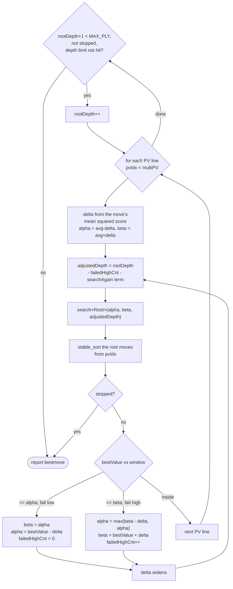

# The search

`src/engine/search.h`, `src/engine/search.cpp`, `src/engine/tt.h`, `src/engine/tt.cpp`, `src/engine/history.h`,
`src/engine/movepick.h`, `src/engine/movepick.cpp`, `src/engine/timeman.h`, `src/engine/timeman.cpp`, `src/engine/score.h`,
`src/engine/score.cpp`.

Alpha-beta with a transposition table, a staged move picker, history-driven ordering and a
pruning set. Every margin, reduction and bonus named here is a tuned constant: read the value
from the source, which is the only place it is current.

Audience: search.

## `tt.cpp` -- the transposition table

A flat array of 32-byte `Cluster`s, three `TTEntry` per cluster plus two bytes of padding.
The size is asserted:

```cpp
static constexpr int ClusterSize = 3;
static_assert(sizeof(Cluster) == 32, "Suboptimal Cluster size");
```

**The cluster is sized to divide a cache line**, so probing one position touches one line.
The cluster count is `mbSize * 1024 * 1024 / sizeof(Cluster)`, and it decides which positions
collide -- two engines with the same table size and different cluster arithmetic search
different trees.

An entry packs a 16-bit key fragment, a move, a value, a static eval, a depth offset from
`DEPTH_NONE`, and a byte holding the generation, the bound and the PV flag. Sixteen bits of
key is not a full check: **collisions are accepted**. A wrong entry costs a wrong move
ordering and is caught by the search, and paying eight bytes per entry to avoid it would cost
more in cache than it saves in accuracy.

`is_occupied()` reads `depth8`, which is why `DEPTH_UNSEARCHED` and `DEPTH_NONE` are negative
and distinct -- an entry that stored no search must still be distinguishable from an empty
slot.

**The table is shared across threads with no lock.** Entries are written and read
concurrently; a torn entry is possible and tolerated. `RelaxedAtomic` in `src/engine/basetypes.h` is what
keeps that defined rather than undefined behaviour. See
[04-multithreading.md](04-multithreading.md).

Replacement weighs depth against age: a shallow entry from an old generation is the cheapest
thing to lose. The generation counter advances per search, so an entry's `relative_age`
grows without the table needing a sweep.

`value_to_tt` / `value_from_tt` convert a mate score between root-relative and node-relative
form. A mate score stored at one ply means a different thing when read at another, and the
conversion is what makes the stored number reusable.

## `history.h` -- the ordering tables

Every table is a **gravity** table, and one operator is the whole mechanism:

```cpp
void operator<<(int bonus) {
    int clampedBonus = std::clamp(bonus, -D, D);
    T   val          = *this;
    *this            = val + clampedBonus - val * std::abs(clampedBonus) / D;
}
```

The update moves the stored value toward the bonus by an amount proportional to how far it
still is from the clamp `D`. **A value saturates smoothly instead of pinning.** A table that
simply added and clamped would lose the ordering between two moves that had both reached the
ceiling, and that ordering is most of what the table is for.

`D` is a template parameter, one per table, so a bonus and the clamp it belongs to cannot be
transposed at a call site.

| Table | Indexed by |
|---|---|
| `ButterflyHistory` | colour, from-to |
| `LowPlyHistory` | ply, up to `LOW_PLY_HISTORY_SIZE`, and from-to |
| `CapturePieceToHistory` | moving piece, destination, captured type |
| `PieceToHistory` (a continuation plane) | moving piece, destination |
| `PawnHistory` | pawn-key row, piece, destination |
| `UnifiedCorrectionHistory` | a key row, then colour, giving one `CorrectionBundle` |
| `CorrectionHistory<PieceTo>` / `<Continuation>` | moving piece and destination, and a plane of those per previous move |
| `TTMoveHistory` | a single entry |

Each table's `D` is a tuned constant and moves with tuning patches, so read it from the
declaration rather than from here:

```sh
grep -nE 'using [A-Za-z]+History' src/engine/history.h
```

The four correction counters share one `CorrectionBundle` per row, and `SharedHistories`
hands out the **counter** rather than the row: `pawn_correction(pos, us)`,
`minor_piece_correction(pos, us)`, and `nonpawn_correction<c>(pos, us)`, which is templated on
the colour whose key selects the row and so yields the remaining two counters. Each picks the
key and the field in one place, so a caller cannot pair one key's row with another key's
field. `Position::do_move` prefetches the four counters, written out at the call site.

`Search::Worker::do_move` prefetches two more, and they are a different pair: the
continuation-correction entries the *child* will read, taken from the parent's
`(ss - 1)` and `(ss - 3)`. The child reads `(ss - 2)` and `(ss - 4)`, and child `ss` is
parent `ss + 1`, so the addresses match exactly for a normal move -- castling and promotion
prefetch an approximation and land on an unused line. Keep the two offsets in step with the
reads in `correction_value`: shifting one without the other costs the prefetch silently,
because a prefetch to the wrong line is not a fault and no gate can see it.

`ContinuationHistory` is a `MultiArray<PieceToHistory, PIECE_NB, SQUARE_NB>`: a plane per
(piece, destination) of the *previous* move, each plane itself a history over the current
move. That is what lets the ordering say "after a knight lands on f3, this reply has worked".

`PawnHistory` is a `DynStats` sized from `PAWN_HISTORY_BASE_SIZE`, which is asserted to be a
power of two because the index is a mask of the pawn key rather than a modulus.

**The split between per-worker and shared decides the entry type.** `mainHistory`,
`lowPlyHistory`, `captureHistory`, `continuationCorrectionHistory` and `ttMoveHistory` are
`Worker` members, touched by one thread. The rest arrive through `SharedHistories&`, shared
between the workers the host put in the same bank ([04-multithreading.md](04-multithreading.md))
-- and those are the ones whose entries carry
`StatsEntry`'s `Shared = true`, reached as `AtomicStats` for the continuation and pawn planes
and spelled out inside `CorrectionBundle` for the four correction counters. That makes the
entry a `RelaxedAtomic<T>`, so the race is defined rather than undefined
([04-multithreading.md](04-multithreading.md)). Moving a table across that line means changing
its type, not just its owner.

## `movepick.cpp` -- the staged picker

Moves are produced in the order the search wants to try them, and **each stage is generated
only when the previous one runs out**. Most nodes cut off on the transposition move or the
first good capture, so generating the quiet moves for those nodes would be most of the
generator's cost spent on moves nobody looks at.

Four sequences, chosen by what the node is:

```
main search   MAIN_TT -> CAPTURE_INIT -> GOOD_CAPTURE -> QUIET_INIT
                      -> GOOD_QUIET -> BAD_CAPTURE -> BAD_QUIET
in check      EVASION_TT -> EVASION_INIT -> EVASION
probcut       PROBCUT_TT -> PROBCUT_INIT -> PROBCUT
quiescence    QSEARCH_TT -> QCAPTURE_INIT -> QCAPTURE
```

In check there is no capture/quiet split: every evasion is generated at once, because there
are few of them and skipping any is unsound.

The stage is entered by arithmetic rather than a branch:

```cpp
stage = EVASION_TT + !(ttm && pos.pseudo_legal(ttm));
```

A transposition move that is not pseudo-legal in this position -- which a 16-bit key
collision can produce -- skips the stage rather than being played.

Selection is one element per call, not a sort. A full sort would order moves the search never
reaches. The `skipQuiets` flag is a member `next_move` re-reads on every call rather than an
argument fixed at construction, because the search sets it mid-node through
`MovePicker::skip_quiet_moves`, called from Step 14, and the picker has to honour that from the
next call on.

## What a worker is given

`Search::SharedState` is everything a `Search::Worker` is built from. Six members: a
`const SearchOptions&` snapshot, the transposition table, the shared history banks, a
**`const Host&`**, and the two `std::atomic<bool>&` flags every worker watches. The seams are in
[00-architecture.md](00-architecture.md); what this page owns is what the search does with them.

**The `Host` does not stop here.** `Worker` holds no `SharedState` -- it unpacks one at
construction, and `host` is unpacked with the rest onto `Worker::host`, which is the whole point
of carrying it. A reference member's binding is fixed at construction, so a handle that reached
only `SharedState` would leave every node dereferencing through the pool's copy; unpacked, the
compiler can hoist the address out of the node loop. `search.h`'s own comment states it.

**The lifetime rule follows from the copy.** A `SharedState` is copied by value into
`ThreadPool::set` and dropped there, so every referent it holds must outlive the *Workers*, not
the pool. That is the same rule `shell/engine.h` states for the option snapshot, for the same
reason, and it is a third constraint on declaration order in that file.

The shape is affordable because of where the seams sit on the clock. Only the tablebase source
is on the node path; the worker set is second, at one node in 512 through `check_time`; the
other five are setup or info-line cadence. A seam whose cadence is a search rather than a node
costs nothing measurable however it is reached.

**A worker is legal before a network exists.** `Engine` sizes the pool while `EvalFile` is still
empty, so `Worker::network` is a `const Eval::NNUE::Network*` that starts null and
`Worker::clear` skips the refresh cache while it is. The cache is seeded from the net's
feature-transformer biases, so it is the one part that cannot be filled early;
`ensure_network_replicated` fills it after a load, and `Worker::evaluate` cannot be reached
before then.

**`SearchManager` is valid the moment it exists.** Its constructor binds only `updates`, so
every scalar member carries an initial value in the declaration: `ponder`, `stopOnPonderhit`,
`callsCnt`, `originalTimeAdjust`, `previousTimeReduction`, `bestPreviousScore`,
`bestPreviousAverageScore`. Two members need none and are exceptions of different kinds:
`iterValue`, which `iterative_deepening` fills before the first read, and `tm`, which carries
its own initialisers for `availableNodes` and `useNodesTime` and has `startTime` written by
`TimeManagement::init` at the top of every search. `tm`'s `optimumTime` and `maximumTime` get
no initialiser and no write when `init` returns early on a search with no time control -- they
are read only under `limits.use_time_management()`, which is exactly the case that skips the
early return. Leave the scalars to the caller and a manager searched without
`ThreadPool::start_thinking` reads indeterminate storage -- and `ponder` is a boolean, for
which a byte that is neither 0 nor 1 is undefined behaviour rather than a wrong answer.

## `Search::go` -- searching without a host

`Search::go` (`engine/search_go.h`) runs one depth-limited search from a FEN and needs no host
registered. It exists so the defaults can be **run**, not merely linked: `tests/enginelink.sh`
and `tests/fuzzsearch.sh` are both built on it.

Each call is independent. `HeadlessRunner::run` resets the manager's cross-search state per
call -- `ThreadPool::clear`'s reset plus `start_thinking`'s two per-`go` fields -- because
carrying it seeds the aspiration window from whatever was searched last. That is right for
successive `go` commands on one engine and wrong for a driver that walks to an unrelated
position each iteration, where it costs whole seconds on a search that should take
milliseconds.

Worker 0 holds the `SearchManager` and is the main worker: only the main worker applies the
depth cap and drives the aspiration loop. The rest hold a `NullSearchManager`, exactly as the
pool builds them.

**A `Worker` holds the manager twice, and the second one is the typed view.** `ManagerSlot`
pairs the owning `unique_ptr<ISearchManager>` with a `SearchManager*` that is null on every
worker but the main one, and `main_manager()` reads that pointer. It used to be a
`static_cast` down the hierarchy guarded by an assert on `threadIdx`, and `-DNDEBUG` is what
ships -- so a release build handed any other worker a `SearchManager*` aimed at a
`NullSearchManager`, whose members do not exist. The pair is filled by `make_main_manager` or
`make_null_manager` and by nothing else, at the one point where the type is still known, so the
two halves cannot disagree.

`Worker` stores the `unique_ptr` at its original offset and the typed pointer **last in the
class**. That is deliberate: every member between them is on the per-node path, and storing the
pair where the `unique_ptr` sat shifted all of them by eight bytes. A type that enforces an
invariant does not have to be the storage layout.

**Both implementations are `final`, and that is a codegen decision rather than a style one.**
Nothing derives from either, and without it the compiler cannot prove what a `SearchManager*`
points at: the call in `search()` was an indirect vtable dispatch at every one of its three
inlined copies and is a direct call at all three now.

**`NullSearchManager::check_time` is never called.** The only call site is guarded by
`is_mainthread()` -- which is the branch the Null Object Pattern exists to remove, so here both
the branch and the null object are present. The hierarchy stays because removing it is a taste
argument, but do not credit it with work it is not doing.

The heavy blocks are process-static and reused, so it is **not reentrant**: one search at a
time, and two callers at once share one root position. Changing the worker count rebuilds them,
which is not cheap -- a `Worker` embeds the NNUE refresh cache -- so alternating counts per call
is not a pattern to build on.

### More than one worker

It takes a worker count, and **a count it cannot honour is refused rather than attempted**.

The non-main workers are dispatched through the parallel-for seam, which is where the host's
threads already are. That seam was always two calls rather than a fork-join:

```cpp
void (*run_on)(usize thread, std::function<void()> fn);
void (*wait_on)(usize thread);
```

so a helper can be started before the main worker searches and waited for after it has raised
the stop flag -- which is the order `Worker::start_searching` requires. Host thread 0 is
skipped, because the caller is running the main worker on it, exactly as
`ThreadPool::start_searching` skips its own.

The built-in parallel-for runs the job **inline**, and an inline helper never returns: the
depth cap tests `mainThread` (`search.cpp`), a non-main worker has none, so it searches to
`MAX_PLY` waiting for a stop the caller cannot reach the line to raise. So a count above what
`parallel_for().num_threads()` reports comes back `std::nullopt`. Attempting it hangs rather
than degrades, and **a hang is not a report**: it would take a gate down instead of failing it.

Above one worker a `WorkerSet` over those workers is registered for the duration of the call
and whatever was there before is put back. At one worker nothing is registered at all, which is
the configuration `enginelink.sh` exists to exercise. `nodes` is the whole search's count --
the main worker's alone at one worker, the sum over the set above one; reporting the main
worker's own would describe a two-worker search as having done half its work.

## `search.cpp` -- the driver

`Worker::iterative_deepening` is what every thread runs, and it is three nested loops rather
than one. `search<Root>` is called from the innermost, so a single root position is searched
many times.



Three things the shape makes visible:

- **A fail high shrinks the depth it re-searches at.** `adjustedDepth` subtracts
  `failedHighCnt`, so each successive fail high at one root depth searches shallower. A node
  that keeps failing high is one whose value is not yet bracketed, and re-searching it at full
  depth repeatedly would spend the iteration on it.
- **A fail low does not.** It resets `failedHighCnt` to zero and moves `beta` down to the old
  `alpha`, because a fail low means the move is worse than believed and the search needs the
  full depth to find out how much. Both branches keep the window one-sided rather than
  reopening it: a fail high raises `alpha` to `beta - delta` as well as lifting `beta`, so
  the re-search is still narrow.
- **The sort must be stable.** Every root move but the first and the new best is set to
  `-VALUE_INFINITE`, so an unstable sort would reorder moves that compare equal and lose the
  ordering the previous iteration established. Under MultiPV it would also disturb the lines
  already searched.

`delta` starts from the move's own `meanSquaredScore` and from `threadIdx`, so **threads
begin with different window widths** -- one of the ways Lazy SMP diverges
([04-multithreading.md](04-multithreading.md)).

Output during a fail is throttled by node count rather than depth: a re-search only reports
past a node threshold, because depth is reached quickly at the start of a search and some GUIs
do not cope with the volume.

## `search.cpp` -- the node

`Worker::search<NodeType>` is a single function structured as 21 numbered Steps, and it is
the largest in the tree:

```sh
awk '/^Value Search::Worker::search\(/{s=NR} s && NR>s && /^}/{print NR-s+1; exit}' \
  src/engine/search.cpp
```

`NodeType` is a template parameter -- `NonPV`, `PV`, `Root` -- so the PV-only bookkeeping is
compiled out of the zero-window instantiation, which is the overwhelming majority of nodes.

The Steps, in the order the node applies them:

| Step | What |
|---|---|
| 1 | initialise the node |
| 2 | aborted search, immediate draw |
| 3 | mate-distance pruning |
| 4 | transposition lookup |
| 5 | static evaluation, corrected |
| 6 | tablebase probe |
| 7 | razoring |
| 8 | futility pruning (child node) |
| 9 | null-move search with verification |
| 10 | internal iterative reduction |
| 11-12 | ProbCut |
| 13 | the move loop |
| 14 | pruning at shallow depth |
| 15 | extensions, including singular |
| 16 | make the move |
| 17 | late move reduction |
| 18 | full-depth search when LMR is skipped |
| 19 | undo |
| 20 | new best move |
| 21 | mate and stalemate |

What each pruning rule assumes, since that is what decides when it is unsound:

- **Razoring** -- so far below alpha at low depth that a quiescence search is enough to
  confirm it.
- **Futility** -- so far above beta that giving away material could not bring it below.
- **Null move** -- if passing still fails high, the real move will too. The assumption fails
  in zugzwang, which is why it is skipped when the side to move has no non-pawn material.
- **Internal iterative reduction** -- a node with no transposition move has no ordering to
  work with, so searching it at full depth mostly wastes the effort.
- **ProbCut** -- a capture that beats beta by a margin at reduced depth probably beats it at
  full depth.
- **Singular extension** -- if the transposition move is much better than every alternative,
  the node hinges on it and it is searched a ply deeper. "Much better" is measured by
  re-searching with that move *excluded*. The same search yields multi-cut when the node
  fails high anyway.
- **LMR** -- late moves in a well-ordered list are unlikely to be best, so they are searched
  shallower, with a re-search at full depth if the reduced search beats alpha.

**The static evaluation is corrected before any of this.** Correction-history tables record
how far the evaluation of positions sharing a pawn structure, a minor-piece configuration or
a non-pawn material count has historically been from what the search actually found, and the
node starts from the corrected value.

`qsearch` is the same shape in 9 Steps: stand-pat, then captures and promotions only, until
the position is quiet enough for the evaluation to mean something.

## `timeman.cpp` -- the budget

Two numbers. The **optimum** is the point past which a new iteration should not be started --
stopping between iterations is free, because the last completed one already has a best move.
The **maximum** is the point past which the search stops wherever it is.

The optimum is scaled between iterations by evidence about whether the current answer can be
trusted: a falling evaluation buys time, a best move stable across iterations sells it back,
best-move changes pooled across threads buy it, and a best move that already accounts for
most of the tree has little left that could displace it. The product is always clamped by the
maximum.

**Under `nodestime` the clock is not a clock.** Remaining time, increment and move overhead
are multiplied into node counts and the search is measured against nodes searched. The `time`
a GUI is told stays real milliseconds -- it asked how long the engine thought, not how the
engine chose to count.

**No clock read is on the per-node path.** The hottest goes through
`TimeManagement::elapsed_time` from `check_time`, which returns on every call but one in at
most 512; the others on that route are `Worker::elapsed` once per depth iteration and
`output_pv` once per info line. The rest are colder still and do not go through `elapsed_time`
at all: one reading per `go` for `LimitsType::startTime`, a few around the bench loop, and two
function-local statics that initialise once. Reading a clock is a syscall on some platforms,
and at millions of nodes per second the granularity is well under a millisecond either way. A
new reader in the node body would turn the `clock.h` seam into a per-node indirect call.

## `score.cpp` -- what a reported score means

The search works in units whose scale is a property of the network. Reporting them raw would
make `cp 200` mean something different after every net change, so the reported centipawn is
defined through a model fitted to real game results, whose parameters depend on the material
left on the board. The same internal evaluation therefore reports lower in an endgame, where
there is less left to convert it with. `UCI_ShowWDL` reads the same model.

Three kinds of score stay distinct rather than being flattened: a **mate** is a distance, a
**tablebase verdict** is a fact reported above any evaluation and below any mate, and
everything else is an estimate. Only the estimate goes through the model.

## `Skill` -- playing below full strength

A weakened engine must not simply search less deeply, because that produces an opponent that
blunders at random -- no easier to plan against and no more fun to play. The engine searches
at full strength, keeps several principal variations behind the GUI's back, and picks among
them with a bias that widens as the level drops, so every move it plays is one it genuinely
considered.

`UCI_Elo` wins over `Skill Level` when `UCI_LimitStrength` is set: a GUI asking for a rating
has asked the more specific question. The polynomial mapping one to the other is a fit
against real games, anchored to a named opponent, so the ratings mean ratings rather than
being a scale of the engine's own invention.
