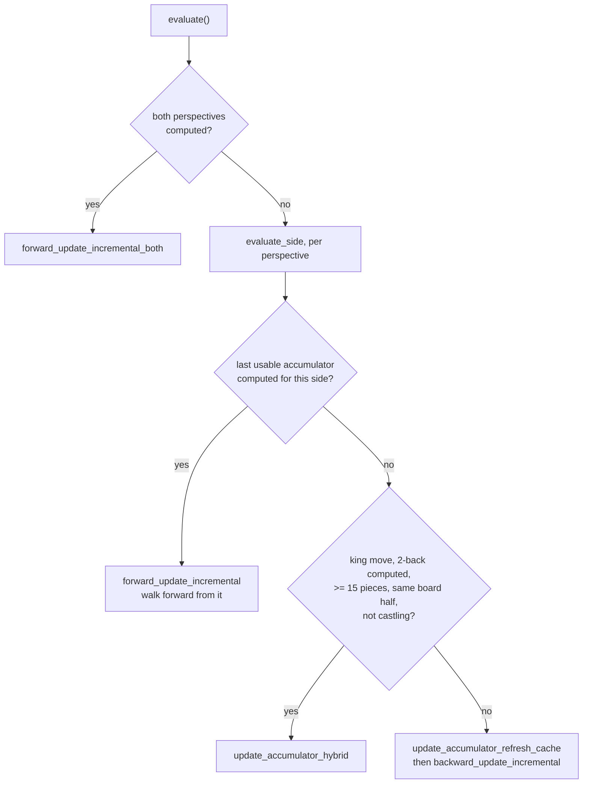

# The evaluation

`src/engine/evaluate.h`, `src/engine/evaluate.cpp`, `src/engine/nnue/` -- the feature transformer, the
accumulator, the layers, and the feature sets under `src/engine/nnue/features/`.

A neural network evaluates the position. `evaluate.cpp` turns its output into the value the
search uses.

Audience: evaluation and NNUE.

## The network, shape first

```
features -> accumulator (L1 = 1024, per perspective)
         -> fc_0  ->  L2 = 32   (SqrClippedReLU + ClippedReLU, concatenated)
         -> fc_1  ->  L3 = 32
         -> fc_2  ->  1
```

`L1` is the transformed feature dimension, the width of the accumulator. `L2` and `L3` are
32. The dimensions live in `nnue/nnue_architecture.h` and are hashed into the network file's
identity -- a net trained for one shape cannot be loaded into another.

Everything is integer arithmetic. Weights are quantised, and `WeightScaleBits` fixes where
the binary point sits, so the layers are `int8`/`int16` multiplies with a shift rather than
floating point. That is what makes the forward pass fast enough to run at every leaf.

## The accumulator is the whole design

The first layer is enormous -- 1024 outputs over a feature space with tens of thousands of
inputs -- and evaluating it from scratch at every node would dominate everything else.

It is never evaluated from scratch. The accumulator holds the first layer's output for the
current position, and a move **updates** it: the features that turned off are subtracted and
the features that turned on are added. A move changes a handful of features, so the update is
a few vector operations instead of a full matrix multiply.

This is why `Position::do_move` records a `DirtyPiece`: the accumulator update needs to know
exactly what changed, and reconstructing that from two board states would cost more than the
update saves.

`src/engine/nnue/nnue_accumulator.cpp` is the largest file under `src/engine/nnue/` because this is where
the engine's time goes.

**The stack** holds one accumulator per ply, so unmaking a move is a pop. **Evaluation is
lazy**: an accumulator is brought up to date only when someone asks for it, so plies pruned
without being evaluated never pay. `find_last_usable_accumulator` walks back to the nearest
usable state, which is either a computed one or the state just before a change that forces a
refresh.

Bringing that state forward is not a two-way choice. `AccumulatorStack::evaluate_side` picks
between three, and the caller has a fast path when both perspectives are already computed:



**A king move invalidates everything** under a king-bucketed feature set, because every
feature is indexed relative to the king square -- but only when the king crosses a bucket
boundary. The hybrid guard tests `(from & 0b100) == (to & 0b100)`, which is bit 2 of the
square index: the file bit that decides which half of the board the king is on, and therefore
which side of the horizontal mirror its bucket sits on. A king move inside one half keeps the
bucket, so the hybrid path can reuse the accumulator from two plies back instead of
refreshing.

**The refresh cache** (`AccumulatorCaches`) is what makes the last branch affordable. Each
`Entry` holds an accumulation, its PSQT counterpart, and the `pieces` array and `pieceBB` it
was computed from, so a refresh diffs against that cached board rather than starting from the
biases -- usually a handful of features rather than all of them.

The `MIN_PC_COUNT_HYBRID` guard of 15 pieces is why the hybrid path is an opening and
middlegame optimisation: with few pieces left a refresh is cheap enough that the extra
bookkeeping does not pay.

## The feature sets

Three, under `src/engine/nnue/features/`:

| Set | What it encodes |
|---|---|
| `half_ka_v2_hm` | the classic: (king square, piece, piece square), one perspective per side, mirrored horizontally |
| `full_threats` | which pieces attack which -- the tactical relationships a static piece-square encoding cannot see |
| `pp_3wide` | pawn-pair structure |

"Half" means one perspective: the accumulator is computed twice, once from each side's point
of view, and the side to move decides which half is read first. "hm" is the horizontal
mirror, which halves the weight table by folding files a-d onto e-h.

The threat features are why `do_move` maintains a `DirtyThreats` list beside `DirtyPiece`:
moving one piece can change many threat relationships, and the bound is worked out in
`types.h`:

> A piece can be involved in at most 8 outgoing attacks and 16 incoming attacks. Moving a
> piece also can reveal at most 8 discovered attacks. This implies that a non-castling move
> can change at most (8 + 16) \* 3 + 8 = 80 features.

`DirtyThreatList` is sized 96 -- 80 plus 16 spare, so that vectorised stores near the end of
the list can write past it without bounds checking.

## The layers, and the sparsity trick

`fc_0` is `AffineTransformSparseInput`. After the clipped ReLU most of the 1024 accumulator
outputs are **zero**, and multiplying by zero is work that can be skipped. The layer builds an
index list of the non-zero inputs (`nnz_helper.h`) and multiplies only those columns.

The activation is a concatenation of two functions of the same input -- `SqrClippedReLU`
alongside `ClippedReLU` -- so the network gets a quadratic term without a second layer.

`src/engine/nnue/simd.h` carries the vector kernels, with a path per ISA. **Which path compiles
changes the instruction sequence but must not change the result**: every architecture in the
compile matrix has to reproduce the same bench signature, and that is what catches a
saturation or narrowing that behaves differently at one vector width.

## `evaluate.cpp` -- from network output to a search value

The network's two heads are summed, and then four adjustments turn that into the value the
search uses:

```cpp
Value nnue = psqt + positional;

int nnueComplexity = std::abs(psqt - positional);
optimism += optimism * i64(nnueComplexity) / 476;
nnue     -= nnue     * i64(nnueComplexity) / 18236;

int material = 534 * pos.count<PAWN>() + pos.non_pawn_material();
int v = (nnue * i64(77871 + material) + optimism * i64(7191 + material)) / 77871;

v -= v * pos.rule50_count() / 199;
v  = std::clamp(v, VALUE_TB_LOSS_IN_MAX_PLY + 1, VALUE_TB_WIN_IN_MAX_PLY - 1);
```

Every constant in that block is tuned and moves with the next SPSA patch. What survives is the
shape, and each line is doing something specific:

- **Complexity** is the disagreement between the two heads. Where they disagree the position
  is sharp, so optimism is amplified and the raw evaluation is damped -- the network is less
  sure, so the number is trusted less and the search's own disposition counts for more.
- **Optimism** is the per-thread search disposition, blended in proportionally to material.
  It is what makes different threads explore differently in Lazy SMP.
- **The fifty-move damping** pulls the evaluation toward zero as the halfmove clock runs: an
  advantage that cannot be converted before the rule draws the game is not worth its
  nominal value.
- **The clamp** keeps the evaluation strictly inside the tablebase range, so an evaluation can
  never be mistaken for a tablebase verdict or a mate.

`assert(!pos.checkers())` -- **the evaluation is never called in check.** The network is not
trained on positions in check, and the search always resolves the check first.

## The net is a runtime input

The default network name lives in `evaluate.h`, the Makefile reads it from there, and
`scripts/net.sh` fetches and verifies it. `EvalFile` can point at another at runtime.

How it gets into the binary depends on which binary:

| build | mechanism |
|---|---|
| ordinary | `INCBIN(EmbeddedNNUE, EvalFileDefaultName)` in `nnue/network.cpp` |
| universal | `#embed EvalFileDefaultName` in `universal/nnue_embed.cpp`, guarded by `__has_embed`, falling back to a generated `network_dump.inc` |
| macOS x86-64 slice | neither: the net is embedded only in the arm64 slice, and the x86 slice `mmap`s it out of its own executable at an offset patched in after the link |

`#embed` is a C++26 feature, so the two universal objects compile at `-std=c++20` with
`-Wno-c++26-extensions` while the rest of the engine is `-std=c++17`.

The `padding` variable beside the array is not decoration: `#embed` yields exactly the file's
bytes, while `network_dump.inc` is a C string literal with a trailing NUL, so
`gEmbeddedNNUESize` subtracts 1 in the fallback path and 0 in the `#embed` path.

Either way the network is in the image, and it dominates the binary's size:

```sh
ls -l src/stockfish src/*.nnue
```

**The engine resolves `EvalFile` relative to the working directory.** Running from anywhere
but `src/` finds no external net and produces an unrelated but entirely plausible number.
