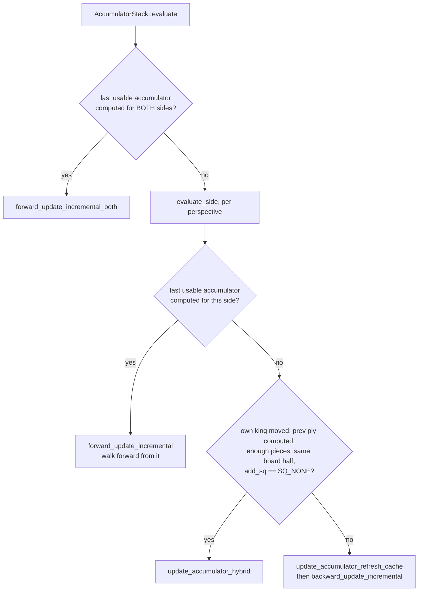

# The evaluation

`src/engine/evaluate.h`, `src/engine/evaluate.cpp`, `src/engine/nnue/` -- the feature transformer, the
accumulator, the layers, and the feature sets under `src/engine/nnue/features/`.

A neural network evaluates the position. `evaluate.cpp` turns its output into the value the
search uses.

Audience: evaluation and NNUE.

## Where each thing lives

| Question | File | Symbol |
|---|---|---|
| what the search calls | `engine/evaluate.cpp` | `Eval::evaluate` |
| how the two heads are produced | `nnue/network.cpp` | `Network::evaluate` |
| dimensions and layer order | `nnue/nnue_architecture.h` | `L1`, `L2`, `L3`, `NetworkArchitecture` |
| the accumulator and its stack | `nnue/nnue_accumulator.h` | `Accumulator`, `AccumulatorStack` |
| the refresh cache | `nnue/nnue_accumulator.h` | `AccumulatorCaches::Entry` |
| accumulator to layer input | `nnue/nnue_feature_transformer.h` | `FeatureTransformer::transform` |
| which inputs the sparse layer skips | `nnue/nnz_helper.h` | `NNZInfo` |
| the file format and its bounds | `nnue/network.cpp`, `nnue/nnue_common.h` | `read_header`, `read_leb_128` |
| the per-ISA kernels | `nnue/simd.h` | one arm per `USE_*` macro |

## The network, shape first

```
                        accumulator, L1 = 1024 per perspective
features (3 sets) ----> pairwise-multiply each half -> 512 u8 per perspective
                        concatenated, side to move first  ->  1024 u8

1024 -> fc_0 -> L2 ----(SqrClippedReLU || ClippedReLU)---> 2*L2 --.
                                                                  |
     2*L2 -> fc_1 -> L3 --(SqrClippedReLU || ClippedReLU)-> 2*L3 --+-> fc_2 -> 1
```

Two things in that picture are easy to get wrong, and both are in
`NetworkArchitecture::propagate`.

**`fc_2` reads the `fc_0` activations as well as the `fc_1` ones.** Its declared input width is
`FC_0_OUTPUTS * 2 + FC_1_OUTPUTS * 2`, and both activation pairs are written into the same
`concat_buffer`, so the second layer is skipped over rather than passed through. A second skip sits
on top of that: `propagate` adds `fc_0_out[L2-2] - fc_0_out[L2-1]` to `fc_2`'s single output before
scaling. Treating this as a plain chain is the mistake that makes a layer look removable.

**`L1` is the accumulator's width AND `fc_0`'s input width, and that is arithmetic rather than
identity.** `FeatureTransformer::transform` multiplies the low half of a perspective's `L1`
accumulator by its high half, shifts by 7, and packs to `u8` -- 512 outputs per perspective -- then
concatenates the two perspectives. Halving and doubling cancel. Change `L1` and both widths move
together; change the pairing and only one does.

Everything is integer arithmetic. `nnue_common.h` fixes the types -- `BiasType = i16`,
`WeightType = i16`, `ThreatWeightType = i8`, `PSQTWeightType = i32`, `TransformedFeatureType = u8`
-- and `WeightScaleBits` fixes where the binary point sits, so a layer is a multiply and a shift
rather than floating point. That is what makes the forward pass affordable at every leaf.

**There are eight of everything after the transformer.** `Network` holds
`NetworkArchitecture network[LayerStacks]` and `Network::evaluate` picks one with
`(pos.count<ALL_PIECES>() - 1) / 4`. The same index selects the PSQT bucket, and
`PSQTBuckets == LayerStacks == 8`. A change to the bucket formula changes which of eight weight
sets a position is evaluated by, so it is a network-format change and not a tuning tweak.

The two heads are the PSQT sum, which `transform` returns as
`(psqt[stm][bucket] - psqt[!stm][bucket]) / 2`, and the layer stack's own output.

## The accumulator is the whole design

The first layer is enormous -- 1024 outputs over a feature space of tens of thousands of inputs --
and evaluating it from scratch at every node would dominate everything else.

It is never evaluated from scratch. The accumulator holds that layer's output for the current
position, and a move **updates** it: features that turned off are subtracted, features that turned
on are added. A move changes a handful of features, so the update is a few vector operations
instead of a full matrix multiply.

This is why `Position::do_move` records a `DirtyPiece`: the update needs to know exactly what
changed, and reconstructing that from two board states would cost more than the update saves.

`src/engine/nnue/nnue_accumulator.cpp` is the largest file under `src/engine/nnue/` because this is
where the engine's time goes:

```sh
wc -l src/engine/nnue/*.cpp src/engine/nnue/*.h src/engine/nnue/*/*.* | sort -n | tail -5
```

**The stack** holds one `AccumulatorState` per ply -- `MaxSize = MAX_PLY + 1` -- so unmaking a move
is a `pop()`, which only decrements `size`. **Evaluation is lazy**: an accumulator is brought up to
date only when someone asks for it, so plies pruned without being evaluated never pay.
`find_last_usable_accumulator` walks back to the nearest usable state, which is either a computed
one or the state just before a change that forces a refresh.

Bringing that state forward is not a two-way choice. `AccumulatorStack::evaluate_side` picks between
three, and `AccumulatorStack::evaluate` has a fast path when both perspectives are already computed:



**Any move of the perspective's own king ends the incremental chain, whatever square it moves to.**
The refresh predicate is the whole condition, and it tests nothing else:

```sh
sed -n '/^bool HalfKAv2_hm::requires_refresh/,/^}/p' src/engine/nnue/features/half_ka_v2_hm.cpp
```

It returns `diff.pc == make_piece(perspective, KING)`. Every feature in all three sets is indexed
relative to that king's square -- `make_index` takes `ksq` in `half_ka_v2_hm`, `full_threats` and
`pp_3wide` alike -- so a king move renumbers the entire input space for that side. Do not read
`KingBuckets` as the boundary: `SQ_E1` and `SQ_E2` sit in different buckets and both are refreshes,
because the bucket is not what the predicate looks at.

**The mirror is what the hybrid guard tests, and it is a different question.** The guard is
`(int(dirtyPiece.from) & 0b100) == (int(dirtyPiece.to) & 0b100)` -- bit 2 of the square index, the
file bit separating a-d from e-h. Each feature set carries an `OrientTBL` keyed on that bit, so a
king crossing it flips the orientation of every threat and pawn-pair index too, and the
already-computed threat deltas the hybrid path carries forward from the previous ply would be in
the wrong orientation. Inside one half those deltas stay valid, so the path is available.

**What the hybrid path actually does** (`update_accumulator_hybrid`) is start from
`accumulators[size - 2]` -- the **previous ply**, not two back -- subtract the refresh-cache entry
for the old king square, add the entry for the new one, apply the threat and pawn-pair deltas
incrementally, and refresh both cache entries on the way through. Its two remaining guards:

- `pos.count<ALL_PIECES>() >= MIN_PC_COUNT_HYBRID`, a function-local `constexpr` in
  `evaluate_side` -- below that piece count a plain refresh is cheap enough that the extra
  bookkeeping does not pay, which makes this an opening and middlegame optimisation;
- `dirtyPiece.add_sq == SQ_NONE`, spelled in the source as `// excludes castling`. Castling is the
  one king move that also places a second piece, and `types.h` says so at `DirtyPiece`:
  *castling uses add_sq and remove_sq to remove and add the rook*.

**The refresh cache** (`AccumulatorCaches`) is what makes the last branch affordable. It is
per-Worker and indexed `[square][colour]`, so 128 entries. Each `Entry` holds an accumulation, its
PSQT counterpart, and the `pieces` array and `pieceBB` it was computed from, so a refresh diffs
against that cached board rather than starting from the biases -- usually a handful of features
rather than all of them. The idea is Luecx's, from Koivisto, and the header calls it by its usual
name, Finny tables.

**An unseeded cache is indeterminate memory, not an empty one.** `AccumulatorCaches()` is the
defaulted constructor and `entries` is a plain array of POD `Entry`, so every accumulation holds
whatever the allocation held until `clear(network)` writes the feature transformer's biases over
it. A `Worker` is built before a net is necessarily resident -- `Engine` sizes the pool while
`networkFile` is still empty -- so `Worker::ensure_network_replicated` is what seeds it, and it must
run before the worker evaluates anything.

## The feature sets

Three, under `src/engine/nnue/features/`, all feeding **one** accumulator:

| Set | Alias in `nnue_architecture.h` | What it encodes | `Dimensions` |
|---|---|---|---|
| `HalfKAv2_hm` | `PSQFeatureSet` | (king square, piece, piece square) | `SQUARE_NB * PS_NB / 2` |
| `FullThreats` | `ThreatFeatureSet` | which piece attacks which | a literal in `full_threats.h` |
| `PP_3Wide` | `PairFeatureSet` | pawn-pair structure | `PawnIds * (PawnIds - 1) / 2` |

"Half" means one perspective: the accumulator is computed twice, once from each side's point of
view, and `transform` reads the side to move's half first. "hm" is the horizontal mirror -- the
header states the convention as *position mirrored such that king is always on e..h files* -- which
halves the weight table, hence the `/ 2` above.

The threat and pair weights share one array. `FeatureTransformer` keeps `weights` for the
`HalfKAv2_hm` half and `threatAndPpWeights` for the other two concatenated, reached through
`threatWeightData()` and `pawnPairWeightData()`. The concatenation is load-bearing and is asserted
where it can be seen:

```sh
grep -n 'PairFeatureSet::IndexBase == ThreatFeatureSet::Dimensions' \
  src/engine/nnue/nnue_feature_transformer.h
```

`PP_3Wide::IndexBase` is a literal in `pp_3wide.h` and `FullThreats::Dimensions` is a literal in
`full_threats.h`; the `static_assert` is the only thing holding the two literals together, and
without it a pawn-pair index would silently address threat weights.

Because there are three sets, `do_move` maintains three dirty records, not one. `types.h` groups
them:

```cpp
struct Dirties {
    DirtyPiece     dirtyPiece;
    DirtyThreats   dirtyThreats;
    DirtyPawnPairs dirtyPawnPairs;
};
```

`AccumulatorState` inherits both `Accumulator` and `Dirties`, which is why every path above reaches
`latest().dirtyPiece` without a second lookup.

The threat list needs a bound, and `types.h` works it out beside `DirtyThreatList`:

> A piece can be involved in at most 8 outgoing attacks and 16 incoming attacks. Moving a
> piece also can reveal at most 8 discovered attacks. This implies that a non-castling move
> can change at most (8 + 16) \* 3 + 8 = 80 features.

The same comment computes 36 for a castling move, so 80 is the binding case. `DirtyThreatList` is
sized 96 -- 80 plus 16 spare, so that vectorised stores near the end of the list can write past it
without bounds checking. Shrinking it to 80 is therefore a buffer overrun, not a saving.

## The layers, and the sparsity trick

`fc_0` is `AffineTransformSparseInput`. After the pairwise transform most of its 1024 `u8` inputs
are **zero**, and multiplying by zero is work that can be skipped.

**The transformer builds the index list; the layer only consumes it.**
`FeatureTransformer::transform` takes an `NNZInfo<L1>&` out-parameter and fills it through
`nnzInfo.make_cursor(p)` while it is
already holding each output vector in a register; `fc_0.propagate` reads `nnzInfo.nnz` and
`nnzInfo.count`. Putting the scan in the layer would mean loading the whole transformed vector a
second time. The entries index non-zero **chunks** of four inputs, not individual inputs --
`u16 nnz[Dimensions / 4]` in `nnz_helper.h` -- so the granularity the layer skips at is four
columns.

The activation after `fc_0` and again after `fc_1` is a concatenation of two functions of the same
input -- `SqrClippedReLU` alongside `ClippedReLU` -- so the network gets a quadratic term without a
second layer. Under `USE_PAIR_ACTIVATIONS` both are produced by one `propagate_pair` call instead of
two `propagate` calls; the values are the same either way.

`src/engine/nnue/simd.h` carries the vector kernels, with an arm per ISA (`USE_AVX2`, `USE_SSE41`,
`USE_SSSE3`, `USE_NEON`, `USE_LASX`, `USE_LSX`, and a scalar fallback). **Which arm compiles changes
the instruction sequence but must not change the result**: every architecture in the compile matrix
has to reproduce the same bench signature, and that is what catches a saturation or narrowing that
behaves differently at one vector width.

`permute_weights()` is the other reason a kernel change is a format change. Weights are stored in
the order `packus` wants them, permuted on read and unpermuted on write, so
`FeatureTransformer::read_parameters` and `write_parameters` are not symmetric line by line -- and
`Network::save` copies the transformer before unpermuting, because the live one is still in use.

## `evaluate.cpp` -- from network output to a search value

`Eval::evaluate` sums the two heads and then makes four adjustments. Read the current arithmetic
from the function rather than from here, because every constant in it is tuned and moves with the
next SPSA patch:

```sh
sed -n '/^Value Eval::evaluate(/,/^}/p' src/engine/evaluate.cpp
```

What survives tuning is the shape, and each step is doing something specific:

- **Complexity** is `abs(psqt - positional)`, the disagreement between the two heads. Where they
  disagree the position is sharp, so optimism is amplified and the raw evaluation is damped -- the
  network is less sure, so the number is trusted less and the search's own disposition counts for
  more.
- **Optimism** is the per-thread search disposition. It is mixed in at a flat weight while the
  network's term is the one scaled by `material`, so the more material stands on the board the more
  the network outweighs the disposition. It is what makes different threads explore differently in
  Lazy SMP.
- **The fifty-move damping** scales the value down by `pos.rule50_count()`: an advantage that cannot
  be converted before the rule draws the game is not worth its nominal value.
- **The clamp** is `std::clamp(v, VALUE_TB_LOSS_IN_MAX_PLY + 1, VALUE_TB_WIN_IN_MAX_PLY - 1)`, which
  keeps the evaluation **strictly** inside the tablebase band, so an estimate can never be read as a
  proven verdict or a mate. [05-tablebases.md](05-tablebases.md) shows the other side of that band.

`assert(!pos.checkers())` -- **the evaluation is never called in check.** The network is not trained
on positions in check, and the search always resolves the check first. `Eval::trace` returns
`"Final evaluation: none (in check)"` rather than asserting, because `eval` is a user command.

## The net file

`Network::read_parameters` reads a fixed header and then one section per weight block, each section
checked against its own hash by `Detail::read_parameters`:

| Bytes | Field | Checked by |
|---|---|---|
| 0-3 | `Version` (`nnue_common.h`) | `read_header` |
| 4-7 | architecture hash | `read_parameters`, against `Network::hash` |
| 8-11 | description length | grown against the stream, never trusted |
| 12.. | description | -- |
| then | `FeatureTransformer` section | its own hash word |
| then | `NetworkArchitecture` x `LayerStacks` | one hash word each |

The description length is the one field a reader would naively `resize()` on. It is a `u32`
straight out of the file, so the loop in `read_header` grows the string in 4 KiB chunks and
refuses as soon as the stream delivers fewer bytes than the header promised. **A declared length
is not evidence; a delivered byte is.** The obvious `tellg`/`seekg` form would also have refused
the shipped network, whose `MemoryBuffer` implements no seeking.

`read_parameters` ends on `stream.peek() == eof`, so trailing bytes are a refusal too.

**A failed read has already overwritten the live network.** Sections are read straight into the
resident object, so a file with a good `FeatureTransformer` and a bad later section leaves the net
half one file and half the other. `load_external` and `load_internal` answer that by clearing
`evalFile.current` and `netDescription` on failure: the engine then either reloads on the next
selection or refuses to search, and both are states this seam already knows how to be in.

### LEB128, and which arrays use it

The large weight arrays are signed-LEB128 compressed and the small ones are not.
`FeatureTransformer::read_parameters` is where the split is visible: `read_leb_128` for `biases`,
`threatPsqtData()`, `pawnPairPsqtData()`, `weights` and `psqtWeights`; plain
`read_little_endian` for `threatWeightData()` and `pawnPairWeightData()`. Each compressed block
is prefixed by the literal `Leb128MagicString` and a `u32` byte count.

Both affine layers read every weight one at a time through `read_little_endian<WeightType>`:

```sh
grep -n 'read_little_endian<WeightType>' \
  src/engine/nnue/layers/affine_transform.h \
  src/engine/nnue/layers/affine_transform_sparse_input.h
```

so what looks like a four-line helper is the inner loop of a net load. Two properties of it are
deliberate and neither is obvious.

**The bytes land in a `u8[]` and the result is `memcpy`'d out.** `IsLittleEndian` is a runtime bool
rather than a constant, so reading straight into the result on one arm compiled *two* `stream.read`
call sites; one array serves both, and the arms differ only in how they assemble it.

**That array is zero-initialised and the result is not.** A short read writes fewer bytes than asked
and sets `failbit`, leaving whatever the storage held -- and reading the object back is then an
indeterminate-value read. Zeroing a byte array before the read makes those bytes 0 with no branch
and no test of the stream, which is what a test would have cost: `stream`'s `operator bool` calls
`fail()`, and `fail()` lives in the **virtual** base `basic_ios`, so reaching it needs a vtable
vbase-offset traversal. `gcount()` is a plain member of `basic_istream` and would have been cheaper;
neither is needed.

The reason to care is not tidiness. `read_leb_128` takes this result as `bytes_left` and spends it
as a byte budget **before** it looks at the stream, so on a truncated net the decode loop would be
bounded by an indeterminate number. Zeroing the *result* instead is a different shape and was
measured to cost, by perturbing what gets inlined in this header; the figure and the command that
produced it are in the comment above `read_little_endian` in `nnue_common.h`.

`tests/leb128.sh` is the gate over the decoder, and it builds its harness under
`-fsanitize=address,undefined` so a bound that is off by one is a report rather than a survivable
read.

### Where the net comes from

The default network name lives in `evaluate.h` as `EvalFileDefaultName`, the Makefile greps it out
of that header, and `scripts/net.sh` fetches and verifies it. `EvalFile` can point at another at
runtime, through the option's `OnChange` in `src/shell/engine.cpp`.

How it gets into the binary depends on which binary:

| build | mechanism |
|---|---|
| ordinary | `INCBIN(EmbeddedNNUE, EvalFileDefaultName)` in `nnue/network.cpp` |
| universal | `#embed EvalFileDefaultName` in `universal/nnue_embed.cpp`, guarded by `__has_embed`, falling back to a generated `network_dump.inc` |
| macOS x86-64 slice | neither: the net is embedded only in the arm64 slice, and the x86 slice `mmap`s it out of its own executable at an offset patched in after the link by `src/universal/patch_x86_slice.sh` |

`#embed` is a C++26 feature used as an extension, so `universal/nnue_embed.cpp` compiles at
`-std=c++20` with `-Wno-c++26-extensions`. The per-architecture entry object beside it takes
`-std=c++20` and not the warning flag -- it uses no `#embed` -- while the rest of the engine is
`-std=c++17`.

The `padding` variable beside the array is not decoration: `#embed` yields exactly the file's bytes,
while `network_dump.inc` is a C string literal with a trailing NUL, so `gEmbeddedNNUESize` subtracts
1 in the fallback path and 0 in the `#embed` path.

Either way the network is in the image, and it dominates the binary's size:

```sh
ls -l src/stockfish src/*.nnue
```

**The engine resolves `EvalFile` relative to the working directory.** Running from anywhere but
`src/` finds no external net and produces an unrelated but entirely plausible number.
