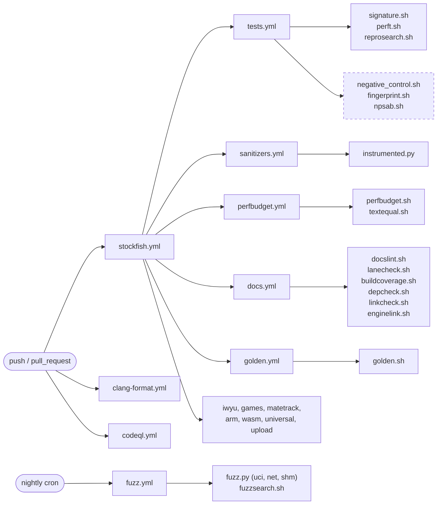

# Tooling and CI

`tests/`, `scripts/`, `.github/workflows/`.

Every gate in the tree, what it proves, and -- the half that matters more -- what it cannot
see. For the source layout see [00-architecture.md](00-architecture.md).

Audience: anyone adding or running a gate.

## Check the exit code, never a piped fragment

```sh
./tests/perfbudget.sh HEAD~1 | tail -1     # WRONG -- reads 0 from tail while the gate is red
./tests/perfbudget.sh HEAD~1; echo $?      # right
```

A gate that SKIPPED for a missing tool has proven **nothing** and must never be reported as a
pass. Both perf gates and the documentation lint distinguish the three outcomes by exit code:
0 clean, 1 findings, 2 could not run.

## The value gates

These answer "does the engine still do the same thing?".

### `tests/signature.sh`

The anchor. `bench` must reproduce a reference node count.

```sh
cd src && ../tests/signature.sh <reference>
```

**Read the reference from the commit record, never from memory or from a page here** -- it
moves with every functional commit, which is why `docslint` refuses a page that quotes it.

It is invoked ~27 times across `tests.yml`, `arm_compilation.yml`, `wasm_compilation.yml` and
`universal_compilation.yml`, after roughly twenty separate architecture builds. That is the
tree's ISA-divergence coverage and it is unusually strong: it is what catches a change that
behaves differently at one vector width.

**It says nothing about cost.** A change can shed no nodes and run measurably slower.

### `tests/perft.sh`

Move generation, by node count at depth, including five Chess960 rows.

The counts are **facts about chess**, not a golden. A mismatch is always a movegen bug and
never an update candidate.

It cannot see a key that desyncs and resyncs, because perft counts leaves.

### `tests/reprosearch.sh`

Node counts repeat across `ucinewgame` at varying node limits.

### `tests/instrumented.py`

The CLI and interactive suite, driven under valgrind, TSan, UBSan and
`-D_GLIBCXX_ASSERTIONS` by `sanitizers.yml`. `tests/testing.py` is its harness.

It asserts that expected **substrings** appear. It does not pin the full text of a session,
so an `info` line format change, a PV rendered one move short, or a changed ponder move
passes.

## The performance gates

These answer "does it still cost the same?", which no value gate above can.

**There are five of them because there are five questions.** Picking the wrong one produces a
confident wrong verdict, so pick by what the change CLAIMS:

| the change claims | gate | why |
|---|---|---|
| "this is pure code motion" | `tests/textequal.sh` | a codegen-equivalence proof has no noise floor; one run settles it |
| "this costs nothing" (a refactor) | `tests/perfbudget.sh` | deterministic; an instruction increase in a behaviour-preserving change is a real red flag |
| "this is faster" (an optimisation) | `tests/npsab.sh`, and probably fishtest | the instruction axis can report the wrong sign -- see below |
| "this moved no cache line" | `tests/perfcounters.sh` | the only axis that sees a miss, a mispredict or a stall, and the only one that runs above AVX2 |
| "and if it did, where?" | `tests/perfdecomp.sh` | per-component instructions, misses and mispredicts; deterministic, and a model |

The last two divide one question between them. `perfcounters.sh` measures the hardware and
cannot say which code moved; `perfdecomp.sh` says which code moved and is measuring a simulator.
Neither replaces the other, and where they disagree the hardware is the fact.

### `tests/perfbudget.sh`

Retired instructions under callgrind, base against head, built and measured in the same run.

```sh
./tests/perfbudget.sh HEAD~1                    # this commit against its parent
./tests/perfbudget.sh origin/master worktree    # uncommitted work
./tests/perfbudget.sh --pgo HEAD~1              # the build that actually ships
```

**Measure both build modes.** `make profile-build` is the shipped recipe, and the two do
not agree on the size of a regression: forcing `Position::adjust_key50` out of line costs
**+0.1000% at -O3 and +0.0477% under PGO**, because the profile lets the compiler make a
better job of the out-of-line call. The PGO binary is also about 4.8% cheaper overall on
this bench. A budget taken only at -O3 gates a binary nobody runs.

Four properties, each deliberate:

- **No golden is stored.** An absolute instruction count is a property of the toolchain and
  the libc as much as of the code, so it cannot be reproduced by a reviewer and it drifts
  upward until it gates nothing. Only the delta is reported, and it is reproducible by
  re-running.
- **Startup is subtracted by measurement**, per binary. It is over 40% of the whole-process
  count at the depth the gate uses, so an unsubtracted ratio describes the network loader as
  much as the engine.
- **A node count that moved makes the comparison VOID**, not expensive. That is a behaviour
  change and `signature.sh` owns it.
- **The tolerance is set from measurement**: the A/A floor across independent builds, against
  a mutation that forces `Position::adjust_key50` out of line. Never raise it to fit a change.

**The limit that matters, and it is not theoretical.** Upstream `ee72cf49f` "Optimize
RankAttacks" is marked *No functional change* and passed a 212,800-game SPRT. It shrinks a
table 4x, trading retired instructions for cache footprint. This gate scores it **+0.16%, a
regression** -- it does not merely miss the win, it reports the wrong sign. An instruction
count cannot see a latency or locality win and is not neutral about one; the same applies to
extra accumulator chains, unrolling for ILP, and software prefetch, which callgrind does not
model at all.

So: **never let this gate alone veto a change whose claim is locality, prefetch or latency
hiding.**

**And the verdict on that class is compiler-dependent.** The same three commits measured
under both compilers the tree builds with:

| Commit | gcc | clang |
|---|---|---|
| `d70dec7d6` Optimize attacks | -0.8231% | -0.5096% |
| `a255ad59e` Optimize evasions | -0.0778% | -0.0881% |
| `ee72cf49f` Optimize RankAttacks | **+0.1628%** | **-0.1427%** |

The two changes that genuinely retire fewer instructions agree in sign under both compilers.
The locality change does not -- gcc calls it a regression and clang calls it an improvement.
That gives a usable rule: **a sign that flips between gcc and clang means the change is not
an instruction-count change at all**, and the instruction axis is the wrong instrument for
it.

callgrind implements no AVX-512 and dies on the first instruction it does not know, so the
instruction axis stops at avx2/bmi2 -- below the tier a player builds. The script refuses
such an `--arch` rather than producing a number.

### Which lane is binding

`perfbudget.sh` can be run at plain `-O3` or with `--pgo`, and on this tree they do not agree
about header restructuring. Measured twice, on changes with identical node counts:

Three changes, each measured on six lanes -- two tiers, two compilers, both build modes. The
tolerance is 0.02%, and **F** marks the only readings above it:

| change | avx2 gcc -O3 | avx2 gcc PGO | avx2 clang -O3 | avx2 clang PGO | bmi2 gcc -O3 | bmi2 gcc PGO |
| --- | --- | --- | --- | --- | --- | --- |
| the win-rate model moved into the core | **+0.0377% F** | +0.0000% | +0.0005% | +0.0008% | +0.0010% | +0.0006% |
| shared memory taken out of the NUMA header | **+0.0367% F** | +0.0008% | -0.0124% | +0.0000% | +0.0006% | -0.0001% |
| `NumaConfig`'s cold half moved to a `.cpp` | -0.0009% | +0.0002% | -0.0008% | -0.0137% | **+0.0243% F** | +0.0001% |

**Every PGO lane is clean, and each `-O3` failure occurs at exactly one (tier, compiler) pair
and nowhere else.** The two changes that read as regressions at avx2/gcc are free at bmi2/gcc;
the change that is free at avx2/gcc is the one that fails at bmi2/gcc. Node counts are
identical throughout, so all six lanes measure the same search.

**PGO is the binding lane.** It is upstream's own recipe, it is what ships, and it is what
fishtest measures; a refactor that is free there and costs under a build nobody distributes has
not cost a player anything. The plain `-O3` figure is advisory: record it in the commit body,
investigate it when it is large, and do not let it alone veto a change.

That is a decision about which measurement answers the question, not a licence to skip one. A
change still reports both, and a regression under PGO still does not land.

**Measure with gcc AND clang, and at more than one tier.** One compiler at one tier cannot
tell a change from its own code layout. Row two is the worked example: avx2/gcc -O3 called it a
+0.0367% regression, clang called the same source **0.0124% faster**, and bmi2/gcc called it
+0.0006%. A reading that changes sign or vanishes when the compiler or the tier changes is not
an instruction-count change at all.

Row three is what stops that from becoming a reason to ignore `-O3` entirely: it is the one
change that is free at avx2 and above tolerance at bmi2. Whichever single lane you had picked,
one of these three would have looked like a regression and a different one would have looked
clean. **The lane is not evidence; the pattern across lanes is.**

The first of those two is a worked example of the gate misreporting rather than the compiler:
the whole process retired 1832789 FEWER instructions, while the separately measured startup
probe got 2423700 cheaper, so `total - startup` rose by the difference. **A startup probe that
moves makes the subtracted search figure move the other way**, which is the same class of trap
as the locality case below -- the number is real and its sign is not the change's.

### `tests/textequal.sh`

Per-symbol machine-code equivalence, LTO disabled.

```sh
./tests/textequal.sh HEAD~1
```

The strongest evidence a pure code-motion change can carry: not a benchmark with a noise
floor but a proof that the compiler emitted the same instructions.

**It does not prove the shipped binary unchanged**, and the reason is worth carrying: the
tree links with `-flto=full` (clang) or `-flto -flto-partition=one` (gcc) by default, and LTO
is exactly where a moved function changes an inlining decision. The gate also clears the
build stamp (`GIT_SHA`, `GIT_DATE`, `GIT_DIFFINDEX`) on both sides so the version string
cannot shift rodata under it -- another reason it is not a statement about the shipped
binary, which carries its stamp.

A green run narrows what `perfbudget.sh` has to catch. It does not replace it.

### `tests/npsab.sh`

Interleaved paired wall-clock A/B, reporting the median of the paired ratios and its spread.

```sh
./tests/npsab.sh HEAD~1
```

Three rules are built in, each of which has produced a published wrong number somewhere:
alternate which binary runs first, because the second slot in a round runs on a hotter core;
report the spread, not just the median; and read the engine's own bench clock, which starts
after the network load and so contains no startup.

**A spread that straddles 1.000 has established no direction**, and the tool says so rather
than reporting the median as a result. On an ordinary developer box that is the expected
outcome for anything under roughly ten percent -- which is why the instruction axis exists.

## The build and packaging scripts

| Script | Job |
|---|---|
| `scripts/net.sh` | download and verify the network the build expects |
| `scripts/get_native_properties.sh` | detect the host ISA and name the matching `ARCH` |
| `scripts/check_universal.sh` | verify the x86-64 runtime-dispatch binary |
| `scripts/check_universal_arm.sh` | the same for aarch64 |
| `scripts/check_universal_macos.sh` | the same for the macOS universal binary |
| `scripts/check_universal_riscv.sh` | the same for riscv64 |

## `tests/fingerprint.sh`

Per-function **call counts** between two revisions.

```sh
./tests/fingerprint.sh HEAD~1
```

Every other gate here compares values -- a node total, an instruction count, a disassembly.
This one asks whether the engine still gets to its answer by calling what it called, as
often. A change that claims to be a decomposition is exactly where that can move while every
value stays put, which makes this the instrument for splitting a large function.

A call count is inlining-immune **at the callee**: it does not care how the callee was
reached, only that it was. It is **not** immune at the caller -- a function inlined into its
caller disappears from the profile -- so read the one-sided list as inlining differences and
the changed list as the signal.

Scope is the engine's own symbols. The allocator and glibc's thread-cancellation counters
(`_int_malloc`, `sbrk`, `munmap`, the pthread cancel pair) move between two runs of one
binary, so they are reported apart from the verdict rather than folded into it. Functions
callgrind can only name by address are excluded: two builds place them differently, so they
have no comparable identity.

Deterministic: three A/A runs report IDENTICAL across 206 engine symbols. Forcing
`Position::adjust_key50` out of line makes it appear as a called symbol with 105296 calls.

## `tests/golden.sh`

Byte-compares the engine's output for a scripted UCI session.

```sh
./tests/golden.sh            # compare every case
./tests/golden.sh search     # one case
./tests/golden.sh --update   # re-record
```

`signature.sh` proves the engine searched the same tree. Nothing else proves it **said** the
same thing: an `info` field that loses a name or changes order, a PV one move short, a ponder
move named against the wrong position, a `d` board that stops printing checkers. None of those
moves the node count.

Three properties, each of which a naive comparison gets wrong:

- **What is not behaviour is filtered before comparing.** The clock, the nps, `hashfull`, the
  network banner and the build stamp are properties of the machine or the build. Leaving the
  stamp in would invalidate every golden on the next commit.
- **The driver waits.** The engine runs `go` on its own thread and treats end of input as
  `quit`, so writing every line at once collects a `bestmove` from a search that never
  finished. After a search command the driver reads until the engine says it is done.
- **A comparison that compared nothing fails.** An absent corpus skips at exit 2; a corpus
  that is present and yields nothing is a rig fault and goes red. A case whose engine printed
  nothing is a dead engine rather than a behaviour.

A `.uci` file is engine input, piped raw, so a `#` line is a command the engine answers
`Unknown command` to. The gate refuses one rather than letting the case diverge for a reason
unrelated to what it tests.

**Re-recording a golden records whatever the engine currently does**, so an update over a
broken build makes the break the expected output. Update only from a tree whose signature
matches the commit record, and put the diff in the commit body.

## `tests/negative_control.sh`

Breaks the engine on purpose and requires each gate to notice.

```sh
./tests/negative_control.sh            # every row
./tests/negative_control.sh docslint   # one row
```

A gate's power to detect a defect is an assumption until something breaks the code and the
gate is watched going red. A gate that has quietly stopped being able to fail is invisible,
because it reports success.

Every mutation perturbs a **value** rather than removing a bound: a mutant that hands the
search an evaluation with no ceiling produces an experiment that never terminates, and a
timeout is a rig fault rather than a detection.

Three ways the rig itself can be wrong, and all three refuse rather than return a verdict: an
anchor string that has rotted (the tree is never mutated, the gate greens, and that reads as
a gate failing to detect), a mutation that does not compile, and a selector naming no row.
The tree is restored from a trap, and the run ends by executing a gate green rather than by
asserting the sources were put back.

Rows that cannot run report SKIPPED and are counted separately. A skipped row proves nothing.

**It also enumerates the gates it does not cover**, because the failure this script exists to
prevent applies to itself: a gate with no row was simply absent, and absence is quiet.
`lanecheck.sh` asks whether a gate is dispatched and `docslint.sh` asks whether it is
documented; **neither asks whether it can fail**, so a gate could be fully wired, fully
described and inert. `reprosearch.sh` was exactly that -- a merge gate nobody had watched go
red.

Every script in `tests/` now needs a row or an excuse, and the excuse list expires in both
directions as `lanecheck.sh`'s does: an excused script that has a row is a stale excuse, and an
excuse naming a script the tree no longer carries fails too.

## `tests/lanecheck.sh`

Every gate must be dispatched by a workflow, or carry an excuse saying what runs it.

A check nobody runs is a claim about the tree rather than a check on it: it never reports, so
it never goes red, so nobody notices it stopped working -- and it still looks like coverage in
a directory listing.

Dispatch is counted from **workflows only**. A gate invoked solely by another local gate is
not dispatched: if that gate runs nowhere the chain bottoms out at nothing and the hole is
laundered into a pass.

The excuse list is the hole, so it expires in its own direction -- an excused script that IS
dispatched is reported as a stale excuse, and an excuse naming a script the tree no longer has
fails too. A script named only in a comment does not count as dispatched, and the name match
requires a separator on both sides so `net.sh` cannot be satisfied by `subnet.shx`.

## `tests/depcheck.sh`

Enforces the declared dependency direction of [00-architecture.md](00-architecture.md).

```sh
./tests/depcheck.sh
```

`src/` is flat, so a zone is a name list rather than a directory. That is this gate's weakness
and the reason it also reports **files in no zone**: a new file joins no zone by default, and
without that check it would be silently exempt from the rule rather than caught by it.

Only the engine-includes-shell edge is checked, because only that one is a defect rather than a
choice. Platform depending on engine is the intended direction, and shell depending on both is
what a process does.

`tests/depcheck.baseline` carries the edges that exist today, one per line, with the reason
each is there. It **expires in both directions**: an edge missing from it fails as new, and an
entry in it that no longer happens fails as stale. A baseline that only grows is not a debt
register, it is a permanent excuse, and the second direction is what keeps it from becoming
one.

One entry is not debt. `types.h -> tune.h` is deliberate -- the include sits after `types.h`'s
own `#endif` so the SPSA macros reach anywhere `types.h` does, and removing it would make every
future tuning run add an include first. It is baselined with that reason rather than exempted,
so it stays visible.

**It reads includes, not the link.** A file that names no shell header but takes a shell type
through a template parameter, or reaches one transitively through a platform header, passes.
The sibling C port checks the same property at link time instead -- it compiles the engine
alone and fails on any undefined symbol -- which is stronger, and is not available here while
`src/` is one flat directory with one link step.

## `tests/buildcoverage.sh`

Every tracked source is named by the build.

```sh
./tests/buildcoverage.sh
```

`SRCS` is an explicit list rather than a wildcard, and that is worth protecting: a wildcard
absorbs whatever is in the directory. The cost of the explicit list is the failure this gate
exists for -- **a file in the tree and in no build list is not compiled, not linked, and covered
by no gate, while still looking maintained.** It then rots against the files that do move, and
the first symptom is a compile error months later in a file nobody was editing.

**It is the prerequisite for the two zone checks.** `linkcheck.sh` reasons about *objects*: a
source the build names nowhere produces none, so it could call straight into the shell with the
zone check green. `depcheck.sh` reads the file and stays green too, because it reasons about
files rather than builds -- `tests/negative_control.sh buildcoverage` asserts exactly that
split.

Comments are stripped before matching, so a filename mentioned only in a comment does not count
as a build rule.

## `tests/linkcheck.sh`

The same rule as `depcheck.sh`, asked of the linker instead of the preprocessor.

```sh
./tests/linkcheck.sh
```

`depcheck.sh` reads `#include` lines, so it sees only edges an include spells. This one compiles
the tree with LTO off, then asks whether any object built from an engine file references a
symbol that only a shell object defines. An edge reached through a template parameter, or
through a forward declaration with no include at all, is invisible to the first check and
plain to this one -- `tests/negative_control.sh linkcheck` injects exactly that case and
asserts **both** halves: `depcheck` stays green, and `linkcheck` goes red.

The zone table lives in `tests/zones.sh` and is sourced by both, because two checks that
disagreed about which file is engine would be worse than either alone.

It asks **two** questions, with a baseline each, and **both are now empty**.
`tests/linkcheck.baseline` is the engine-to-shell edge and
`tests/linkcheck-platform.baseline` is the engine-to-platform edge; every host service the
engine needs -- the arena, the output sink, the parallel-for, the worker set and NUMA topology,
the tablebase prober, the NUMA network replica, the clock -- arrives through an injection seam
instead. Both expire in both directions like the other baselines, and both are meant to stay
empty: the next host dependency added to `engine/` fails the gate rather than joining a list.

The two are reported separately because closing them was different work: the shell edge needed a
value snapshot, the platform edge needed the seams. The symbol-level record is finer-grained
than the include baseline on purpose -- a file that already includes a header has nothing new to
announce when it adds a *call*, so only symbols make that visible.

**It describes the non-LTO build**, and turning LTO off is not what it looks like. Under `-flto`
an object holds IR and its symbol table is not the one the real link resolves.

**`EXTRACXXFLAGS=-fno-lto` cannot turn it off.** `src/Makefile` interpolates `EXTRACXXFLAGS`
into `CXXFLAGS` and appends `-flto` *after* it, so the Makefile's flag is last and wins. Both
zone checks build through `COMPCXX` instead, a wrapper that drops every `-flto` argument and
passes the rest through untouched.

The two checks fail differently on LTO objects, which is worth knowing before trusting either.
`nm` reads the plugin-readable symbol table GCC writes into an LTO object, so `linkcheck.sh`
still answers correctly -- for the wrong reason. `ld` without the plugin cannot resolve those
objects at all: it warns and **exits 0**, so `enginelink.sh` would report a clean standalone
engine over a link that resolved nothing. That limit is the same one `textequal.sh` carries.

## `tests/enginelink.sh`

The strong form of the same rule: **link `engine/` alone.**

```sh
./tests/enginelink.sh
```

It compiles the tree with LTO off, takes only the engine objects, and links them with a stub
`main` and nothing else. Either every symbol resolves from another engine object or from the
language runtime, or the link fails and names what is missing. Today: 22 objects, zero
unresolved.

**It subsumes `linkcheck.sh`, which is why both exist rather than one.** The older check
intersects symbol sets, so it can only see a reference to a symbol that some platform or shell
object *defines*, and it cannot see an inline call at all -- the platform clock was reached by
three inline `now()` calls while both baselines read zero. The linker has neither blind spot.

`libstdc++`, libc and pthread are the language runtime, not host services, so they are allowed
to resolve. Everything else must come from `engine/` or from a seam's **default** -- and that is
what this gate is really for. A default is a claim until something links without the host that
would override it.

**It also runs.** A link resolves a symbol without ever calling it, so the link half says every
default is *reachable* and nothing about whether it works. `tests/enginelink_main.cpp` is the
host: it links against `engine/` only, registers **nothing**, and drives three depth-limited
searches through `Search::go` (`src/engine/search_go.h`) plus a fourth that repeats the first.
So the arena's fallback actually allocates, the parallel-for actually clears the transposition
table inline, the clock is actually read, and the tablebase source actually answers "none
loaded".

It asserts properties rather than a node count -- a result exists, the best move is not none,
nodes are non-zero, the root is scored, and a repeat gives the same move. An exact count would
be a second bench signature to maintain, and this gate is about whether the defaults run, not
about what they compute.

Two constraints on the host, both of which fail quietly if broken. It is compiled from a
`tests/` directory beside `src/`, because it includes `../src/engine/...` exactly as it does in
the repo -- compiled from anywhere else those relative includes resolve somewhere else. And it
is given the net's **directory**, not a path to a net: `src/` is gitignored and accumulates nets
from older builds, so naming one from outside picks a net that will not parse against the
feature set the objects were compiled for. The engine knows its own default name.

`tests/negative_control.sh enginelink` plants an engine object calling a platform symbol through
a forward declaration and asserts the gate goes red. That row exists because the gate was
**wrong when first written** and reported clean on exactly this mutation: the objects still held
LTO IR, and `ld` handed an LTO object without the plugin warns and *exits 0*, linking a binary
that resolved nothing. Both gates now refuse outright if they see that warning.

## `tests/perfcounters.sh`

What the hardware actually did, base against head, at four architecture tiers.

```sh
./tests/perfcounters.sh                      # merge-base with master, against HEAD
./tests/perfcounters.sh --rounds 7 --comp clang
./tests/perfcounters.sh --tiers "x86-64-avx2" --pgo
```

`perfbudget.sh` simulates and `npsab.sh` times. This one reads the CPU's counters:
instructions, cycles, cache misses and references, branch misses and branches, plus IPC and the
two miss rates derived from them. It reaches what neither other axis can.

**It is the only performance tool that runs above AVX2.** callgrind implements no AVX-512 and
dies on the first instruction it does not know, so `perfbudget.sh` refuses those tiers outright
-- and those are tiers players build. The default set is `x86-64`, `x86-64-sse41-popcnt`,
`x86-64-avx2` and `x86-64-vnni512`.

**It answers a question the instruction axis cannot even ask.** A change that keeps
instructions and loses IPC has moved a cache line; the budget scores that as free. This is the
same asymmetry that makes `perfbudget.sh` report a locality win with the wrong sign.

It uses `perf_event_open` directly through `tests/perf_counters.cpp`, not the `perf` CLI, which
is a separate package and absent on plenty of machines that can still count. That needs
`perf_event_paranoid` at 2 or lower -- the usual default -- and a container needs `CAP_PERFMON`;
without it the script skips rather than reporting zeroes.

`tests/perfcounters_report.py` does the aggregation. It reports the median of the **paired**
ratios, not the ratio of the medians: a pair is one round, and a round is the only comparison in
which both sides saw the same machine state.

**Read the spread, not the median.** Instructions and branches are near-deterministic; cycles,
IPC and both miss counts are not, and they move with frequency scaling, with what else the
machine is doing, and with where the scheduler puts the process. A ratio whose spread straddles
1.000 has established no direction, and the report says so in those words rather than printing a
median that looks decisive.

Exit 0 means measured, not clean -- whether a moved miss rate is acceptable is a judgement the
table informs rather than makes. Exit 1 is reserved for the one thing the script can decide
alone: the two sides searched a different number of nodes, so the comparison is VOID.

**Two rig faults it refuses rather than reports.** A counter the kernel multiplexed carries only
part of the run, so the tool scales it and flags `scaled=1`, and the script drops the reading
rather than quote it. And both binaries hashing identically means one side was measured twice --
which yields a beautifully tight ratio of 1.0000 and means nothing -- so equal hashes at
different revisions are a skip, not a result.

## `tests/perfdecomp.sh`

Where the cost is, per component, deterministically.

```sh
./tests/perfdecomp.sh                       # merge-base with master, against HEAD
./tests/perfdecomp.sh --depth 8 --comp clang
```

`perfcounters.sh` says *whether* the machine executed the program differently. This says
*where*. It runs callgrind with the cache and branch simulators on both sides, sums self cost
per symbol, groups the symbols by `tests/perfcomponents.tsv`, and prints instructions, D1 read
misses and conditional mispredicts per component with the winner named.

**Every figure is deterministic and every figure is a model.** Two runs of one binary give the
same counts, so a 0.1% component difference is real rather than thermal -- that is what pays for
the ~50x slowdown. But the cache simulator has one fixed geometry, is not this machine's cache,
and knows nothing about the prefetcher or out-of-order execution. It ranks locality; it does not
predict time. Where the two axes disagree, `perfcounters.sh` measured the hardware and this
measured a model of it. It also implements no AVX-512, which is why `perfcounters.sh` exists
beside it.

`tests/perfdecomp.py` parses the callgrind output file rather than `callgrind_annotate`, which
wraps a long C++ symbol across output lines and cannot be column-parsed. Two properties of that
format are load-bearing: a name-compression id is defined on its **first** appearance and that
may be a `cfn=` line, and the cost line following `calls=` is the callee's **inclusive** cost,
which must be skipped or the whole NNUE evaluation is counted inside `search` and again inside
itself.

**Two diagnostics that make a broken grouping visible.** A component whose regex matches nothing
on either side is named rather than printed as a zero, because a zero on one side reads as a
total win forever. And the largest *ungrouped* symbols are listed for both sides, which is how a
symbol that is a call upstream and inlined here -- reading as a 7.9x regression in its component
-- gets caught.

## `tests/docslint.sh`

Five mechanical checks over this documentation set:

1. every markdown link resolves;
2. every `src/`, `tests/`, `scripts/` or `.github/` path named in prose exists;
3. no page quotes a bench signature -- it moves every functional commit and nobody greps
   documentation when it does;
4. every script in `tests/` and `scripts/` is named by some page, because a gate nobody can
   discover is a gate nobody runs;
5. no **tracked** file references the untracked working area, `.gitignore` excepted.

Check 5 sweeps every tracked file rather than every page, and that scope is load-bearing: a
source comment or a workflow file dangles for a reader exactly as a doc line does. Check 2
exempts a path that `.gitignore` names, since a page legitimately describes the tool that
writes an ignored artifact -- and that exemption is exactly why check 5 must exist separately,
because an ignored directory lands in it and reports clean.

**It settles the mechanical half of documentation rot and no more.** It cannot tell you a
sentence has become false. Three classes it will pass: a real symbol attributed to the wrong
file, a list with the wrong count or order, and a behaviour described as absent from a build
that has it. That half is yours.

## Fuzzing

Every gate above compares the engine against a **known-good answer**. That shape can only find
a defect in behaviour someone already described. The three inputs the engine did not produce --
a command from a GUI, a Syzygy table off a mirror, a network file named by `EvalFile` -- have
no known-good answer to compare against, so nothing above covers them.

```sh
./tests/tbfetch.sh                                  # the tb corpus, once
./tests/fuzz.py --seconds 600 --harness tb          # one harness
./tests/fuzz.py --seed 4242 --harness tb            # reproduce a finding
```

`tests/fuzz.py` runs three harnesses, which fail differently and do not substitute for one
another:

| harness | input | what it reaches |
|---|---|---|
| `uci` | mutated command text | the parser, and essentially never the search behind it -- a mutated line is rejected at the first token |
| `tb` | mutated Syzygy bytes | the decoder, the highest-consequence reader in the tree |
| `net` | a mutated file through `EvalFile` | the loader, whose failure mode is a *replacement* net rather than a missing one |
| `shm` | concurrent engine processes, some killed mid-startup | the cross-process path, whose failures need a second process rather than a mutated byte |

`shm` is the odd one: its input is not a file. `shm_unix.h` hands one process's network to
another over a Unix socket and an mmapped memfd, so its failure modes are two creators racing
and a peer dying mid-transfer. The one defect this layer is known to have produced -- a client
disappearing killing the server with `SIGPIPE` -- is exactly that shape, and it came from
production rather than from testing. The property is **survivorship**: a process that dies
because a *peer* died is the defect; a process killed on purpose is the stimulus.

The `tb` harness matters most because its bad outcome is not a crash. An index computed one off
returns a **confident wrong verdict** the search believes, so "did not crash" is not the
property that matters there -- and so neither harness stops at liveness.

Each takes a **reference from the clean input first**, and compares against it:

| harness | the property, beyond surviving |
|---|---|
| `tb` | if the engine still probes a table (`tbhits` above zero) and still answers, the move must be the one the unmutated tables gave. A different move is the search believing a table that lied to it. |
| `net` | a corrupt network must be refused, not loaded. Reporting an evaluation that differs from the shipped net's, with no error, is the engine passing off a corrupt network as an opinion. |

The reference is what makes these checkable at all: without it there is no way to tell a
refused input from an accepted one that lies, because both leave the engine alive and both
print a number. It also means a harness that cannot obtain its reference stops with a rig
fault rather than reporting the whole run clean.

The `net` property passes today because the loader validates: corrupt a net's weights and the
engine answers `ERROR: Network evaluation parameters compatible with the engine must be
available` and does not load it. That is the engine being correct, not the check being weak,
and the check is what tells the two apart.

**The seed prints first, and every finding prints the seed that produced it.** A fuzz run whose
failure cannot be replayed is an anecdote.

## `tests/fuzzsearch.sh`

Fuzz the search **in-process**, against engine objects only, under ASan and UBSan.

```sh
./tests/fuzzsearch.sh --seconds 600                      # a run
./tests/fuzzsearch.sh --seconds 600 --corpus .fuzz-corpus-search   # keep what it learns
```

A different instrument from the harnesses above, not a fourth one of them. Those drive the
shipped binary's stdin, so a mutation spends most of its budget in the command parser -- the
table above says so of `uci` outright. This one puts nothing between libFuzzer and the node
body, and it is the only fuzzing in the tree that runs under sanitizers.

**The input is a walk, not a position.** Each byte selects one of the legal moves available, so
every position searched is legal and reachable by construction. There is no illegal-board false
positive to triage, which is the failure mode that gets a fuzzer switched off. It reaches
positions no bench list and no golden corpus contains.

It links `src/engine/` alone and registers no seam, exactly as `enginelink.sh` does, through
`Search::go`. So any crash is in the engine with no host to blame -- and the seam defaults are
under the fuzzer too.

**It is the only gate that runs the engine under UBSan**, so it reaches a class of defect the
others cannot: state that is valid only because a host assigned it. `SearchManager`'s members
carry their own initial values for exactly that reason -- a search driven without
`ThreadPool::start_thinking` reads them otherwise, and UBSan reports the load of a non-`bool`
value into `ponder`.

Two properties of the rig are load-bearing, and both fail by looking like success:

- **`-print_funcs=0` is the difference between fuzzing and not.** By default libFuzzer
  symbolizes and prints the new functions each corpus unit reaches, and on a statically linked
  sanitized engine that `llvm-symbolizer` pass costs about **ninety seconds**, charged to the
  fuzz budget: 3 executions in 90s with it against 3721 in 20s without. Without the flag the run
  still exits 0, so the guard below is what separates the two.
- **A run that executed almost nothing is a broken rig, not a pass.** The script refuses under a
  thousand executions and reports its rate, on the same rule that says a SKIPPED gate is never
  green.
- **The corpus is the fuzzer's memory.** Without `--corpus` every run starts empty and spends
  its budget rediscovering the same shallow coverage, so a nightly job never gets deeper than
  its first night. The CI lane caches it and uses `restore-keys`, so a key miss still starts
  from the most recent corpus rather than from nothing.

It needs clang, and skips loudly without it. It is not part of the shipped Makefile and adds
nothing to the binary a player runs.

`Hash` and `Threads` are the only options whose fuzzed value the engine turns straight into an
allocation, so they are drawn from a bounded pool and emitted **verbatim**. Mangling defeats a
bound, and truncation is the specific defeat: it rewrites a value the spin parser refuses into
one it honours, turning `Hash value 99999999` into `9999` -- a table the box actually backs,
which exhausts the machine rather than the process and takes the harness down with it, leaving
no finding to read.

A harness must also refuse to bank a broken **rig** as a finding. Three ways the tb rig can be
wrong -- an illegal fixture, no table loaded, a search never reached -- and each stops the run
with a rig fault instead of a verdict. This is not hypothetical: the harness's first run
reported one, against an illegal fixture. `tests/negative_control.sh` carries a row for each
detector and a `fuzz-rig` row for the inverse property.

`tests/tbfetch.sh` fetches the ten-file, ~26 KiB 3-man set and verifies each file by its
**magic** rather than by HTTP status, because a mirror that answers a missing file with a body
-- an error page, a redirect to a landing page -- otherwise stores it as a table, and it fails
much later inside the decoder where it reads as a corrupt table rather than a bad download.
Both mirrors tried do exactly that. Without a corpus the harness **skips visibly** rather than
passing.

**None of this is a merge gate**, and the nightly `fuzz.yml` gives each harness a job of its
own with the whole budget rather than splitting one budget three ways -- they run at
throughputs orders of magnitude apart, so a shared budget is really a budget for the fastest of
them. A clean run means "nothing failed inside that budget", never "there is nothing to find".

### A corrupt table crashes the engine

The `tb` harness found this, and it is **not fixed**:

```sh
printf '\x00' | dd of=tests/syzygy-3man/KNvK.rtbw bs=1 seek=10 count=1 conv=notrunc
```

The engine loads the table, answers `readyok`, and dies with SIGSEGV on the first probe. Under
valgrind the fault is a read of unmapped memory inside `decompress_pairs`
(`src/platform/syzygy/tbprobe.cpp`), reached from `probe_dtz` by way of `rank_root_moves` and
`Engine::go`:

```
Invalid read of size 1
   at decompress_pairs(PairsData*, unsigned long)
   by do_probe_table<TBTable<WDL>, WDLScore>(...)
   by Tablebases::probe_dtz(Position&, ProbeState*)
Address 0x6378 is not stack'd, malloc'd or (recently) free'd
```

Sweeping all 80 bytes of `KNvK.rtbw` at two values each finds exactly one aborting byte, and
its behaviour is a clean threshold rather than noise -- **every** value below the shipped 128
crashes, and every value at or above it is answered normally:

| byte 10 | 0 | 1 | 2 | 3 | 64 | 127 | 129 | 255 |
|---|---|---|---|---|---|---|---|---|
| | SEGV | SEGV | SEGV | SEGV | SEGV | SEGV | ok | ok |

A header field the decoder trusts to bound how far it may walk fits that shape: understating it
sends the decoder past the end of the mapping, overstating it changes nothing it reaches for
this position. **Which named field it is has not been established** -- byte 11 tolerates every
value tried, which rules out the adjacent `maxSymLen`/`minSymLen` pair, and no reading of the
header layout offered so far survives contact with the sweep. The reproducer and the fault site
are solid; the field identity is not, and is the next thing to nail down.

Two consequences regardless of which field it is. **A corrupt table should be refused, not
answered and not crashed on** -- one flipped byte in a downloaded file kills the engine
mid-game, and Syzygy files come off public mirrors. And a random 8-byte mutation of the same
file has separately produced an uncaught `std::bad_alloc`, which `-fno-exceptions` turns into
`std::terminate`; whether that shares this cause is unknown.

### setoption during an unbounded search deadlocks the engine

The `uci` harness found this, and it is **not fixed**:

```sh
printf 'uci\nisready\ngo infinite\nsetoption name Hash value 32\nquit\n' | ./src/stockfish
```

The engine never exits. It is not slow -- it is unreachable: `stop` and `quit` are no longer
read, so nothing in the protocol can recover it.

`Engine::resize_threads` (`src/shell/engine.cpp:249`) and `Engine::set_tt_size`
(`src/shell/engine.cpp:259`) each open with `wait_for_search_finished()`, and both are reached from
an option's on-change handler. That handler runs on the **UCI reader thread**, which is the
only thread that would ever read the `stop` that releases the wait. The reader blocks waiting
for a search that only the reader could end.

The boundary is exactly whether the search ends by itself:

| after `go infinite` | after `go depth 20` |
|---|---|
| `setoption name Threads value 2` hangs | returns normally |
| `setoption name Threads value 1` hangs -- even with no change to apply | returns normally |
| `setoption name Hash value 32` hangs | returns normally |
| `stop` first, then `setoption` returns normally | -- |

Any option whose handler waits will do; `Threads` and `Hash` are simply the two reached here,
and a value identical to the current one still hangs, so the wait happens before anything asks
whether there is work to do.

**The UCI specification says `setoption` is sent only while the engine is not calculating**, so
a conforming GUI does not produce this, and that is the honest limit on its severity. It is
still a state from which the protocol offers no way out, reachable in four lines from a stock
binary.

The harness reached it through a defect of its own -- a generated line beginning with an empty
token read as `" go"`, which its stop-guard missed, leaving an unbounded search with nothing
behind it. That guard is fixed and the harness now runs clean. The engine behaviour is
independent of it, and the reproducer above uses no fuzzing at all.

## Local hooks

```sh
uv sync && pre-commit install     # once
pre-commit run --all-files        # everything, now
```

`.pre-commit-config.yaml` runs file hygiene, `ruff` (lint and format), `ty`, `make format`, and
the three static gates above -- `docslint.sh`, `lanecheck.sh`, `depcheck.sh`. **CI does not run
these.** The workflows stay the authority; this catches the same classes before the commit
exists, which is the only difference that matters when a gate takes seconds.

`pyproject.toml` holds the `ruff` and `ty` configuration and declares the dependency the gates
need. The lint set is curated rather than `ALL`: these are operator tools, so `print` IS their
output and `subprocess` IS their job, and a rule family the tools violate by design would force
`--exit-zero` -- an advisory hook is a laundered gate.

Two scopes are narrowed on purpose, and both are named rather than left to be discovered.
`ty` skips `tests/instrumented.py` and `tests/testing.py`: its diagnostics there are unannotated
upstream code reached without narrowing, and silencing them means adding asserts to code this
fork does not own. `E501` is ignored in those same two files, where every overlong line is a
single string literal -- a search-output regex, a FEN with its move list, ANSI-coloured
f-strings. Editing a regex to satisfy a line limit is how a gate quietly stops matching.

**The `clang-format` hook runs only if `clang-format-20` is present**, the version CI pins. The
Makefile falls back to a bare `clang-format` when 20 is absent, and a different major reformats
the whole tree to its own house style: running it once here rewrote 29 files nobody had
touched. It skips loudly instead, which weakens nothing -- CI's own `clang-format` step is
`continue-on-error` and comments rather than blocks.

## CI

| Workflow | Gates |
|---|---|
| `stockfish.yml` | the umbrella: calls the rest |
| `tests.yml` | the compile matrix -- 13 platform/compiler configurations, ~20 architecture builds, each benching the signature |
| `sanitizers.yml` | TSan, UBSan, valgrind, valgrind-thread, uninstrumented, glibcxx assertions |
| `matetrack.yml` | mate-finding over a position suite |
| `games.yml` | 8 self-play games on a debug build; fails on an assertion or a disconnect |
| `avx2_compilers.yml` | a compiler sweep at one architecture |
| `arm_compilation.yml`, `universal_compilation.yml`, `wasm_compilation.yml` | the remaining targets |
| `iwyu.yml`, `clang-format.yml`, `codeql.yml` | include hygiene, formatting, static analysis |
| `upload_binaries.yml` | release artifacts |
| `perfbudget.yml` | the instruction budget, base against head, at two tiers |
| `golden.yml` | `golden.sh` -- the recorded command outputs |
| `docs.yml` | `docslint.sh`, `lanecheck.sh`, then `buildcoverage.sh`, `depcheck.sh`, `linkcheck.sh`, `enginelink.sh` |
| `fuzz.yml` | nightly: the `uci`, `net` and `shm` harnesses, and `fuzzsearch.sh` |

`docs.yml` builds, despite the name: `linkcheck.sh` and `enginelink.sh` both compile the tree.
The zone checks live there rather than in a lane of their own so a reader looking for one finds
the others beside it.

`tests/perft.sh` and `tests/reprosearch.sh` run at exactly one step of `tests.yml`, gated on
the 64-bit configurations, after an avx2 build.

### Reachability

A gate runs only if something can start the workflow that names it. `stockfish.yml` is the
one entry point that fans out; `clang-format.yml` and `codeql.yml` trigger themselves. Every
other workflow declares only `workflow_call`, so it runs when the umbrella calls it and never
otherwise.



The dashed box is the point: those gates are reached by no workflow. They run locally or not at
all, and `tests/lanecheck.sh` holds each of them to carrying an excuse that says so.

`fuzz.yml` hangs off the cron rather than the umbrella, and that is deliberate: it is **not a
merge gate**. A clean nightly means "nothing failed inside that budget", never "there is nothing
to find", and blocking a merge on a time-boxed random search would make the budget a correctness
threshold it cannot be.
A workflow with only a `workflow_call` trigger and no caller is in the same position -- it
cannot start, so nothing it names is in a lane, which is what `lanecheck` checks before it
looks at any script.
