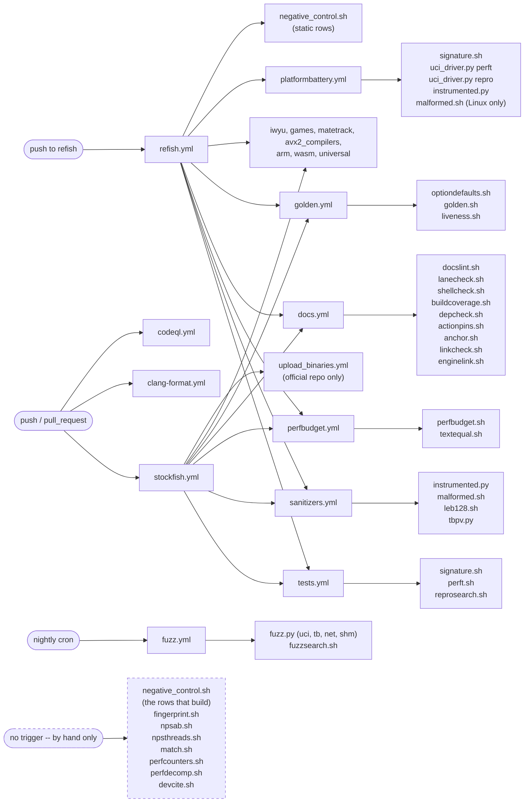

# Tooling and CI

`tests/`, `scripts/`, `.github/workflows/`.

Every gate in the tree, what it proves, and -- the half that matters more -- what it cannot
see. For the source layout see [00-architecture.md](00-architecture.md).

Audience: anyone adding or running a gate.

## Check the exit code, never a piped fragment

```sh
./tests/perfbudget.sh HEAD~1 | tail -1     # WRONG -- reads 0 from tail while the gate is red
./tests/perfbudget.sh HEAD~1; echo $?      # right
```

A gate that SKIPPED for a missing tool has proven **nothing** and must never be reported as a
pass. Both perf gates and the documentation lint distinguish the three outcomes by exit code:
0 clean, 1 findings, 2 could not run.

## Which gate settles which claim

Pick by what the change CLAIMS, not by what is cheap to run. Every row's third column is the
reason the row above it is not a substitute: a gate quoted without its blind spot is a gate
being over-trusted.

| the claim | the gate | what it cannot see |
|---|---|---|
| "it searches the same tree" | `tests/signature.sh` | cost; and anything off the bench position list |
| "move generation is right" | `tests/perft.sh` | a key that desyncs and resyncs -- perft counts leaves |
| "`ucinewgame` resets what a search reads" | `tests/reprosearch.sh` | whether those node counts are the right ones; a second thread |
| "it still SAYS the same thing" | `tests/golden.sh` | a command no `.uci` case sends; every field the filter drops |
| "the CLI still works" | `tests/instrumented.py` | the full text of a session -- it asserts substrings |
| "it still answers mid-search" | `tests/liveness.sh` | the move, the score, the node count. It is blind to everything a hang is not |
| "the unhosted search runs on the same parameters" | `tests/optiondefaults.sh` | an option the engine has no field for |
| "the call graph is unchanged" | `tests/fingerprint.sh` | a callee inlined INTO its caller; and any code the workload never reaches |
| "no host dependency leaked into `engine/`" | `tests/depcheck.sh`, then `tests/linkcheck.sh`, then `tests/enginelink.sh` | each is blind where the next sees: includes miss a template edge, symbols miss an inline header body, the link misses what nothing calls |
| "every source is built" | `tests/buildcoverage.sh` | a header no unit includes; whether the object reaches the binary at a given `ARCH` |
| "the include set is minimal" | `tests/iwyu.sh` | a use behind another host's `#ifdef`; and in shim mode, any absolute verdict |
| "a known-bad table is still refused" | `tests/malformed.sh` | a field nobody has broken yet |
| "the weight reader matches the FORMAT" | `tests/leb128.sh` | the engine -- it builds one translation unit and no binary |
| "the PV extension respects its array" | `tests/tbpv.py` | anything but the one seeded sequence over the one corpus |
| "nothing NEW breaks it" | `tests/fuzz.py`, `tests/fuzzsearch.sh` | a correctly-read corrupt table; and the run's own budget bounds the claim |
| "the engine plays" | `tests/match.sh` | strength; and any defect both binaries share |
| "it costs the same" / "it is faster" / "it scales" | the six performance gates below | each other -- see the selector table |
| "this gate can still fail" | `tests/negative_control.sh` | a gate with no row, which is simply absent from it |
| "every gate runs somewhere" | `tests/lanecheck.sh` | whether the gate asserts anything once it runs |
| "the docs are not rotten" | `tests/docslint.sh` | whether a sentence is false |
| "the citations resolve" | `tests/devcite.sh` | whether the SHA names the commit the sentence means |
| "the actions are pinned" | `tests/actionpins.sh` | whether a pin is the latest release -- reported by `--latest`, never gated |
| "the commit record is readable by a lane" | `tests/anchor.sh` | bodies a shallow clone did not fetch |
| "the gate scripts are sound shell" | `tests/shellcheck.sh` | whether a gate checks the thing it claims to |

Most of these can SKIP -- for a missing tool, a missing corpus, a missing PMU -- and a skip
answers nothing. Read the exit code, and for `negative_control.sh` read the skipped count
besides, because a skipped row leaves its status at 0.

## `tests/signature.sh`

The anchor. `bench` must reproduce a reference node count.

```sh
cd src && ../tests/signature.sh <reference>
```

**Read the reference from the commit record, never from memory or from a page here** -- it
moves with every functional commit, which is why `docslint` refuses a page that quotes it.

`tests.yml`, `arm_compilation.yml`, `wasm_compilation.yml`, `universal_compilation.yml` and
`platformbattery.yml` each invoke it after every architecture they build:

```sh
grep -c signature.sh .github/workflows/*.yml
```

That is the tree's ISA-divergence coverage, and it is what catches a change that behaves
differently at one vector width.

**It says nothing about cost.** A change can shed no nodes and run measurably slower.

## The performance gates

These answer "does it still cost the same?", which no value gate above can.

**There are six of them because there are six questions.** Picking the wrong one produces a
confident wrong verdict, so pick by what the change CLAIMS:

| the change claims | gate | why |
|---|---|---|
| "this is pure code motion" | `tests/textequal.sh` | a codegen-equivalence proof has no noise floor; one run settles it |
| "this costs nothing" (a refactor) | `tests/perfbudget.sh` | deterministic; an instruction increase in a behaviour-preserving change is a real red flag |
| "this is faster" (an optimisation) | `tests/npsab.sh`, and probably fishtest | the instruction axis can report the wrong sign -- see below |
| "this moved no cache line" | `tests/perfcounters.sh` | the only axis that measures a miss or a mispredict on the hardware, and the only counting axis that runs above AVX2 |
| "and if it did, where?" | `tests/perfdecomp.sh` | per-component instructions, misses and mispredicts; deterministic, and a model |
| "this scales" | `tests/npsthreads.sh` | every other axis runs one thread, so a contention change is invisible to all five |

The last two divide one question between them. `perfcounters.sh` measures the hardware and
cannot say which code moved; `perfdecomp.sh` says which code moved and is measuring a simulator.
Neither replaces the other, and where they disagree the hardware is the fact.

### `tests/perfbudget.sh`

Retired instructions under callgrind, base against head, built and measured in the same run.

```sh
./tests/perfbudget.sh HEAD~1                    # this commit against its parent
./tests/perfbudget.sh origin/master worktree    # uncommitted work
./tests/perfbudget.sh --pgo HEAD~1              # the build that actually ships
./tests/perfbudget.sh --syzygy DIR HEAD~1       # a PROBING workload, not the bench list
```

**`--syzygy` is not an option, it is a different workload.** The bench list never probes, so
without it the whole tablebase reader is absent from every figure this gate produces and a
bound placed inside `decompress_pairs` reads as free. Anything touching
`src/platform/syzygy/` quotes that cell. An empty `DIR` skips rather than measuring nothing.

**The corpus and the positions are one choice, and `--fens` is how the second half is made.**
The default list is `tests/tbprobe.fens`, which is four men, and the largest table it reaches is
148 KB; `tests/tbprobe5.fens` against the `--men 5` corpus reaches 13.7 MB. Block count scales
with table size, so a decoder cost measured on the small pair is a **lower bound** on the same
cost in the large one -- the gate prints which it measured, reading the men count off the corpus
rather than asserting it. Mismatch the two and nothing fails: 4-man positions leave a 5-man
corpus's big table unread, and 5-man positions find no table at all in the 3-4-man one. Name
both in the command and in whatever quotes it:

```sh
./tests/perfbudget.sh --syzygy resources/syzygy-5man --fens tests/tbprobe5.fens HEAD~1
```

**Measure both build modes.** `make profile-build` is the shipped recipe, and the two do not
agree on the size of a regression: forcing `Position::adjust_key50` out of line reads
materially cheaper under PGO than at `-O3`, because the profile lets the compiler make a
better job of the out-of-line call. Take both figures rather than quoting one:

```sh
./tests/perfbudget.sh HEAD~1 && ./tests/perfbudget.sh --pgo HEAD~1
```

A budget taken only at `-O3` gates a binary nobody runs.

Four properties, each deliberate:

- **No golden is stored.** An absolute instruction count is a property of the toolchain and
  the libc as much as of the code, so it cannot be reproduced by a reviewer and it drifts
  upward until it gates nothing. Only the delta is reported, and it is reproducible by
  re-running.
- **Startup is subtracted by measurement**, per binary. Net load plus magic-table
  construction is a large share of the whole-process count at the depth the gate uses, so an
  unsubtracted ratio describes the network loader as much as the engine.
- **A node count that moved makes the comparison VOID**, not expensive. That is a behaviour
  change and `signature.sh` owns it.
- **The tolerance is set from measurement**: the A/A floor across independent builds, against
  a mutation that forces `Position::adjust_key50` out of line. Never raise it to fit a change.

**The limit that matters, and it is not theoretical.** Upstream `ee72cf49f` "Optimize
RankAttacks" is marked *No functional change* and passed an SPRT on fishtest. It shrinks a
table 4x, trading retired instructions for cache footprint. This gate scores it a
**regression** -- it does not merely miss the win, it reports the wrong sign. An instruction
count cannot see a latency or locality win and is not neutral about one; the same applies to
extra accumulator chains, unrolling for ILP, and software prefetch, which callgrind does not
model at all.

So: **never let this gate alone veto a change whose claim is locality, prefetch or latency
hiding.**

**And the verdict on that class is compiler-dependent.** Three upstream commits, each marked
*No functional change*, under both compilers the tree builds with:

```sh
for c in d70dec7d6 a255ad59e ee72cf49f; do
  for comp in gcc clang; do ./tests/perfbudget.sh --comp "$comp" "$c~1" "$c"; done
done
```

`d70dec7d6` "Optimize attacks" and `a255ad59e` "Optimize evasions" genuinely retire fewer
instructions, and both compilers agree they are improvements. `ee72cf49f` is the locality
change, and the two disagree about its sign. That gives a usable rule: **a sign that flips
between gcc and clang means the change is not an instruction-count change at all**, and the
instruction axis is the wrong instrument for it.

callgrind implements no AVX-512 and dies on the first instruction it does not know, so the
instruction axis stops at avx2/bmi2 -- below the tier a player builds. An `--arch` matching
`avx512` or `vnni` **SKIPs at exit 2** rather than producing a number, so a grid loop that reads
only "not a failure" records the tier as measured when nothing measured it.

Dispatched by `perfbudget.yml` at two tiers, base against head.

### Moving a body out of a header is not free, and its size barely matters

**This is the trap a decomposition walks into, and it was measured on this tree.** Take a
function that is defined in a header, move it into a `.cpp`, and the compiler must now emit it
where before it could inline it away. That is a change to the whole-program inliner's budget,
and with LTO on the budget is global -- so what comes back different is not the moved code but
whatever the inliner decided to stop inlining elsewhere, which on this tree is
`Search::Worker::search`.

| what moved | search, gcc 13.3 `x86-64-avx2` |
|---|---|
| A/A control, same revision both sides | +286 Ir |
| two once-per-process functions out of `shm_unix.h` | **+175,341 Ir (+0.0133%)** |
| a whole 137-line mapper out of `tbprobe.cpp` | **+303,067 Ir (+0.0229%)** |

Neither change moves code the bench executes -- the bench opens no tablebase and reads no
shared-memory root -- and `textequal.sh` with LTO off reports **no symbol body changed** across
the second one. Folding that mapper back into a single translation unit left the cost unchanged,
so it is not the file boundary either.

**Three consequences for anyone restructuring a header here.**

1. **Measure the bench list even when the change has nothing to do with it.** A slice whose
   claim is about tablebase code still has to answer for a workload that never opens one.
2. **The gate's tolerance is a noise allowance, not a budget.** 0.0133% passes and is still six
   hundred times the A/A floor. A refactor that spends it has spent something.
3. **Templates are the exception, and the reason is precise.** A template must be visible where
   it is *instantiated*, not everywhere its class is named -- so a member template whose
   instantiations all live in one translation unit can move into that unit and the compiler sees
   the same code in the same place. Moving two such templates out of `numa.h` read flat or
   better in all six cells.

So: move templates whose instantiations all live in one unit; leave non-template bodies in the
header unless the measurement says otherwise.

**Do not read for candidates by eye -- let the compiler name them.** A template instantiated in
one translation unit leaves a weak symbol in exactly one object file, so build with LTO off and
ask which weak symbols have a single definer:

```sh
for o in *.o; do nm --defined-only -C "$o" | awk -v o="$o" '$2=="W"||$2=="V"{   $1="";$2="";print o"	"substr($0,3)}'; done   | awk -F'	' '{c[$2]++; own[$2]=$1} END{for (k in c) if (c[k]==1) print own[k]"	"k}'
```

`tests/textequal.sh` shows how to get LTO-free objects: `EXTRACXXFLAGS=-fno-lto` does not work,
because `src/Makefile` appends `-flto` after it, so the gates build through a `COMPCXX` wrapper
that strips the flag.

A single definer makes a template a candidate and nothing more. Ask three questions before
moving one: is it on the per-node path, does an explicit instantiation pin argument types a
future caller would have to add to, and does anything but the file it already lives beside
include the header?

### Which lane is binding

`perfbudget.sh` runs at plain `-O3` or with `--pgo`, and on header restructuring the two do
not agree. Take the whole grid rather than one cell of it -- two tiers, two compilers, both
build modes:

```sh
for arch in x86-64-avx2 x86-64-bmi2; do
  for comp in gcc clang; do
    ./tests/perfbudget.sh --arch "$arch" --comp "$comp" HEAD~1
    ./tests/perfbudget.sh --arch "$arch" --comp "$comp" --pgo HEAD~1
  done
done
```

**PGO is the binding lane.** It is upstream's own recipe, it is what ships, and it is what
fishtest measures; a refactor that is free there and costs under a build nobody distributes has
not cost a player anything. The plain `-O3` figure is advisory: record it in the commit body,
investigate it when it is large, and do not let it alone veto a change. That is a decision
about which measurement answers the question, not a licence to skip one. A change still reports
both, and a regression under PGO still does not land.

**One `-O3` lane is not evidence; the pattern across lanes is.** A header change can exceed
tolerance at one (tier, compiler) pair and be free at every other, and which pair that is does
not repeat from change to change. A reading that changes sign or vanishes when the compiler or
the tier changes is not an instruction-count change at all.

**A startup probe that moves makes the subtracted search figure move the other way.** The gate
reports `total - startup`, so a change whose whole process retires fewer instructions can still
read as a regression when its separately measured startup probe got cheaper by more. The number
is real and its sign is not the change's, which is the same class of trap as the locality case
above.

**Startup carries its own verdict, at its own tolerance.** Two deltas are printed and both are
reported before either exits, so a run that regressed on both does not send the reader to fix
one and rediscover the other. `--startup-tolerance` defaults to 1%, against the search
tolerance's 0.02%, because startup is paid ONCE per process and the search is not: a tenth of a
percent in the loader is invisible to a player who then searches for minutes, and the same tenth
in the search is the whole subject of this gate. It is a real quantity either way -- this tree
has moved it by a sixth -- and before it was gated it was measured, printed, and decided by
nobody in either direction.

### `tests/textequal.sh`

Per-symbol machine-code equivalence, LTO disabled.

```sh
./tests/textequal.sh HEAD~1
```

The strongest evidence a pure code-motion change can carry: not a benchmark with a noise
floor but a proof that the compiler emitted the same instructions.

**It does not prove the shipped binary unchanged**, and the reason is worth carrying: the
tree links with `-flto=full` (clang) or `-flto -flto-partition=one` (gcc) by default, and LTO
is exactly where a moved function changes an inlining decision. The gate also clears the
build stamp (`GIT_SHA`, `GIT_DATE`, `GIT_DIFFINDEX`) on both sides so the version string
cannot shift rodata under it -- another reason it is not a statement about the shipped
binary, which carries its stamp.

A green run narrows what `perfbudget.sh` has to catch. It does not replace it.

`perfbudget.yml` runs it after the budget under **`continue-on-error`**: the codegen comparison
informs and does not block, so a red run there is a comment on a merge nobody stopped.

**It proves nothing about a change to a SIGNATURE**, which is the limit to know before reaching
for it on a typing change. A parameter's type is part of the mangled name, so replacing a `bool`
parameter with a scoped enum renames every symbol that mentions it -- including the ones a caller
instantiated, `std::stable_sort`'s comparator chain among them. The gate matches bodies by name,
so each renamed symbol appears once under *only in base* and once under *only in head*, and its
body is never compared. Typing two `bool` parameters in one prototype renamed 14 symbols here and
left the verdict at DIFFERS with nothing established either way. Use `perfbudget.sh` for those;
`textequal.sh` answers only for changes that keep every signature byte-for-byte.

**The trailing run of alignment padding is dropped from each symbol**, and the word trailing is
load-bearing. objdump attributes the nops that align the NEXT function to the end of the current
one, so adding or removing a function anywhere shifts what follows it against a 16-byte boundary
and changes that run's length in symbols the change never touched. Without this the gate reported
two changed bodies for a commit that deleted five unused includes -- three `cs nopw` becoming one
`nopl` in one symbol, one becoming four in another, no instruction different in either, and
neither file touched.

A nop in the MIDDLE of a body is not padding: it is branch-target alignment the compiler chose to
emit, and dropping those would hide a real codegen change. So the run is peeled from the end and
stops at the first instruction that is not a filler.

The instruction totals this gate prints therefore exclude padding, and are a few thousand lower
than a raw disassembly count for that reason.

When a verdict still says DIFFERS, `--keep` retains the normalised listings and a per-symbol diff
says which symbol and which instruction:

```sh
./tests/textequal.sh --comp gcc --keep <base> <head>
cd <kept dir> && diff <(grep '^<mangled>	' base.txt | cut -f2-) \
                      <(grep '^<mangled>	' head.txt | cut -f2-)
```

### `tests/npsab.sh`

Interleaved paired wall-clock A/B, reporting the median of the paired ratios and its spread.

```sh
./tests/npsab.sh HEAD~1
```

Three rules are built in, and each closes a way a wall-clock A/B reports a number that is not
the change: alternate which binary runs first, because the second slot in a round runs on a
hotter core; report the spread, not just the median; and read the engine's own bench clock,
which starts after the network load and so contains no startup.

**A spread that straddles 1.000 has established no direction**, and the tool says so rather
than reporting the median as a result. On a box doing anything else at the same time that is
the expected outcome for a change of the size a refactor makes -- which is why the instruction
axis exists.

### `tests/npsthreads.sh`

How the two revisions SCALE, across thread counts.

```sh
./tests/npsthreads.sh 5062aee5                       # 1 2 4 8 ... up to nproc
./tests/npsthreads.sh --threads "1 16" --rounds 5 HEAD~1
```

**Every other axis in this tree is single-threaded.** `perfbudget.sh`, `perfcounters.sh`,
`perfdecomp.sh` and `npsab.sh` all run `bench <tt> 1 <depth>`, and `match.sh` defaults to
`Threads 1`. A player runs eight or sixteen, so nothing else here measures contention on the
shared last level, on the transposition table, or on the counters the search manager polls.

**The other axes cannot simply be pointed at more threads, and the reason is not effort.** They
all refuse a comparison whose node counts differ, correctly -- a count over a different tree is
not comparable. But a multi-threaded search at a fixed DEPTH is not reproducible against itself.
Three runs of `bench 128 8 10 default depth` on this tree gave 4,214,870, 4,775,340 and
4,098,171 nodes: a **16.5% spread** against a 0.02% tolerance. The single-threaded run beside it
repeats exactly. Every existing gate reports VOID and learns nothing.

**So the node count becomes the input.** With `nodes` as the limit type the search stops on a
node budget rather than a depth, and the workload is fixed by construction; only the overshoot
past the budget varies. The same three runs at `bench 128 8 3000000 default nodes` gave
147,141,383, 147,141,788 and 147,146,570 -- a **0.0035% spread**. That is why this gate takes
`--nodes` and not `--depth`, and why it carries a tolerance where `npsab.sh` carries an
equality.

**Read `r(T)/r(1)`, not the nps column.** The threaded nps ratio conflates single-thread speed,
which three other axes already measure more precisely, with scaling, which none of them do. The
headline divides the first out:

> `r(T)/r(1)`, where `r(T)` is the median paired nps ratio at T threads

which is identically the ratio of the two sides' scaling efficiencies. Below 1.000 means head
scales worse. A value inside the A/A half-width printed beside it has established no direction,
and that control widens with thread count on every box.

**The hash is held FIXED across thread counts**, because a game has one hash size whatever the
thread count. Growing it with T is the standard way to make a scaling curve look good, and it
hides exactly the contention this gate exists to find.

It refuses `ARCH=native`, warns when asked for more threads than the host has cores -- above
that it measures the scheduler -- and warms both binaries at the WIDEST thread count, so the
pool spin-up and the hash faulting are not paid inside round 1 of the row most likely to be
quoted.

## `tests/match.sh`

Play this branch against upstream and report whether the engine **played**.

```sh
./tests/match.sh                       # merge-base with master, against HEAD
./tests/match.sh --games 200 --tc 10+0.1
./tests/match.sh --syzygy tests/syzygy-34man   # both engines probe
```

**`--syzygy` is the only way the tablebase reader is exercised under a clock.** The bench list
opens no table, so every other gate reaches that code either not at all or under callgrind, where
nothing has a deadline. Both engines get the same `SyzygyPath`, because a match that gave one side
tables would measure the tables. The path is made **absolute** before it is passed: fastchess runs
the engines from its own working directory, so a relative one resolves to nothing there and the
match reads as clean while probing no table. A missing directory and a directory with no `.rtbw`
both **skip**.

It builds both revisions with `profile-build`, fetches and builds fastchess at the revision
`games.yml` already pins, and plays a match at a fixed time control. Every other gate here
compares the engine against a recorded answer; this one is the only thing in the tree that puts
it in front of an opponent.

**It does not measure strength, and it is not a substitute for fishtest.** At the sizes it
runs, the error bar fastchess prints beside the Elo is wider than any refactor could move --
read the two together or quote neither. What it does establish is liveness: no crash, no
disconnect, no illegal move, no forfeit on time.

**It judges no move.** A game that completes is a pass however badly it was played, and a
defect both binaries share is invisible to it exactly as it is to every other differential
gate here.

**A timeout is a rig fault, not a result.** A forfeit on time is a game the loser did not play,
and on a busy box both sides forfeit at random, so a non-zero timeout count is reported apart
from the score rather than folded into it. A background build invalidates a match exactly as it
invalidates `npsab.sh`.

**No workflow runs it**, and `tests/lanecheck.sh` carries the excuse for that: a hosted runner
is not idle, so a match run there forfeits on time and scores the box rather than the engine.
It runs when someone remembers it.

## The build and packaging scripts

| Script | Job |
|---|---|
| `scripts/net.sh` | download and verify the network the build expects |
| `scripts/get_native_properties.sh` | detect the host ISA and name the matching `ARCH` |
| `scripts/check_universal.sh` | verify the x86-64 runtime-dispatch binary |
| `scripts/check_universal_arm.sh` | the same for aarch64 |
| `scripts/check_universal_macos.sh` | the same for the macOS universal binary |
| `scripts/check_universal_riscv.sh` | the same for riscv64 |

## `tests/fingerprint.sh`

Per-function **call counts** between two revisions.

```sh
./tests/fingerprint.sh HEAD~1
```

**No workflow runs it.** `lanecheck.sh` excuses it on cost -- callgrind over the whole call
graph -- not on capability, so a lane could exist and does not; it runs when someone remembers
it before a decomposition.

Every other gate here compares values -- a node total, an instruction count, a disassembly.
This one asks whether the engine still gets to its answer by calling what it called, as
often. A change that claims to be a decomposition is exactly where that can move while every
value stays put, which makes this the instrument for splitting a large function.

A call count is inlining-immune **at the callee**: it does not care how the callee was
reached, only that it was. It is **not** immune at the caller -- a function inlined into its
caller disappears from the profile -- so read the one-sided list as inlining differences and
the changed list as the signal.

### The workload decides what the fingerprint can see

The bench list never opens a tablebase, so every call inside the reader is absent from a
default profile and a change routed through `decompress_pairs` reports no call-count change at
all. `--syzygy` points `SyzygyPath` at a directory and drives `tests/tbprobe.fens` instead:

```sh
./tests/fingerprint.sh --syzygy tests/syzygy-3man HEAD~1
```

The difference is the whole reason the option exists. A depth-8 bench run reports `tbhits 0`
and 215 engine symbols; the probing run reports `tbhits` above zero, 245 engine symbols, and
`decompress_pairs` called 243,166 times. A missing directory, a directory with no `.rtbw` and
an empty FEN file all **skip**, because a probing measurement taken with no tables loaded is
the bench list wearing a different name.

Depth defaults to 14 rather than 8 under `--syzygy`, matching `perfbudget.sh`, so a call count
from this gate and an instruction count from that one describe one workload rather than two.

What the probing profile carries that the search does not: the `SyzygyPath` line runs as the
first bench command, so mapping the tables is inside the measured region. `perfbudget.sh`
subtracts that through a startup probe; this gate has nothing to subtract, because a call count
is not a difference of two totals. A change to the table **loader** therefore moves counts here
too.

### Scope, and the two classes outside the verdict

Scope is the engine's own symbols. The allocator and glibc's thread-cancellation counters
(`_int_malloc`, `sbrk`, `munmap`, the pthread cancel pair) move between two runs of one
binary, so they are reported apart from the verdict rather than folded into it. Functions
callgrind can only name by address are excluded: two builds place them differently, so they
have no comparable identity.

**One engine symbol is outside it too, and the reason is a limit on the determinism claim.**
`SearchManager::check_time` fires the debug dump on `tick - lastInfoTime >= 1000` -- a
wall-clock millisecond count, not a node count -- so `dbg_print` is called once per second of
*real* elapsed time. callgrind runs the engine roughly 50x slower than the metal and the factor
moves with machine load, so that one count differs between two runs of the same binary. It is
listed below the verdict with its count rather than dropped. Add a symbol to `CLOCK_DRIVEN`
only when its call sits under a branch on elapsed **time**; that it moved in an A/A is the
symptom every real defect has too.

It is otherwise deterministic: an A/A run reports IDENTICAL across every engine symbol, on the
bench list and on a probing workload alike, so any changed count is the change and not the
machine. `tests/negative_control.sh fingerprint` is that property going red -- it forces
`Position::adjust_key50` out of line, which turns an inlined body into a called symbol with a
count of its own.

**The build stamp is neutralised on both sides**, for the reason `textequal.sh` carries the same
line: `misc.o` is compiled with `-DGIT_SHA`, `-DGIT_DATE` and `-DGIT_DIFFINDEX`, an empty
`GIT_SHA` selects a different branch of `engine_version_info`, and under LTO that moves inlining
decisions elsewhere in the binary -- which moves a call count with them.

**It was not, and the way that hid is worth knowing before trusting any two-path gate.** This
script prepares a *revision* with `git worktree add`, which carries `.git` and therefore a
populated stamp, and prepares `worktree` from a `tar` copy that excludes `.git` and stamps empty.
Same revision down the two paths produced different binaries, so `worktree` mode -- the mode a
developer uses on uncommitted work -- compared a stamped binary against an unstamped one and
attributed the difference to the change under test. It reported a per-node function at 91487 to
35884 calls for a working tree in which that function was byte-size identical with the same three
call sites in the same caller.

Neither of the two controls available could see it. An A/A run is quiet, but only in the mode it
runs in. A null perturbation over two revisions with identical `src/` -- a docs-only commit --
reports IDENTICAL, because both sides get a populated stamp. **A gate with two build paths needs a
control per path**, and this one had one control and two paths.

## `tests/actionpins.sh`

Holds every third-party GitHub Action to a commit, a stated version, and one version.

```sh
./tests/actionpins.sh            # the three gated properties
./tests/actionpins.sh --latest   # and report which pins are behind a release
```

Three properties, and only the last needs the network:

- **pinned to a SHA**, not a tag or a branch. A tag is mutable by whoever owns the action, so
  `@v4` means "run whatever they publish next" on a runner holding this repository's token;
- **carrying its version** in a trailing comment. A bare 40-hex string is unreadable, so nobody
  can see a pin has gone stale;
- **one action, one version** across the tree. This is the one that needs no network and no
  release feed, and it is the one that was missing: `actions/cache` sat at v4.2.0 in one workflow
  and v6.1.0 in two others, and the tree said nothing. It surfaced as a Node 20 deprecation
  warning on a runner -- a message from GitHub about their schedule rather than a check of ours.

Dispatched by `docs.yml`, which caches the resolved pins so the network half does not refetch
every run.

**Being the latest release is deliberately not gated.** It is true until the action's next
release and false afterwards through no change here, so gating it reddens the lane on someone
else's schedule. `--latest` reports it for a human to act on. Nothing in this repository keeps
pins current automatically; there is no dependabot configuration, and adding one is a decision
about repository-wide automation rather than about a gate.

The network half -- that a pin's SHA really is the release its comment claims -- skips loudly
without an authenticated `gh`, and says so rather than folding into the pass.

## `tests/negative_control.sh`

Breaks the engine on purpose and requires each gate to notice.

```sh
./tests/negative_control.sh            # every row
./tests/negative_control.sh docslint   # one row
./tests/negative_control.sh static     # the rows that need no build
```

**The `static` group is what a per-push lane can afford**, and it is the only group any
workflow runs -- `refish.yml`'s `NegativeControl` job. The full set builds the engine once per
row and is hours; a static row reads the tree or compiles a syntax-only probe, and the group
finishes in minutes. Membership is a tag on the row's own declaration -- `row docslint static`
-- rather than a list kept elsewhere, because a list kept elsewhere goes stale the first time a
row is added, and a row that quietly leaves the group is a row the lane stops running while
still reporting a pass. A `static` selector that names no row refuses, the same as a rotted
anchor.

```sh
grep -c '^row ' tests/negative_control.sh          # every row
grep -c '^row .* static' tests/negative_control.sh # the group the lane runs
```

A gate's power to detect a defect is an assumption until something breaks the code and the
gate is watched going red. A gate that has quietly stopped being able to fail is invisible,
because it reports success.

Every mutation perturbs a **value** rather than removing a bound: a mutant that hands the
search an evaluation with no ceiling produces an experiment that never terminates, and a
timeout is a rig fault rather than a detection.

**One class of row mutates nothing, and it is where a new type's row goes.** A type introduced
so that a wrong spelling stops compiling has no gate to redden -- the compiler is the gate. Such
a row writes a probe translation unit, compiles it against the real headers, and asserts the
illegal form is REFUSED:

```sh
printf '#include "history.h"\nusing namespace Stockfish;\n%s\n' \
    'HistoryBankIndex f(usize n) { return n; }' > probe.cpp
( cd src && g++ -std=c++17 -I. -Iengine -fsyntax-only probe.cpp )   # must FAIL
```

`-Iengine` as well as `-I.` is load-bearing: the probes include engine headers by bare name and
`src/` is zone directories, so `-I.` alone fails to find them -- which makes the illegal form
AND the legal one fail, and scores a broken rig as a detection. So each of these rows asserts
both halves, and the second is what catches it: every legal spelling must still compile. A row
that only checked the refusal would be satisfied by a header that stopped compiling at all.

These rows are `static` by construction -- they build no engine -- and they restore nothing,
because they never touched the tree.

Three ways the rig itself can be wrong, and all three refuse rather than return a verdict: an
anchor string that has rotted (the tree is never mutated, the gate greens, and that reads as
a gate failing to detect), a mutation that does not compile, and a selector naming no row.
The tree is restored from a trap, and the run ends by executing a gate green rather than by
asserting the sources were put back.

Rows that cannot run report SKIPPED and are counted separately. **A skipped row proves nothing,
and it leaves the script's exit status at 0** -- so a lane that reads only the status reports a
pass for a run that checked nothing. The `Refish` workflow reads the skipped count as well as
the status, and treats a count it cannot parse as a failure rather than as zero.

**It reports its own coverage, script by script**, because the failure this script exists to
prevent applies to itself: a gate with no row is simply absent from it, and absence is quiet.
`lanecheck.sh` asks whether a gate is dispatched and `docslint.sh` asks whether it is
documented; **neither asks whether it can fail**, so a merge gate can be fully wired, fully
described and inert, and nothing in the tree says so.

Every script in `tests/` needs a row or an excuse -- a `NO ROW` line fails the run -- and the
excuse list expires in both directions as `lanecheck.sh`'s does: an excused script that has a
row is a stale excuse, and an excuse naming a script the tree no longer carries fails too. A
row counts for its script when the row name is the stem or begins with it, so `depcheck-stale`
covers `depcheck.sh`; that is how one script takes several rows without several excuses.

What is excused, each with the reason it cannot fail on its own: a report that
exits 0 for any ratio (`npsab.sh`, `npsthreads.sh`, `perfcounters.sh`, `perfdecomp.sh`), the
aggregation half another gate invokes rather than runs, the zone table, `testing.py`, which
`instrumented.py`'s row already covers, `match.sh`, whose planted defect would be scored by the
same clock the box perturbs -- and this script, which cannot be its own negative control.

## `tests/lanecheck.sh`

Every gate must be dispatched by a workflow, or carry an excuse saying what runs it.

A check nobody runs is a claim about the tree rather than a check on it: it never reports, so
it never goes red, so nobody notices it stopped working -- and it still looks like coverage in
a directory listing.

Dispatch is counted from **workflows only**. A gate invoked solely by another local gate is
not dispatched: if that gate runs nowhere the chain bottoms out at nothing and the hole is
laundered into a pass.

The excuse list is the hole, so it expires in its own direction -- an excused script that IS
dispatched is reported as a stale excuse, and an excuse naming a script the tree no longer has
fails too. A script named only in a comment does not count as dispatched, and the name match
requires a separator on both sides -- one before, so `net.sh` cannot be satisfied by
`subnet.sh`, and a non-name character after, so `net.shx` cannot satisfy it either.

Dispatched by `docs.yml`, and by the `lane-coverage` pre-commit hook on any change under
`tests/`, `scripts/` or `.github/workflows/`.

## `tests/perfcounters.sh`

What the hardware actually did, base against head, at every architecture tier in `--tiers`.

```sh
./tests/perfcounters.sh                      # merge-base with master, against HEAD
./tests/perfcounters.sh --rounds 7 --comp clang
./tests/perfcounters.sh --tiers "x86-64-avx2" --pgo
./tests/perfcounters.sh --syzygy resources/syzygy-5man --fens tests/tbprobe5.fens
```

`perfbudget.sh` simulates and `npsab.sh` times. This one reads the CPU's counters:
instructions, cycles, cache misses and references, branch misses and branches, plus IPC and the
two miss rates derived from them. It reaches what neither other axis can.

**It is the only counting axis that runs above AVX2.** callgrind implements no AVX-512 and dies
on the first instruction it does not know, so `perfbudget.sh` and `perfdecomp.sh` refuse those
tiers outright -- and those are tiers players build. `npsab.sh` builds whatever `--arch` it is
given, but it times rather than counts and cannot resolve a small difference. The default tier
set spans plain `x86-64` up to an AVX-512 tier; `TIERS` at the top of the script is the current
list.

**It answers a question the instruction axis cannot even ask.** A change that keeps
instructions and loses IPC has moved a cache line; the budget scores that as free. This is the
same asymmetry that makes `perfbudget.sh` report a locality win with the wrong sign.

It uses `perf_event_open` directly through `tests/perf_counters.cpp`, not the `perf` CLI, which
is a separate package and absent on plenty of machines that can still count. That needs
`perf_event_paranoid` at 2 or lower -- the usual default -- and a container needs `CAP_PERFMON`;
without it the script skips rather than reporting zeroes.

`tests/perfcounters_report.py` does the aggregation. It reports the median of the **paired**
ratios, not the ratio of the medians: a pair is one round, and a round is the only comparison in
which both sides saw the same machine state.

**Read the spread, not the median.** Instructions and branches are near-deterministic; cycles,
IPC and both miss counts are not, and they move with frequency scaling, with what else the
machine is doing, and with where the scheduler puts the process. A ratio whose spread straddles
1.000 has established no direction, and the report says so in those words rather than printing a
median that looks decisive.

**A counter's meaning belongs to the microarchitecture, not to the tool.** What
`PERF_COUNT_HW_CACHE_MISSES` counts differs between CPUs and under a hypervisor may be
approximated or unavailable. The ratio is between two binaries measured on one box in one run,
and it is comparable to nothing else -- never quote one machine's miss rate beside another's.

Exit 0 means measured, not clean -- whether a moved miss rate is acceptable is a judgement the
table informs rather than makes. Exit 1 is reserved for the one thing the script can decide
alone: the two sides searched a different number of nodes, so the comparison is VOID.

A tier that fails to build measured nothing and is recorded as exit 2, because `continue` alone
would leave the exit code at 0 and a grid in which every tier failed to compile would read as a
pass. **A skip demotes, it never overwrites**: the status variable is last-writer-wins, so a
late tier failing to build would otherwise bury a VOID an earlier tier already found, and exit 1
has to survive everything that follows it to mean what the paragraph above says.

**Two rig faults it refuses rather than reports.** A counter the kernel multiplexed carries only
part of the run, so the tool scales it and flags `scaled=1`, and the script drops the reading
rather than quote it. And both binaries hashing identically means one side was measured twice --
which yields a ratio of 1.0000 that means nothing -- so equal hashes at different revisions are
a skip, not a result.

**`--syzygy` is what makes this the only REAL-cache view of the tablebase reader.** The bench
list opens no tablebase, so without it the reader never executes and a locality claim about it
can be checked against nothing but `perfdecomp.sh`'s simulated two-level model -- which has a
fixed geometry and knows nothing about this machine's prefetcher. `--fens` names the positions
and defaults to `tests/tbprobe.fens`; the corpus and the positions are one choice, and the two
wrong pairings both run clean while measuring something other than what the report says. The
depth defaults to 14 with `--syzygy`, matching the other two axes.

**Three tables, because the whole-process figure cannot be read as a search figure.** Every
counter here covers the whole process, and the largest single mispredict mover on this tree is
the network reader, which runs once. So each tier prints the whole process, then startup alone
-- a probe that loads the net, builds the magic tables, maps any tablebases and quits without
searching -- then the difference, paired within each round. The split is not cosmetic: on the
bench list the whole process reads 0.86 on branch misses and the search alone reads 1.0044, so
the entire apparent win is the loader and the search is fractionally worse.

**Only the instruction row of that difference is clean.** The startup probe is a separate
process, so it pays its own cold-cache and cold-predictor cost where in the measured run that
same work WARMS both for the search behind it. Retired instructions are the same work either
way; cycles, misses and mispredicts are over-charged to startup, and the search rows for those
read worse than the truth by that much. The script prints this above the table rather than
leaving it to be inferred.

The two extra tables are outside the exit code deliberately. They split the first table rather
than adding a verdict to it, and a tier whose startup probe did not pair still has a
whole-process result that is not in doubt. A round in which any counter came back smaller in
the run than in its own startup probe is dropped from the search table rather than clamped to
zero, because a clamped zero reports noise as a measurement.

## `tests/perfdecomp.sh`

Where the cost is, per component, deterministically.

```sh
./tests/perfdecomp.sh                       # merge-base with master, against HEAD
./tests/perfdecomp.sh --depth 8 --comp clang
./tests/perfdecomp.sh --syzygy tests/syzygy-34man   # reaches the tablebase reader
./tests/perfdecomp.sh --syzygy resources/syzygy-5man --fens tests/tbprobe5.fens
./tests/perfdecomp.sh --pgo                 # the lane that ships
```

**Two flags decide which program is decomposed at all.** Without `--syzygy` the bench list opens
no tablebase, so every tablebase row reports MATCHED NOTHING and the reader a probing search
spends a large share of its time in is absent from the table entirely -- a decomposition of the
engine minus the code the branch's largest result came from. With it, `tablebase probe` is a
component like any other. Without `--pgo` the decomposition is of `-O3`, and the lane a player
runs is decomposed nowhere; splitting a function changes what a profile can attribute, so the two
modes can disagree about where cost sits.

The same three refusals `perfbudget.sh` makes apply: no such directory, no `.rtbw` in it, no
positions in the FEN file, all **skip**. The probing depth defaults to 14, matching
`perfbudget.sh` and `fingerprint.sh`, so a component split, an instruction ratio and a call count
describe one workload rather than three.

**`--fens` names the positions, and the corpus alone does not.** It defaults to
`tests/tbprobe.fens`, which is 4-man. Point `--syzygy` at a 5-man corpus without moving the
positions and the big tables are never read; point 5-man positions at a 3-4-man corpus and no
table is found at all. Both combinations run clean and report a decomposition of something other
than what the caller asked for, which is why the banner names the FEN file and reads the men
count off the corpus rather than asserting it in a sentence that goes false when a bigger corpus
arrives. The cost of a block walk scales with table size, so a figure taken here bounds the same
figure on anything bigger from below.

One thing is inside the measured region on a probing run and is not on the instruction axis: the
`SyzygyPath` line runs as the first bench command, so **mapping the tables is decomposed too** and
lands in the tablebase rows beside the probing. `perfbudget.sh` subtracts that through a startup
probe; a per-component split has nothing to subtract, because the question here is where the work
is rather than what one change moved. Read `tablebase probe` on a probing profile as reader plus
loader.

`perfcounters.sh` says *whether* the machine executed the program differently. This says
*where*. It runs callgrind with the cache and branch simulators on both sides, sums self cost
per symbol, groups the symbols by `tests/perfcomponents.tsv`, and prints instructions, D1 read
misses and conditional mispredicts per component with the winner named.

**Every figure is deterministic and every figure is a model.** Two runs of one binary give the
same counts, so a component difference far below any wall-clock noise floor is real rather than
thermal -- that is what pays for the simulator's order-of-magnitude slowdown, which is also why
`lanecheck.sh` excuses this gate from a lane rather than wiring one. But the cache simulator has
one fixed geometry, is not this machine's cache, and knows nothing about the prefetcher or
out-of-order execution. It ranks locality; it does not predict time. Where the two axes
disagree, `perfcounters.sh` measured the hardware and this measured a model of it. It also
implements no AVX-512, which is why `perfcounters.sh` exists beside it.

`tests/perfdecomp.py` parses the callgrind output file rather than `callgrind_annotate`, which
wraps a long C++ symbol across output lines and cannot be column-parsed. Two properties of that
format are load-bearing: a name-compression id is defined on its **first** appearance and that
may be a `cfn=` line, and the cost line following `calls=` is the callee's **inclusive** cost,
which must be skipped or the whole NNUE evaluation is counted inside `search` and again inside
itself.

**A grouping can break in four ways, and each is reported differently** -- because the cost of
getting this wrong is a plausible-looking table that a reader quotes.

A component whose regex matches nothing **on both sides** is named rather than printed as a
zero, and the run still succeeds: a symmetric absence is an inlining fact, while a zero on one
side reads as a total win forever. Which symbols collapse is a property of the compiler *and*
the tier, so a row empty under clang at one ARCH may be populated at another; compare the
neighbouring row that absorbed the cost rather than the empty one.

A component matching **on one side only** divides a real cost by nothing. That row is marked `X`
and excluded from the verdict, the rest of the table still prints, and the run exits 1. It is
not a refusal because asymmetric inlining is the expected outcome of the refactors this gate
exists to measure -- suppressing every sound row in `tests/perfcomponents.tsv` to report one
artifact trades away the measurement.

A profile in which more than 5% of **either side's** instructions carry no symbol -- a raw
address or an unresolved name-compression id -- cannot be attributed at all, so no table is
printed and the run exits 2. A healthy profile reads 0.0% to 0.1% here, so the limit sits far
above the noise; the failure it catches reads 81.5% against 0.1%, and arises when valgrind
resolves no symbol table for one binary while the other is fine. Every row then matches on the
named side alone and the grouped total becomes arithmetic on a hole. An empty profile refuses
the same way, because a truncated callgrind file otherwise reads as a total win.

Alongside these, the largest *ungrouped* symbols are listed for both sides, and the unnamed
share is printed beside the coverage figure on every run.

**Anchor a component on a symbol that survives both compilers.** clang inlines more
aggressively, so a row naming only the narrow callee empties there while its cost reappears
inside a wider symbol. Name both: `net parse` matches `read_leb_128` and the
`read_parameters` that swallows it, and `NNUE network evaluate` matches `Network::evaluate` and
the `NetworkArchitecture::propagate` that survives at some tiers and folds in at others. Anchor
on `Name::` when widening, or a bare identifier will claim same-named methods from the rows
below it -- the file is first-match-wins.

## `tests/shellcheck.sh`

Lints the shell the gates are written in.

```sh
./tests/shellcheck.sh                  # 0 clean, 1 findings, 2 skipped
./tests/shellcheck.sh --severity error # the only option it takes
```

**The tool is PINNED, and the pin is asserted rather than hoped for.** A lint's finding set is
version-dependent -- 0.9.0 reports a trap-invoked cleanup as SC2317 and 0.11.0 reports the same
line as SC2329 -- so a suppression written against one version is not a suppression under the
other. `tests/shellcheck.version` is the single owner of the number; `docs.yml` reads it,
downloads that release into `resources/shellcheck/`, and the gate asserts the version it found
equals it. **A different version is a SKIP, not a verdict**, and so is no shellcheck at all.
`resources/` is searched before `PATH`, because a distro shellcheck is whatever the image
happened to ship.

**Every claim this branch makes is decided by hand-written bash**, and until this gate landed no
tool had read a line of it:

```sh
cat tests/*.sh scripts/*.sh | wc -l
```

The pre-commit config lints, formats and type-checks the Python; the language the gates are
actually written in had nothing.

**Scope is by authorship, not by directory, and the rule maintains itself.** `tests/` and
`scripts/` hold upstream's scripts as well as this branch's, and fixing a style finding in a
file the branch has never touched buys nothing and costs a rebase conflict forever. But
"upstream file" is the wrong line: the branch has already modified four of the five upstream
scripts that had findings, so the conflict is already being paid there. So a script is in scope
unless it is **byte-identical to the fork point** -- and a script absent from the fork point is
in scope by definition, because the branch created it. The excuse evaporates the moment the
branch touches the file, nothing is listed by name, and nothing has to be maintained.

Findings in the excused set are **reported and not gated**. A real defect there belongs in the
upstream defect register with a reproducer, not in a style sweep.

**No baseline**, deliberately. Every other debt register here expires in both directions --
`depcheck`'s, `linkcheck`'s, `lanecheck`'s excuses. A shellcheck baseline could not, in the one
place where the findings are cheapest to fix. The in-scope set is held at zero and a suppression
is a comment at the site:

```sh
# shellcheck disable=SC2086
# $objs is an object LIST and must split into separate arguments.
```

The directive takes no trailing text on its own line, and it must sit before the whole command
rather than before a continuation line. Two file-scoped directives exist, both where the
property is genuinely file-wide: every SC2016 in `negative_control.sh` is a mutation anchor
quoted verbatim, and every one in `devcite.sh` is a regex matching literal backticks.

It judges scope against the fork point, so `docs.yml` checks out full history for it: with no
merge-base it puts **every** script in scope, which is the strict direction and says which case
it is in. The pre-commit hook maps its exit 2 back to 0 and prints SKIP, so a commit on a box
with no pinned shellcheck passes the hook having linted nothing; `docs.yml` is the lane that
cannot do that, because it installs the pin first.

**What it cannot see**: whether a gate checks the thing it claims to. `negative_control.sh` is
what proves a gate can fail, and a script can be shellcheck-clean and assert nothing.

## Fuzzing

Every gate above compares the engine against a **known-good answer**. That shape can only find
a defect in behaviour someone already described. The inputs the engine did not produce -- a
command from a GUI, a Syzygy table off a mirror, a network file named by `EvalFile`, a second
engine process on the same machine -- have no known-good answer to compare against, so nothing
above covers them.

```sh
./tests/tbfetch.sh                                  # the tb corpus, once
./tests/fuzz.py --seconds 600 --harness tb          # one harness
./tests/fuzz.py --seed 4242 --harness tb            # reproduce a finding
```

`tests/fuzz.py` runs four harnesses, which fail differently and do not substitute for one
another:

| harness | input | what it reaches |
|---|---|---|
| `uci` | mutated command text | the parser, and essentially never the search behind it -- a mutated line is rejected at the first token |
| `tb` | mutated Syzygy bytes | the decoder, the highest-consequence reader in the tree |
| `net` | a mutated file through `EvalFile` | the loader, whose failure mode is a *replacement* net rather than a missing one |
| `shm` | concurrent engine processes, some killed mid-startup | the cross-process path, whose failures need a second process rather than a mutated byte |

`shm` is the odd one: its input is not a file. `shm_unix.h` hands one process's network to
another over a Unix socket and an mmapped memfd, so its failure modes are two creators racing
and a peer dying mid-transfer. A client disappearing mid-write kills the server with `SIGPIPE`
unless the signal is handled, which is the shape of every failure in this layer. The property
is **survivorship**: a process that dies because a *peer* died is the defect; a process killed
on purpose is the stimulus.

The `tb` harness matters most because its bad outcome is not a crash. An index computed one off
returns a **confident wrong verdict** the search believes, so "did not crash" is not the
property that matters there -- and so no harness stops at liveness.

Each takes a **reference from the clean input first**, and compares against it:

| harness | the property, beyond surviving |
|---|---|
| `tb` | after a corrupt table has been probed, a probe of a table the mutation did NOT touch must return exactly what the clean corpus returned. One table's corruption reaching another's verdict is the search believing a reader that lost track of which bytes belonged to what. |
| `net` | a corrupt network must be refused, not loaded. Reporting an evaluation that differs from the shipped net's, with no error, is the engine passing off a corrupt network as an opinion. |

**`tb` probes twice per iteration, and only the second probe carries a claim.** A table is
mapped at first probe, so the only way to put the mutated bytes through the parser is to probe
the material that table holds -- and once that has happened, its answer is comparable to
nothing. The Syzygy format has no integrity field, the mutated bytes *are* the compressed
values for that material, and a reader that decodes them perfectly returns a different move
than the clean table did.

That is not a theory. The harness asserted the opposite for its whole life and never showed it,
because the crashes below fired first; with those closed, it reported a "wrong verdict" about
once every twenty iterations, every one of them a correct read of bytes the harness had itself
changed. **A property no implementation can satisfy is not a check, it is a scheduled false
alarm** -- the same objection this page makes to the `tb` lane it dropped.

So the first probe is the stimulus, judged on liveness alone, and the second reads an untouched
table and is judged on its answer. What that leaves uncovered is worth stating rather than
asserting away: **nothing in this tree can tell a correctly-read corrupt table from an
incorrectly-read one**, and with no checksum in the format nothing can. What a corrupt table
must not do is crash, hang, or contaminate a neighbour, and those three are what is checked.

The reference is what makes these checkable at all: without it there is no way to tell a
refused input from an accepted one that lies, because both leave the engine alive and both
print a number. It also means a harness that cannot obtain its reference stops with a rig
fault rather than reporting the whole run clean.

The `net` property passes because the loader validates: corrupt a net's weights and the engine
answers `ERROR: Network evaluation parameters compatible with the engine must be available` and
does not load it. That is the engine being correct, not the check being weak, and the check is
what tells the two apart.

**The seed prints first, and every finding prints the seed that produced it.** A fuzz run whose
failure cannot be replayed is an anecdote.

## Local hooks

```sh
uv sync && pre-commit install     # once
pre-commit run --all-files        # everything, now
```

`.pre-commit-config.yaml` runs file hygiene, `ruff` (lint and format), `ty`, `make format`, and
four of the static gates above -- `docslint.sh`, `lanecheck.sh`, `shellcheck.sh` and
`depcheck.sh`, each on the file globs its subject lives under. **CI does not run these.** The
workflows stay the authority; this catches the same classes before the commit exists, which is
the only difference that matters when a gate takes seconds.

**Two hooks turn a skip into a pass, and both do it deliberately.** `pre-commit` reads any
non-zero status as a failure, so `shell-lint` maps `shellcheck.sh`'s exit 2 back to 0 and prints
SKIP; a commit on a box with no pinned shellcheck therefore passes a hook that linted nothing.
`docs.yml` is what cannot be fooled that way, because it installs the pin first.

`pyproject.toml` holds the `ruff` and `ty` configuration and declares the dependency the gates
need. The lint set is curated rather than `ALL`: these are operator tools, so `print` IS their
output and `subprocess` IS their job, and a rule family the tools violate by design would force
`--exit-zero` -- an advisory hook is a laundered gate.

Two scopes are narrowed on purpose, and both are named rather than left to be discovered.
`ty` skips `tests/instrumented.py` and `tests/testing.py`: its diagnostics there are unannotated
upstream code reached without narrowing, and silencing them means adding asserts to code this
fork does not own. `E501` is ignored in those same two files, where every overlong line is a
single string literal -- a search-output regex, a FEN with its move list, ANSI-coloured
f-strings. Editing a regex to satisfy a line limit is how a gate quietly stops matching.

**The `clang-format` hook runs only if `clang-format-20` is present**, the version CI pins. A
different major reformats the whole tree to its own house style, rewriting files nobody touched.
`make format` refuses outright without the pinned major, so the hook's guard chooses what
happens instead of that refusal: a loud SKIP rather than a failed commit. It weakens nothing --
CI's own `clang-format` step is `continue-on-error` and comments rather than blocks.

## CI

**Column two names every script under `tests/` that the workflow invokes, and `docslint.sh`
holds it to the YAML.** A row that falls a gate behind is the failure this page describes two
sections down -- a list that drifts by one entry reads exactly like one that has not -- so it is
welded rather than proofread. A workflow that runs no gate names none, and that is the honest
entry for the six that build or publish rather than check.

| Workflow | Gates |
|---|---|
| `stockfish.yml` | the umbrella: calls the rest, and runs nothing itself |
| `refish.yml` | this branch's umbrella, calling the same reusable lanes; `negative_control.sh` is its alone |
| `tests.yml` | the compile matrix: every platform/compiler configuration in its `config:` list, several architectures each, running `signature.sh`, `perft.sh` and `reprosearch.sh` |
| `sanitizers.yml` | four jobs: `instrumented.py` under TSan, UBSan, valgrind, valgrind-thread, uninstrumented and glibcxx assertions; then `malformed.sh`, `leb128.sh` and `tbpv.py`, one job each, the last over the corpus `tbfetch.sh` writes |
| `matetrack.yml` | mate-finding over a position suite, then `instrumented.py --none` |
| `games.yml` | a short self-play match on a debug build; fails on an assertion or a disconnect |
| `avx2_compilers.yml` | a compiler sweep at one architecture |
| `arm_compilation.yml`, `universal_compilation.yml`, `wasm_compilation.yml` | the remaining targets, each benching `signature.sh` |
| `iwyu.yml` | `iwyu.sh` in native mode, which is the only mode with an absolute verdict |
| `clang-format.yml`, `codeql.yml` | formatting and static analysis; neither runs a gate under `tests/` |
| `upload_binaries.yml` | release artifacts |
| `perfbudget.yml` | `perfbudget.sh` at two tiers, base against head, then `textequal.sh` as `continue-on-error` -- the codegen comparison informs, it does not block |
| `golden.yml` | `optiondefaults.sh`, then `golden.sh` against the corpus `tbfetch.sh --men 4` fetches, then `liveness.sh` |
| `docs.yml` | `docslint.sh`, `lanecheck.sh`, `shellcheck.sh`, `buildcoverage.sh`, `depcheck.sh`, `actionpins.sh`, `anchor.sh`, then `linkcheck.sh` and `enginelink.sh` |
| `fuzz.yml` | nightly: all four `fuzz.py` harnesses -- `uci`, `tb`, `net`, `shm` -- one job each, then `fuzzsearch.sh`, over the corpus `tbfetch.sh` writes |
| `platformbattery.yml` | the functional battery on Linux arm64 and Windows arm64: `signature.sh` on both, `uci_driver.py`, `instrumented.py` and `malformed.sh` on Linux only, over the corpus `tbfetch.sh` writes |

**`arm_compilation.yml` and `universal_compilation.yml` take a `publish` input, and `refish.yml`
passes false.** Both end by uploading a (pre)-release artifact, and this branch calls no release
job and downloads no artifact, so each upload was produced by a lane and consumed by nothing.
False also drops the strip and clean steps, which exist to package that artifact. What either
lane proves is unchanged: the target still compiles and `signature.sh` still runs against the
anchor. The default is true, so `stockfish.yml` passes nothing and is unaffected.

**`universal_compilation.yml` is the only lane that compiles `src/universal/`**, which is the
runtime dispatch `06-platform.md` owns -- `grep -rlE 'ARCH=[a-z0-9-]*universal' .github/workflows`
returns it alone -- and the only one running `scripts/check_universal.sh`, which asks whether the
binary selects the right architecture at run time rather than whether it built. Dropping it to
save CI would leave the dispatch layer with no coverage of either kind.

`docs.yml` builds, despite the name: `linkcheck.sh` and `enginelink.sh` both compile the tree.
The zone checks live there rather than in a lane of their own so a reader looking for one finds
the others beside it.

`tests/perft.sh` and `tests/reprosearch.sh` run at exactly one step of `tests.yml`, gated on
the 64-bit configurations, after an avx2 build.

**That step is x86-64 Linux and nothing else, which is what `platformbattery.yml` is for.** The
compile matrix runs `signature.sh` on Windows arm64, Windows Mingw-w64, macOS, Android, ppc64
and loongarch64, so the bench anchor already travels; movegen, search reproducibility, the UCI
surface and the malformed-table refusal did not. The battery carries the movegen and the
reproducibility check through `tests/uci_driver.py`, which speaks UCI directly, needs no
`expect`, and is plain subprocess pipes -- which is what makes it portable at all.

**Two checks stop at the Linux target and the reasons differ.** `malformed.sh` builds under
AddressSanitizer and UBSan and Mingw-w64 ships no runtime for either. `instrumented.py` is
upstream's harness and no lane has ever run it off Linux, so putting it on a new target in the
same commit that adds the target would leave two things to explain if it went red. Both are
stated in the lane rather than left as silent gaps.

It runs on two arm64 targets rather than a wide matrix because it is answering one question --
does this engine SEARCH correctly off x86-64 -- and because the three subsystems this branch
changed most, `shm`, `numa` and `thread_native`, are the three that diverge most across
platforms. **It asserts behaviour and never performance**: a performance figure is per-host by
construction, so a second host's numbers would not pool with the first's.

### Reachability

A gate runs only if something can start the workflow that names it. **Two** entry points fan
out: `stockfish.yml` for the branches upstream builds and `refish.yml` for this one.
`clang-format.yml` and `codeql.yml` trigger themselves, and `fuzz.yml` hangs off a cron. Every
other workflow declares `workflow_call`, so it runs when an umbrella calls it and never
otherwise -- `docs.yml`, `golden.yml`, `perfbudget.yml` and `platformbattery.yml` add a
`workflow_dispatch` on top, which `lanecheck.sh` deliberately does not count, because a lane
only a human can click gates no change.

The two umbrellas call the same reusable lanes, and the difference between them is three jobs:
`refish.yml` adds `platformbattery.yml` and the static half of `negative_control.sh`, and omits
the release plumbing -- `Prerelease` and the two `upload_binaries.yml` jobs -- which publishes
artifacts rather than checking anything and self-excludes on a fork anyway.



The dashed box is the point: those gates are reached by no workflow, so they run when a
developer remembers them or not at all. `tests/lanecheck.sh` holds each to carrying an excuse
that names what runs it instead, and the excuse list in that script is the current one -- one
array of name and reason, because two index-parallel arrays print a reason belonging to a
different script the first time a name is removed without its reason, and exit 0 while doing it.

**`refish.yml` exists so that this branch runs the gates it built.** It is a separate entry
point rather than a branch name added to `stockfish.yml`: `refish` is a fork-private branch, and
naming it in upstream's orchestrator is neither upstreamable nor removable once merged. It calls
the same reusable lanes, so the two umbrellas cannot drift, and it adds the one gate
`stockfish.yml` has no reason to carry -- the static half of the negative control.

Five of the seven by-hand gates have a reason a lane cannot fix. `npsab.sh`, `match.sh` and
`npsthreads.sh` need an idle box -- `npsthreads.sh` needs real cores besides, and a hosted
runner has two shared vCPUs, so a scaling curve taken there describes the hypervisor.
`perfcounters.sh` needs a PMU, which a virtualised runner does not expose. `devcite.sh` reads the
untracked working area, so a clone gives it an empty corpus and it would pass by having nothing
to read -- the worst of the five, because that one looks green.

`fingerprint.sh` and `perfdecomp.sh` are callgrind and deterministic, so their excuse is cost
rather than capability, and the rows of `negative_control.sh` that build the engine are the
same. **Say which of the two it is when reading that list**, because "cannot run here" and
"nobody wired it" look identical in a directory listing.

`fuzz.yml` hangs off the cron rather than the umbrella because it is not a merge gate. A
workflow with only a `workflow_call` trigger and no caller is in the same position -- it cannot
start, so nothing it names is in a lane, which is what `lanecheck` checks before it looks at any
script.
